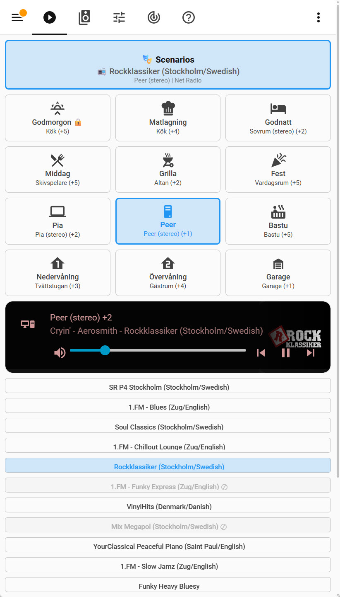
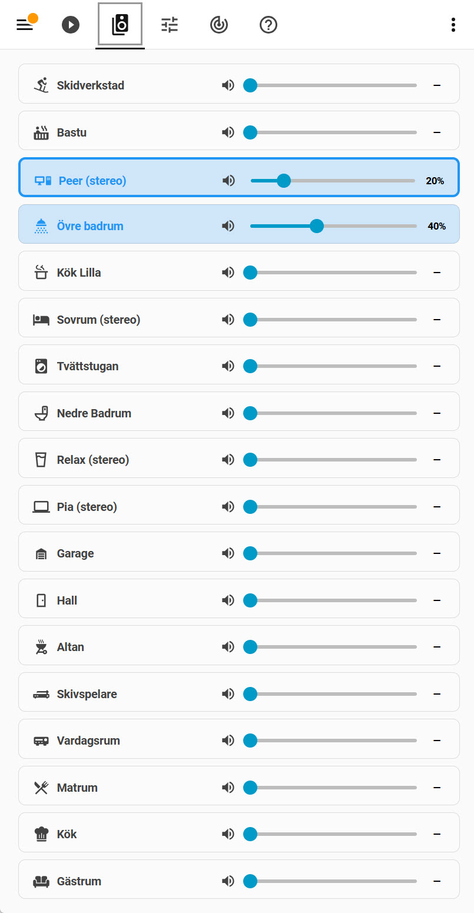
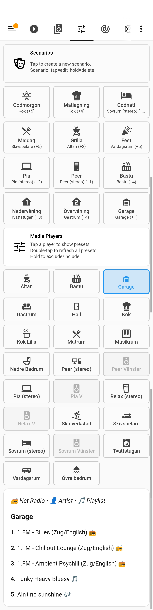
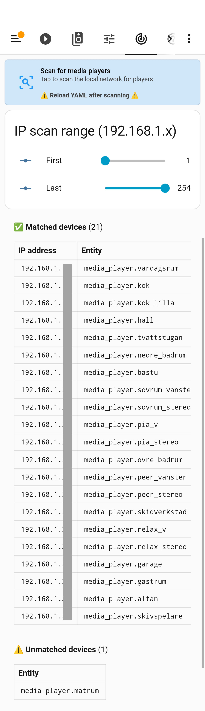

# MusicCast Multi-Room Audio Control for Home Assistant

A Home Assistant package for multi-room audio using Yamaha MusicCast native favorites. Define named scenarios for different listening contexts, link players on demand, and let the system randomize your preset music — all from a dashboard, without touching YAML.

**What you get:** A dashboard with scenario buttons. Tap a scenario to start music on the right players at the right volumes. Long-press to save the current group and volumes. The system is entirely set up in the UI — adding scenarios, managing players, tuning randomization.

> **Note:** This is not a replacement for the MusicCast app. It extends it with convenient controls from within Home Assistant to enable automations — you can still use the MusicCast app to manage your rooms, favorites, and routines.

## TL;DR – Quick Start

**Setup takes ~15 minutes.**

1. Ensure the **Yamaha MusicCast** integration is installed and your devices are discovered in Home Assistant
2. Register the MusicCast dashboard in `configuration.yaml`
3. Copy the dashboard and package files to your `dashboards/` and `packages/musiccast/` directories
4. Install required HACS components
5. Restart HA
6. Open the **Discovery** view and run a network scan to resolve player IP addresses
7. Open the **Settings** view and create your first scenario (tap the header card, enter name/icon/master player)
8. Switch to the **Now Playing** view and tap your scenario to start music
9. Open the **Players** view, tap the players you want in the scenario, and adjust the volumes
10. Go back to **Now Playing** and long-press the scenario to save the group and volumes

---

## What You Get

### Dashboard Views

**Now Playing** — Your daily driver. Scenario buttons show active state, master player, and current source. Activate a scenario, re-randomize its preset, or save the current group and volumes. Below the scenarios: a live media player card for the active master player, and a table of presets for the current scenario with lock/exclude controls.

**Players** — Link or unlink players to the active scenario. Linked players follow the master; unlinking also turns the player off. Changes take effect immediately without restarting the scenario.

**Settings** — Scenario and preset management. Create, edit, or delete scenarios. See which presets are loaded on each player, including empty slots. Duplicate presets are highlighted.

**Discovery** — Network scan to resolve player IP addresses. Run once after initial setup and after adding new devices.

---

## Key Concepts

- **Scenario** — A named listening context: a master player, a set of linked players, saved volumes, and a preset source. Examples: "Morning" (kitchen only, quiet), "Dinner" (kitchen + living room, medium), "Sauna" (sauna + outdoor, loud).
- **Preset** — A MusicCast favorite stored on the device (net radio station, Spotify artist/playlist, etc.). Up to 40 per player, managed in the MusicCast app. When a scenario activates, the system picks a preset from the master player and starts playback.
- **Randomization** — Each preset has a state per scenario. States are independent per scenario — locking a preset for "Morning" does not affect "Dinner".
  - **Normal** — included in random selection
  - **Locked** — always plays on activation
  - **Excluded** — never selected
- **Player Linking** — Players are linked under a master using MusicCast's native group feature. All linked players play the same source; volume can be adjusted independently. Group configuration can be saved per scenario and is automatically restored on next activation.
- **Multi-Zone Devices** — Some devices expose multiple players (e.g., Zone 2 on an AV receiver), but Zone 2 players cannot currently be used as a scenario master — they share their parent device's IP address and preset list.
- **Stereo Pairs** — Stereo pair slaves must be manually excluded in the Settings view.
- **Terminology** — The MusicCast app has **rooms**, **favorites**, and **routines**, whereas Home Assistant uses **zone** for geographic areas and **scene** for saved entity states. In this package: **player** = MC room, **preset** = MC favorite, **scenario** ≈ MC routine.

---

## Prerequisites

### Yamaha MusicCast Integration

This package requires the **Yamaha MusicCast** integration (built-in to HA). Your devices must be discovered and their media_player entities must be available before setup.

Verify: Settings → Devices & Services → Yamaha MusicCast. All your players should appear as `media_player.*` entities.

### Static IP Addresses

Player IP addresses are resolved once via network scan and stored. If your devices use DHCP and their IPs change, preset loading will break until you re-run the scan. **Static IP addresses (or DHCP reservations) are strongly recommended.**

### Required HACS Components

Install via HACS (Settings → Devices & Services → HACS → Integrations):

| Component | Purpose |
|---|---|
| `button-card` | Scenario buttons, preset buttons, player tiles — all interactive cards |
| `auto-entities` | Dynamic player grid and scenario grid (variable number of cards) |
| `decluttering-card` | Reusable card templates (reduces dashboard YAML size) |
| `mini-media-player` | Compact media player card in Now Playing view |
| `config-template-card` | Template-based card re-rendering for live updates |
| `slider-entity-row` | Volume slider in player cards |
| `browser-mod` | Scenario editor popup (create/edit/delete scenarios) |
| `card-mod` | CSS styling for cards |

---

## Installation

### 1. Register the Dashboard

Add to your `configuration.yaml`:

```yaml
lovelace:
  dashboards:
    dashboard-musiccast:
      mode: yaml
      filename: dashboards/musiccast.yaml
      title: MusicCast
      icon: mdi:music-box-multiple
      show_in_sidebar: true
```

Accessible at: `https://your-ha-url/dashboard-musiccast`

### 2. Copy Files

Copy to your Home Assistant config directory:

```
config/
├── dashboards/
│   └── musiccast.yaml
└── packages/
    └── musiccast/
        ├── orchestrator.yaml
        ├── mixer.yaml
        ├── media_players.yaml
        ├── musiccast_local.yaml        ← put site-specific automations here
        ├── scenario_persistor.sh
        ├── media_players_writer.sh
        ├── media_players_reader.sh
        ├── musiccast_presets_fetcher.sh
        ├── randomization_persistor.sh
        └── data/
            ├── scenarios.json          ← scenario metadata (created on first scenario)
            ├── media_players.csv       ← player IPs (created by network scan)
            └── ...                     ← scenario_*.csv and presets_*.csv created as you add scenarios
```

Make all `.sh` scripts executable:
```bash
chmod +x /config/packages/musiccast/*.sh
```

### 3. Enable Packages

Ensure your `configuration.yaml` loads packages:

```yaml
homeassistant:
  packages: !include_dir_named packages/
```

Then restart HA.

### 4. Run Network Scan

Open the **Discovery** view in the MusicCast dashboard:

1. Set IP range (default 1–254; narrow it to your device subnet for speed, e.g. 10–50)
2. Tap **Resolve Entity IPs**
3. Wait for the scan to complete (~15 seconds for a narrow range, up to 60s for full subnet)
4. Review matched vs unmatched players

The scan writes `data/media_players.csv` with `ip=entity_id` entries. All playback scripts use this file for IP lookups. Re-run whenever you add new devices or your network DHCP assignments change.

> **Zone 2 players** (e.g., a second output zone on an AV receiver) share their parent device's IP and cannot be matched by the network scan. They appear as unmatched (`0.0.0.0=media_player.zone2_name`). This is expected — they work for playback via HA but cannot be directly queried for presets.

### 5. Create Your First Scenario

Open the **Settings** view:

1. Tap the scenario management header card (top of the view)
2. Enter a name (e.g., "Morning"), an icon (e.g., `mdi:coffee`), and select a master player
3. The scenario is created with a single-player default group
4. Switch to **Now Playing** and tap the scenario to activate it
5. Use the **Players** view to link additional players
6. Long-press the scenario button to save the current group and volumes

---

## Visual Guide

### Now Playing

The main view. Shows the active scenario with a now-playing card at the top, followed by scenario buttons for quick switching, a mini media player and presets for the active master player.



**What you see:**
- **Now-playing card** — Active scenario name, current preset title, and playback controls
- **Scenario buttons** — One button per scenario; tap to activate, long-press to save current group and volumes, hold to exclude from randomization

### Players

Full list of MusicCast players with individual volume sliders. Active players (currently linked to a scenario) are highlighted.



**What you see:**
- **Volume sliders** — Adjust volume per player; changes sync to all group members automatically
- **Mute toggle** — Per-player mute button
- Powered-on players show a filled slider; linked players have blue text; the master player has a blue border

**Player actions:**
- **Tap** — Link or unlink the player to/from the active scenario's master
- **Double-tap** — Toggle power on/off
- **Hold** — Unlink and power off

### Settings

The setup view. Shows all scenarios and all players in a grid, with the preset list for the selected players at the bottom.



**What you see:**
- **Scenarios grid** — Tap to edit, hold to delete; tap the header card to create a new scenario
- **Players grid** — Tap a player to view its presets; double-tap to refresh all presets; hold to exclude/include from the active player pool
- **Players header card** — Refresh all presets from all devices
- **Preset list** — All preset slots for the selected players, including empty slots. Duplicates are highlighted. Source type is reflected per preset.

### Network Scan

Admin view for discovering player IPs on the local network. Run once during setup, or re-run if devices change IP address.



**What you see:**
- **IP range sliders** — Set the scan range (typically the full subnet, e.g. 192.168.1.1–254)
- **Matched devices** — Players found at their expected IPs, mapped to HA entity IDs
- **Unmatched devices** — Players found on the network but not matched to a known HA entity (network name doesn't match the friendly name), or players where no IP was detected (e.g. Zone 2 of a multi-zone AVR, which shares its parent device's IP)

---

## Customization

### Adding Your Automations

Put all site-specific automations in `musiccast_local.yaml`. The package ships with examples (alarm → stop music, garage LUX → stop music, kitchen TV → stop music). Replace or add to these without touching `orchestrator.yaml`.

#### Check if a scenario is active

```yaml
conditions:
  - condition: template
    value_template: "{{ states('input_text.active_scenario') != '' }}"
```

#### Check if a specific player is in the active group

```yaml
conditions:
  - condition: template
    value_template: >
      
      
      {{ 'media_player.my_zone' in players }}
```

#### Stop music and clear the active scenario

```yaml
actions:
  - action: script.musiccast_scenario_toggle
    data:
      scenario: "{{ states('input_text.active_scenario') }}"
```

### Excluding Players

Long-press any player tile in the **Settings** view to exclude/include it from `group.musiccast_players`. The typical case is excluding stereo pair slaves — they should not be independently linked or managed. Excluded players:
- Don't appear in the Players view
- Can't be selected as master for new scenarios
- Are not powered off when scenarios change

### Tuning Randomization

In the **Now Playing** view, preset tiles for the active scenario show current state:
- No icon — included in random selection
- 🔒 — locked: always plays when the scenario activates. Useful when you always want to start with a specific preset (e.g. the morning news). You can still re-randomize to a different preset after activation.
- ⊘ — excluded: never selected during randomization, but can still be played manually. Useful for seasonal presets (e.g. a Christmas playlist) that you want available but not in the regular rotation.
- ⚠ — duplicate: the same preset text appears more than once on this player. Informational only; duplicates can be played and locked/excluded independently.

---

# Use Cases

Here's how I use it day-to-day. The scenarios are set up around how we actually move through the house — different rooms, different moods, different times of day.

**Morning** — I come down to the kitchen and tap "Morning" on the HA dashboard. The kitchen player starts — usually the news, at a low volume.

**Dinner** — When it's time to cook, I switch to "Dinner". Kitchen and living room join up, a bit louder, with the music set for that scenario. If we stay in the kitchen after eating, I unlink the living room on the fly without restarting anything.

**Sauna** — Tapping "Sauna" starts music on both the sauna player and the relax area speakers at the right volume for that space.

**Changing the mood** — If the current preset isn't right, I re-randomize or pick directly from the preset list. The randomization is a key part of the value — the MusicCast app's routines are locked to a single source, which gets repetitive. Here, net radio stations and Spotify artist playlists saved as favorites give a good mix without having to think about it.

Furthermore, the MusicCast app is slow and often fails to link groups. For some reason, HA does the same job faster and more reliably — still using the native MusicCast linking mechanism.

---

## Known Limitations

<details>
<summary><strong>Long-pressing a linked player in the Players view deactivates the scenario</strong></summary>

Long-pressing a player tile in the Players view unlinks it and powers it off. The power-off is asynchronous — the device goes offline after the HA action completes — and HA interprets this the same way it would if the device were powered off externally via the MusicCast app: the scenario is no longer active. For scenario management, use single-tap to link/unlink players while keeping the scenario active; reserve long-press for when you intentionally want to remove a player from playback entirely.

</details>

<details>
<summary><strong>Presets are managed in the MusicCast app</strong></summary>

You cannot add, delete, or rename presets from HA. The package reads and plays them; the MusicCast app owns them.

</details>

<details>
<summary><strong>Scenarios sharing a master player share that master's preset pool</strong></summary>

Two scenarios with the same master player will see the same raw presets, though their lock/exclude states are independent per scenario.

</details>

<details>
<summary><strong>Zone 2 players cannot be resolved by network scan</strong></summary>

Zone 2 players share their parent device's IP address. They work for playback control but cannot be fetched for presets directly.

</details>

<details>
<summary><strong>Spotify playlist switches are not detected</strong></summary>

The media player reflects what is currently playing, but MusicCast provides no preset metadata to HA. If the user switches to a different Spotify playlist in the MusicCast app, HA cannot detect that the active preset has changed — the scenario header card in the dashboard may then show a stale or incorrect now-playing state.


</details>

<details>
<summary><strong>Spotify cannot be cast directly to MusicCast</strong></summary>

There is no official Spotify integration for HA that supports MusicCast. The workaround is saving Spotify playlists, artists, or "artist radio" as MusicCast favorites and playing them via presets, which is how this package uses them.

</details>

<details>
<summary><strong>Spotify artist radio and playlists show the same icon</strong></summary>

The MusicCast `getPresetInfo` API returns `"spotify"` as the content type for all Spotify presets regardless of whether they are playlists or artist radios. There is no other field in the API response that distinguishes them. Both types show 🎵.

</details>

<details>
<summary><strong>Preset cache may not persist across restarts with many players and full preset lists</strong></summary>

`sensor.musiccast_media_player_presets` stores preset data for all players in a single sensor's attributes. HA's recorder has a 16 KB limit per entity's attributes — if this is exceeded, a warning is logged and the attributes are not written to the database.

The fetcher is optimised to store only the two fields actually used (`text` and `input`) and to skip empty preset slots, which keeps the payload small under typical conditions. However, with a large number of players and fully-loaded preset lists (up to 40 per player), the limit may still be hit.

**In practice this is transparent:** attributes are still available in HA's in-memory state during the session, and the mixer refreshes the sensor before each scenario activation — so playback is unaffected. The only observable effect is a slight delay on the very first scenario activation after a restart while the sensor re-fetches.

</details>

<details>
<summary><strong>Only tested with Net Radio, server lists, and Spotify favorites</strong></summary>

Any source saved as a MusicCast favorite should work in principle, but other source types (Tidal, Napster, FM, etc.) have not been verified.

</details>

<details>
<summary><strong>Icon picker is text input</strong></summary>

When creating or editing scenarios, the icon field requires typing `mdi:icon-name` manually. HA's native icon picker is not available in this context.

</details>

---

## Potential Enhancements

- **Dynamic IP re-resolution** — Player IPs are resolved once via network scan. If a device's IP changes (DHCP without static reservations), preset loading silently breaks until a manual re-scan. A future option would trigger re-scan automatically when a preset fetch fails, removing the static IP requirement.

- **Enable/disable presets per scenario** — Selectively exclude presets from randomization per scenario (e.g. a Christmas playlist active only in December). Would extend the existing lock/exclude model with time- or date-based qualification.

- **Delete players from UI** — Currently, removing a player requires editing `data/media_players.exclude` manually. An explicit delete flow in the Admin view would also handle cleanup: surfacing any scenarios that use the player as master and need reassignment.

---

# Technical Reference

<details>
<summary><strong>Why Native Presets (Not Streaming)</strong></summary>

MusicCast devices store up to 40 favorites (presets) directly on the hardware. These are net radio stations, Spotify artists/playlists, or other sources you've saved in the MusicCast app. This package uses those presets as its music source.

The alternative — server-side streaming via Music Assistant — was removed because:
- Presets are already curated per-device and per-user in the MusicCast app
- Native playback is more reliable (no server dependency, no stream buffering)
- Preset management stays in the MC app where users are already familiar with it

Spotify cannot be cast directly to MusicCast from HA — there is no official integration that supports it. The practical solution is saving Spotify playlists, artists, or artist radio as MusicCast favorites, which this package plays via presets. Net radio stations work the same way. This gives good source variety without requiring any streaming server.

</details>

<details>
<summary><strong>Package Structure</strong></summary>

The package is split across three YAML files by concern:

**`orchestrator.yaml`** — Scenario management and transport control: create, edit and delete scenarios; link and unlink players; capture and restore volumes; scripts backing the scenario editor; automations for detecting manual player changes.

**`mixer.yaml`** — Playback engine: fetch presets from devices, apply randomization logic (lock/exclude), select and play a preset, track the active scenario's now-playing state.

**`media_players.yaml`** — Discovery and configuration: expose all MusicCast players and their IPs, expose scenario group config (master and members), fetch and cache preset lists, network scan.

**`musiccast_local.yaml`** — Site-specific automations. This is the only file you should modify for your own setup. Examples: stop music when a TV turns on, turn off music when the alarm arms, trigger specific scenarios from physical buttons.

</details>

<details>
<summary><strong>Data Flow</strong></summary>

```
User taps scenario button
        ↓
script.musiccast_scenario_toggle
        ├─ Read group from scenario_{id}.csv (master = line 1, members = rest)
        ├─ Power on master player
        ├─ Link member players
        ├─ Apply saved volumes from scenario_{id}.csv
        └─ Call script.musiccast_scenario_mixer
                ├─ Read master IP from sensor.musiccast_player_ips
                ├─ Fetch presets via HTTP: GET /YamahaExtendedControl/v1/netusb/getPresetInfo
                ├─ Read randomization state from presets_{id}.csv
                ├─ Select preset (locked → play that one; else random from non-excluded)
                └─ Play via media_player.play_media
```

</details>

<details>
<summary><strong>Persistence Files</strong></summary>

| File | Format | Purpose |
|---|---|---|
| `data/scenarios.json` | JSON | Scenario metadata: `{id: {name, icon}}` |
| `data/scenario_{id}.csv` | CSV | Group + volumes: `entity_id:volume` per line, master first |
| `data/presets_{id}.csv` | CSV | Randomization state: `preset_num,state` (L=locked, X=excluded) |
| `data/media_players.csv` | CSV | Player IPs: `ip=entity_id` per line |
| `data/media_players.exclude` | Text | Excluded players: one entity_id per line |
| `data/media_players.include` | Text | Active players: auto-generated from csv minus exclusions |

All files are plain text and human-readable, but are managed by the system and may be overwritten. They are not intended to be edited manually.

</details>

<details>
<summary><strong>Key Entities</strong></summary>

| Entity | Type | Purpose |
|---|---|---|
| `input_text.active_scenario` | input_text | ID of the currently active scenario (empty = none) |
| `sensor.musiccast_scenario_config` | sensor | Scenario metadata: names and icons (from `scenarios.json`) |
| `sensor.musiccast_scenarios` | sensor | Scenario group config: master player and members (from CSV files) |
| `sensor.musiccast_media_players` | sensor | Discovered player → IP mappings (from `media_players.csv`) |
| `sensor.musiccast_media_player_presets` | sensor | Presets for all players (fetched on demand) |
| `group.musiccast_players` | group | All active (non-excluded) MusicCast players |
| `input_boolean.scenario_updating` | input_boolean | True while a scenario script is running (use for automations) |

</details>

<details>
<summary><strong>Core Files</strong></summary>

- **Dashboard:** `dashboards/musiccast.yaml`
- **Core packages:** `packages/musiccast/orchestrator.yaml`, `packages/musiccast/mixer.yaml`, `packages/musiccast/media_players.yaml`
- **Site-specific:** `packages/musiccast/musiccast_local.yaml`
- **Data files:** `packages/musiccast/data/`

</details>


