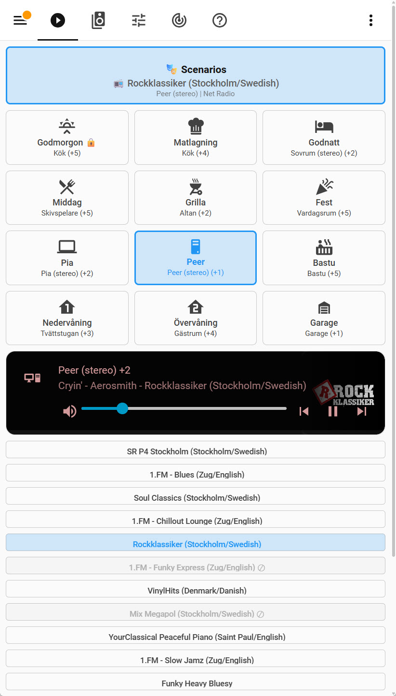
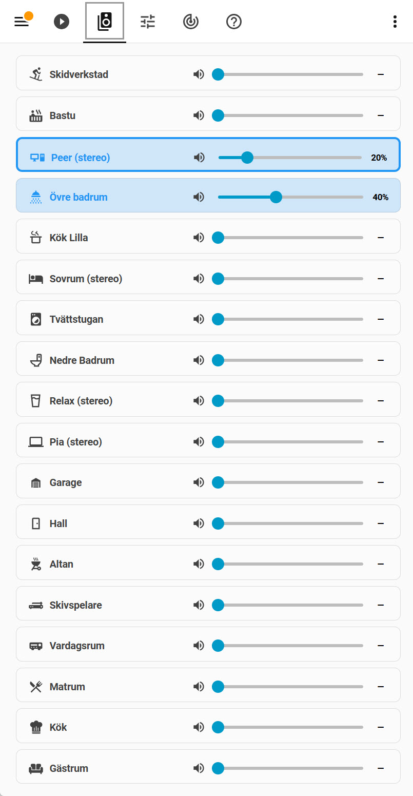
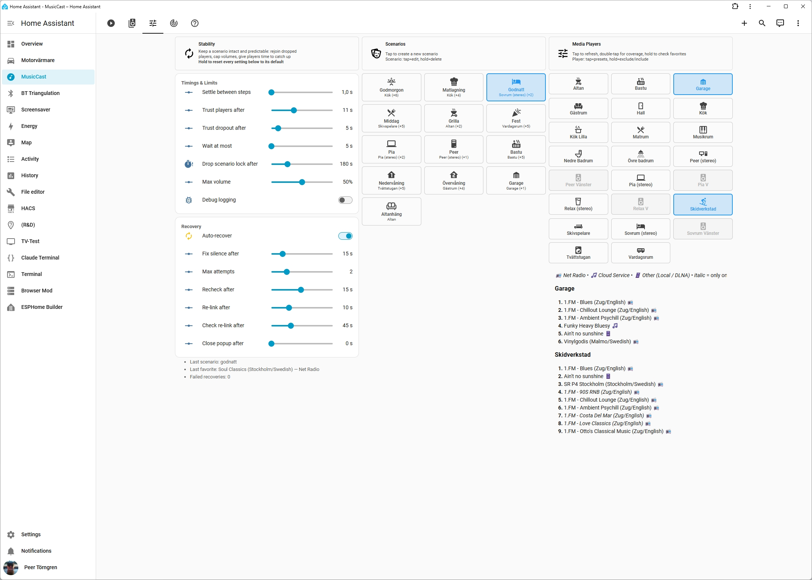
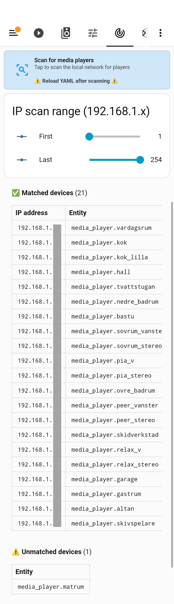

# MusicCast Multi-Room Audio Control for Home Assistant

A Home Assistant package for multi-room audio using Yamaha MusicCast native favorites. It does two things: it gives you named scenarios — tap one to start the right music, on the right players, at the right volumes — and it keeps those scenarios alive, because MusicCast on its own does not.

**The orchestration.** Define scenarios for different listening contexts, link players on demand, and let the system randomize your preset music — all from a dashboard, without touching YAML. Long-press a scenario to save the current group and volumes. Everything is set up in the UI: adding scenarios, managing players, tuning randomization.

**The reliability half, which is why the package is as large as it is.** MusicCast groups come apart in specific, repeatable ways: a player drops out mid-playback; a device powers off without dissolving the group it was in; a returning device stays invisible for about ten minutes; a Net Radio favorite drifts from the station it actually plays; playback stops on its own when a stream ends, leaving a scenario reporting itself active over a silent house. Roughly half of what this package does is absorbing those, and each one is documented in [Known Limitations](#known-limitations) with what the package does about it.

⚠️ **The timing numbers that ship with this package are observations from one house, not constants.** How long a group takes to build, how long a player takes to report itself accurately, and how long a stream takes to start all vary with wiring — wired, WiFi and powerline behave very differently — and with how many players you have, their generation, and what else is on the network at that moment. A player that rejoins in 2 seconds here may take 20 elsewhere. That is why the Stability settings are exposed instead of hard-coded: the tuning surface is a feature of the problem, not clutter. Start with the defaults and change them if your house disagrees.

> **Note:** This is not a replacement for the MusicCast app — you can still use it to manage rooms, favorites and routines, and presets must be maintained there. What this adds is automation and, in practice, speed: the MusicCast app is slow to link groups and often fails at it, while Home Assistant does the same job faster and more reliably, using the same native linking mechanism.

## TL;DR – Quick Start

**Setup takes ~15 minutes.**

1. Ensure the **Yamaha MusicCast** integration is installed and your devices are discovered in Home Assistant
2. Register the MusicCast dashboard in `configuration.yaml`
3. Copy the dashboard and package files to your `dashboards/` and `packages/musiccast/` directories — including `data/media_players.include`, without which HA will not start
4. Install required HACS components (HACS itself first, if you do not have it)
5. Empty or edit `musiccast_local.yaml` — it ships as one household's worked example
6. Restart HA
7. Open the **Settings** view and **hold the Stability header** to apply the shipped defaults — a new install starts with Auto-recover off and every timing at its minimum
8. Open the **Discovery** view, set your subnet and IP range, and run a network scan to resolve player IP addresses
9. Open the **Settings** view and create your first scenario (tap the header card, enter name/icon/master player)
10. Switch to the **Now Playing** view and tap your scenario to start music
11. Open the **Players** view, tap the players you want in the scenario, and adjust the volumes
12. Go back to **Now Playing** and long-press the scenario to save the group and volumes

---

## What You Get

### Dashboard Views

**Now Playing** — Your daily driver. Scenario buttons show active state, master player, and current source. Activate a scenario, re-randomize its preset, or save the current group and volumes. Below the scenarios: a live media player card for the active master player, and a table of presets for the current scenario with lock/exclude controls.

**Players** — Link or unlink players to the active scenario. Linked players follow the master; unlinking leaves the player on and playing by itself. Hold to unlink *and* power it off. Changes take effect immediately without restarting the scenario.

**Settings** — Scenario and preset management. Create, edit, or delete scenarios. See which presets are loaded on each player, including empty slots. Duplicate presets are highlighted. Also holds the **Stability** controls (see below).

**Discovery** — Network scan to resolve player IP addresses. Run once after initial setup and after adding new devices.

**Guide** — In-dashboard help: what every tap, double-tap and hold does in each view, what the colours and badges mean, and what each Stability setting is for.

### Auto-Recovery

A playing scenario can be disturbed from outside Home Assistant in two ways, and **Auto-Recovery** (toggle in the Settings view) handles both.

**A player drops out of the group** — a device or network hiccup. The system rejoins it to its scenario automatically and keeps the current source, with no re-randomize.

**Playback stops on its own** — most often an internet radio stream ending, which leaves the player paused with the group still intact. Without this, the scenario goes on reporting itself active while the house is silent. The system presses play again on the master.

Either way, a popup with an **Undo** button appears on any open dashboard afterwards, in case the change was deliberate — you moved a speaker to another group in the MusicCast app, or stopped the music there. Undo reverses exactly what was done: a rejoined player is removed again and the scenario cleared; resumed playback is paused again, leaving the group alone. If the recovery *fails* you get a notification instead of a popup — it waits until you acknowledge it, so it can't be missed while no dashboard is open.

A pause or stop you make yourself is never overridden. The package distinguishes a change made through Home Assistant — the dashboard, an automation, a script — from one the device made on its own, and only acts on the latter.

If Auto-Recovery is off, or a player can't be recovered, the scenario clears and the dashboard shows no active scenario. To get it back:
- **Single-tap the scenario** — restores it: rejoins the dropped players and keeps the source playing, with no new preset. Double-tap instead for a fresh randomized start.
- **Tap a dropped player** in the Players view — relinks just that one player to the still-playing master.

**Why so many timing settings?** Because MusicCast is timing-sensitive and the timings are not universal. Building a distribution group, reporting a state change back to Home Assistant, and starting a stream all take a variable amount of time, and how much depends on the environment: wired versus WiFi versus powerline, how many players are in the group, which generation the devices are, and what else is on the network at that moment. A player that rejoins in two seconds here may take twenty somewhere else.

So every number shipped below is **an observation from one house, not a constant** — taken in an installation of around twenty MusicCast devices reachable over WiFi and powerline, on its largest scenario, which groups seven of them. A smaller installation, or one entirely on wired ethernet, will likely need lower values; a busier or slower network, higher ones. Expect to tune them. Each setting's description says which symptom means "raise this", so the tuning is diagnosable rather than guesswork: a player left silent after a recovery means one value is too low, a recovery that reports failure while the room is audibly fine means another is.

Tuning is in the Settings → **Stability** block, which is split into two cards: **Timings & Limits**, which always applies, and **Recovery**, which only matters while Auto-recover is on and dims when it is off.

The **Recovery** labels drop the word *recovery* because the card supplies it: **Max attempts** (how many times to retry a stubborn player before giving up), **Recheck after** (how long to wait before checking the fix landed — also how long playback must stay stopped before a stop counts as real rather than a blip between tracks), **Fix silence after** (how long a player must sit quiet, while the master still reports playing and the player is still linked to it, before that counts as a fault worth fixing — the wait *before* acting, where Recheck after is the wait *after*) **Re-link after** and **Check re-link after** (a silent scenario is first fixed by rebuilding the link — unlinking the players and linking them straight back, leaving the master alone so a playlist keeps its place; the first is the pause between unlink and link, the second is how long to let it settle before judging, since players do not return together and judging early falls back to restarting the station for nothing), and **Close popup after** (how long the **Undo** popup stays on screen; 0 for no popup at all, so recoveries are accepted silently, which is what you want once you trust them — a recovery that *fails* raises a notification regardless). The heading also covers a read-only status line showing the last scenario, the favorite it would restore, and how many recoveries are currently failing — counted per scenario and per player, since a player that recovers successfully drops out of the count and activating a scenario clears it.

**Timings & Limits** holds the settings that apply whether or not Auto-recover is on:

- **Settle between steps** — the unit the waits between grouping steps are expressed in; unjoin, join and stop each wait a documented multiple of it. A device does not report its own new role fast enough to wait on, so these are deliberate blind waits. Raise it on slower hardware.
- **Trust dropout after** — how long a player must be *absent from the group* before that counts as a real dropout. A player that comes straight back cancels the wait, so only persistent absences reach it. Distinct from **Fix silence after**, which watches a member that is still enrolled but has gone quiet: this one watches membership, that one watches sound.
- **Wait at most** — a ceiling on the waits that watch for devices to confirm a group or power change, not a delay. Operations return as soon as the devices report, and only spend this when one is slow or gone. It applies per wait, so a script with two waits can spend it twice in the worst case.
- **Drop scenario lock after** — a safety net rather than a timing parameter. While the package is rebuilding a group it raises a lock that stands down drop detection, the volume sync and the caption check; if the script holding it dies part-way the lock would otherwise stay up silently and the package would stop noticing faults. This releases it and logs a warning. It must exceed the longest scenario rebuild your house performs — raise it if it ever fires during a real activation.
- **Report failure after** — how long a scenario may be starting, or shutting down, before the package reports that it has failed. A device refusing a group call stops the activation where it stands, and everything that would otherwise report a problem runs later in the same script, so the failure is silent by construction: powered-on players, no music, and nothing said. This watches from outside the scripts and raises a notification naming the scenario. It only reports — clearing the lock is the setting above — so it is much the shorter of the two, and it must still outlast a legitimate rebuild.
- **Debug logging** — diagnostic logging, off in normal use. Worth turning on when investigating why a scenario misbehaved: auto-recovery heals some faults within seconds, so the only trace of an incident can otherwise be the single line saying it was fixed.

and two more that are deliberately **not** recovery settings:

- **Trust players after** — set too short and two things go wrong with no drop involved: the favorite indicator goes dark seconds after a scenario is tapped, and member volumes drift off the scenario's. A player reports its new source and volume up to ~10 s *after* it starts playing, and until then what it says about itself still describes the previous scenario. This is how long the package waits, from the moment playback starts, before believing players again (0 = believe them immediately). It gates the volume sync and the caption check as well as drop detection, so it stays in effect with Auto-Recovery off.
- **Max volume** — a ceiling on the volumes the package sets itself, i.e. scenario volumes and members following the master (0% = off, no cap). Volumes you set by hand are never capped: any player can be turned above the ceiling manually, but a member following a master above it stops at the ceiling.

---

## Key Concepts

- **Scenario** — A named listening context: a master player, a set of linked players, saved volumes, and a preset source. Examples: "Morning" (kitchen only, quiet), "Dinner" (kitchen + living room, medium), "Sauna" (sauna + outdoor, loud).
- **Preset** — A MusicCast favorite stored on the device (net radio station, Spotify artist/playlist, etc.). Up to 40 per player, managed in the MusicCast app. When a scenario activates, the system picks a preset from the master player and starts playback.
- **Randomization** — Each preset has a state per scenario. States are independent per scenario — locking a preset for "Morning" does not affect "Dinner".
  - **Normal** — included in random selection
  - **Locked** — always plays on activation
  - **Excluded** — never selected
- **Player Linking** — Players are linked under a master using MusicCast's native group feature. All linked players play the same source; volume can be adjusted independently. Group configuration can be saved per scenario and is automatically restored on next activation.
- **Overlay Player** — A player joined dynamically to a playing scenario's master by an automation, without being a scenario member (e.g. a patio speaker linked while the kitchen door is open). The active scenario and playing preset are untouched; extra members are tolerated by scenario detection, and master volume changes propagate to all linked players. See Customization → Overlay Players.
- **Multi-Zone Devices** — Some devices expose multiple players (e.g., Zone 2 on an AV receiver), but Zone 2 players cannot currently be used as a scenario master — they share their parent device's IP address and preset list.
- **Stereo Pairs** — Stereo pair slaves must be manually excluded in the Settings view.
- **Terminology** — The MusicCast app has **rooms**, **favorites**, and **routines**, whereas Home Assistant uses **zone** for geographic areas and **scene** for saved entity states. In this package: **player** = MC room, **preset** = MC favorite, **scenario** ≈ MC routine.

---

## Prerequisites

### Home Assistant

**This package tracks current Home Assistant.** It is developed and run on the latest stable release
and adopts new syntax as HA introduces it, so **no minimum version is maintained or tested**. It will
certainly not load on anything older than roughly **2024.10** — it uses the modern
`triggers:` / `conditions:` / `actions:` script syntax and `action: perform-action` — but the practical
advice is simply to be current.

**It is developed and run on Home Assistant OS.** Every `shell_command`, every `command_line` sensor
and all five scripts use absolute `/config/packages/musiccast/…` paths, and the scripts need a working
shell environment — among the tools they call are `bash`, `jq`, `python3`, `curl`, `base64`, `seq`,
`xargs`, `mktemp`, `sort -V`, `find`, `date`, `awk`, `sed`, `cut` and `tr`. That names the ones worth
checking on a non-HAOS install, not every coreutil the scripts touch. Container and venv Core installs are **untested rather
than unsupported** — they may work if those tools are available and `/config` is the config directory,
but nothing here has been verified against them.

### Yamaha MusicCast Integration

This package requires the **Yamaha MusicCast** integration (built-in to HA). Your devices must be discovered and their media_player entities must be available before setup.

Verify: Settings → Devices & Services → Yamaha MusicCast. All your players should appear as `media_player.*` entities.

### Static IP Addresses

Player IP addresses are resolved once via network scan and stored. If your devices use DHCP and their IPs change, preset loading will break until you re-run the scan. **Static IP addresses (or DHCP reservations) are strongly recommended.**

### Required HACS Components

**HACS itself is a prerequisite** — it is not part of Home Assistant and has to be installed first;
see [hacs.xyz](https://hacs.xyz) for its own instructions. Once it is in place, HACS opens from the
**sidebar**.

All eight components below are **frontend plugins** rather than integrations, so they are found under
HACS → *Frontend* (in older HACS versions; current releases present one combined list). The exception
is `browser-mod`, which is both — see the note under the table.

| Component | Purpose |
|---|---|
| `button-card` | Scenario buttons, preset buttons, player tiles — all interactive cards |
| `auto-entities` | Dynamic player grid and scenario grid (variable number of cards) |
| `decluttering-card` | Reusable card templates (reduces dashboard YAML size) |
| `mini-media-player` | Compact media player card in Now Playing view |
| `config-template-card` | Template-based card re-rendering for live updates |
| `slider-entity-row` | Volume slider in player cards |
| `browser-mod` | Scenario editor popup (create/edit/delete scenarios) |
| `card-mod` | CSS styling for cards |

⚠️ **`browser-mod` needs a second step the others do not.** It is an integration as well as a card, so
after installing it from HACS you must also add it under **Settings → Devices & Services → Add
Integration → Browser Mod**, and restart if prompted. Skipping this fails quietly: the dashboard loads
and every view works, but the scenario editor popup never opens.

---

## Installation

### 1. Register the Dashboard

Add to your `configuration.yaml`:

```yaml
lovelace:
  dashboards:
    dashboard-musiccast:
      mode: yaml
      filename: dashboards/musiccast.yaml
      title: MusicCast
      icon: mdi:music-box-multiple
      show_in_sidebar: true
```

Accessible at: `https://your-ha-url/dashboard-musiccast`

### 2. Copy Files

Copy to your Home Assistant config directory:

```
config/
├── dashboards/
│   └── musiccast.yaml
└── packages/
    └── musiccast/
        ├── orchestrator.yaml
        ├── mixer.yaml
        ├── stabilizer.yaml
        ├── media_players.yaml
        ├── musiccast_local.yaml        ← put site-specific automations here
        ├── scenario_persistor.sh
        ├── media_players_writer.sh
        ├── media_players_reader.sh
        ├── musiccast_presets_fetcher.sh
        ├── randomization_persistor.sh
        └── data/
            ├── media_players.include   ← ships with a placeholder; copy it, do not skip it
            ├── scenarios.json          ← scenario metadata (created on first scenario)
            ├── media_players.csv       ← player IPs (created by network scan)
            └── ...                     ← scenario_*.csv and presets_*.csv created as you add scenarios
```

The `.sh` scripts do not need to be made executable — every `shell_command` invokes them as
`bash /config/packages/musiccast/<script>.sh`, so file permissions do not matter. This means you can
install the package with the File Editor add-on or a Samba share alone, without terminal access.

⚠️ **`data/media_players.include` must be in place before you start Home Assistant.** It is the one
file in `data/` that ships with the package rather than being created for you, because the packages
read it *while loading their configuration*: `group.musiccast_players` and every automation that
watches your players build their entity lists from it. If it is missing, Home Assistant will not
start.

It arrives holding one placeholder entity, which does nothing and matches no real device — enough for
the configuration to load. **Your first network scan replaces it with your actual players**, and every
later scan rewrites it. You never edit it by hand.

**The rest of `data/` you do not need to create** — the scripts that write into it create it on first
use, and the scripts that read from it exit quietly while it is still missing. It fills up as you run
the network scan and add scenarios.

**If your config directory is a Git repository**, the two halves of `data/` deserve different treatment:

```gitignore
# Machine-specific, rebuilt by any network scan — safe to ignore
packages/musiccast/data/media_players.csv
```

⚠️ **Do not ignore `media_players.include`, even though a scan rebuilds it too.** It is read while
Home Assistant loads its configuration, so a config restored from a repository that omits it will not
start — and the scan that would recreate it cannot run until Home Assistant is up.

Everything else in `data/` — `scenarios.json`, `scenario_*.csv`, `presets_*.csv` — *is* your
configuration: scenario definitions, per-player volumes and preset states, all edited through the
dashboard rather than by hand. Keeping those in version control gives you the only backup they have.

### 3. Enable Packages

Ensure your `configuration.yaml` loads packages:

```yaml
homeassistant:
  packages: !include_dir_named packages/
```

⚠️ **Empty or edit `musiccast_local.yaml` before restarting.** It ships as a *worked example* — one
household's real automations, wired to that house's entities (a Verisure alarm, a kitchen door sensor,
a patio light, named MusicCast players). None of those exist in your Home Assistant, so left as-is it
gives you a file full of automations referencing nothing. It is there to show the shape of site-specific
wiring, not to be used unchanged. Delete its contents and keep the file, or replace the examples with
your own; nothing else in the package depends on what is in it.

Then restart HA.

⚠️ **A full restart, not a YAML reload — and the same applies to every later change.** The package
defines `shell_command` entries, and those are only re-read on a full restart. *Reload All YAML
Configuration* leaves the previous definitions live in memory, so an edited or newly added
`shell_command` silently keeps running its old version. If a change to this package appears to have no
effect, this is the first thing to check.

### 4. Apply the Shipped Defaults

⚠️ **Do this before anything else, or the package will look broken.** Home Assistant does not give a
new helper a value, so on a fresh install every setting sits at its minimum and **Auto-recover is
off** — the recovery behaviour described above is present but disabled, and the timings are all at
their lowest.

Open the **Settings** view and **hold the Stability header card**. It offers to reset every setting to
its default; accept. That one action turns Auto-recover on and sets every timing to the shipped value,
which is also what the Guide view's defaults table lists.

You only need it once, on a new installation. Afterwards the same gesture is how you get back to a
known starting point if tuning has wandered.

### 5. Run Network Scan

Open the **Discovery** view in the MusicCast dashboard:

1. **Set the subnet.** Leave it blank and it scans `192.168.1`. If your players are on `10.0.0.x` or
   `192.168.2.x`, set it here first — otherwise the scan sweeps a subnet you do not use and finds
   nothing, with no indication why.
2. **Set the IP range — a new install scans nothing until you do.** Both ends start at 1, giving a
   range of 1–1, so the first scan finds no players and reports no error. Set it to cover your devices:
   1–254 for a whole subnet, or narrow it for speed, e.g. 10–50.
3. Tap **Scan for media players**
4. Wait for the scan to complete (~15 seconds for a narrow range, up to 60s for full subnet)
5. Review matched vs unmatched players — see below for what to do about an unmatched one
6. Reload **Groups + Automations** (Developer Tools → YAML). No restart required.

The reload is not optional: the scan also rewrites the player list that `group.musiccast_players` and the automation triggers are built from, and those are only re-read on reload.

The scan writes `data/media_players.csv` with `ip=entity_id` entries. All playback scripts use this file for IP lookups. Re-run whenever you add new devices or your network DHCP assignments change.

**How players are matched, and what to do when one is not.** The scan asks each device on the subnet
for its own name and pairs it with the Home Assistant entity whose **friendly name is identical**
(leading and trailing spaces ignored). So a player shows as unmatched when the two names differ — the
device is called *Kitchen Speaker* in the MusicCast app while its entity is named *Kitchen*, for
instance. Fix it by making them the same, in whichever place is easier: rename the entity under
Settings → Devices & Services → Entities, or rename the device in the MusicCast app. Then run the scan
again.

> **Zone 2 players** (e.g., a second output zone on an AV receiver) share their parent device's IP and cannot be matched by the network scan. They appear as unmatched (`0.0.0.0=media_player.zone2_name`). This is expected — they work for playback via HA but cannot be directly queried for presets.

### 6. Create Your First Scenario

Open the **Settings** view:

1. Tap the scenario management header card (top of the view)
2. Enter a name (e.g., "Morning"), an icon (e.g., `mdi:coffee`), and select a master player
3. The scenario is created with a single-player default group
4. Switch to **Now Playing** and tap the scenario to activate it
5. Use the **Players** view to link additional players
6. Long-press the scenario button to save the current group and volumes

---

## Visual Guide

### Now Playing

The main view. Shows the active scenario with a now-playing card at the top, followed by scenario buttons for quick switching, a mini media player and presets for the active master player.



**What you see:**
- **Now-playing card** — Active scenario name, current preset title, and playback controls
- **Scenario buttons** — One button per scenario; tap to activate (or restore a dropped scenario, keeping the source — see Auto-Recovery), double-tap to re-randomize the preset, hold to save the current group and volumes

### Players

Full list of MusicCast players with individual volume sliders. Active players (currently linked to a scenario) are highlighted.



**What you see:**
- **Volume sliders** — Adjust volume per player; changes sync to all group members automatically
- **Mute toggle** — Per-player mute button
- Powered-on players show a filled slider; linked players have blue text; the master player has a blue border

**Player actions:**
- **Tap** — Link or unlink the player to/from the active scenario's master
- **Double-tap** — Toggle power on/off
- **Hold** — Unlink and power off

### Settings

The setup view. Shows all scenarios and all players in a grid, with the preset list for the selected players at the bottom.



**What you see:**
- **Stability** — Toggle auto-rejoin, tune the retry cap and the waits, cap the volumes the package applies, and see the last scenario, its favorite, and any currently failing rejoins (see Auto-Recovery above)
- **Scenarios grid** — Tap to edit, hold to delete; tap the header card to create a new scenario
- **Players grid** — Tap a player to view its presets; hold to exclude/include from the active player pool
- **Media Players header card** — Tap to refresh all presets from all devices; **double-tap** for a table of which favorites are shared across players; **hold to check every favorite** (see below)
- **Preset list** — All preset slots for the selected players, including empty slots. Duplicates are highlighted. Source type is reflected per preset. A favorite in *italics* is on no other player — deliberately faint, a hint rather than a warning.

#### Checking favorites

A favorite can stop working while the music it points at is perfectly fine. The device accepts the recall, selects the input, and never starts — nothing errors anywhere, and the first sign is a scenario coming up silent. Holding the **Media Players** header card plays every favorite on every player in turn and reports the ones that never start, so a dead favorite can be found deliberately instead of discovered by a quiet room.

- **Every player must be switched off before it starts, and every player is switched off when it finishes.** The check refuses to run otherwise, naming the players that are on. It takes over the house for its duration — anything gentler would mean deciding per player whether to hand it back, and a device that wakes itself up afterwards would go unnoticed. Volumes are restored; power is not, because the answer is always off.
- **Confirm first.** It asks before starting, and refuses outright while a scenario is playing.
- **It takes minutes, not seconds.** The header card and a notification both show which player it is on and how many have failed so far. Hold the card again to abort; the player being tested is still restored.
- **The report names every failing slot** by player, slot number and label. The remedy is to re-save that favorite in the MusicCast app and refresh the presets — what died is the stored reference, not the station or the playlist, which usually still plays fine from its own app.
- **Players that never answered are named too**, so a clean result cannot quietly exclude a device that was unplugged when the preset list was last fetched.
- **Re-run before acting on a single failure.** Repeated runs over the same house agree on most slots but not all: roughly a third of the failures in one run pass in the next, whatever the source type. A slot that fails twice is worth re-saving; one that failed once may simply have been unlucky. The check is a way to narrow down where to look, not a verdict.

### Discovery

The view for finding player IPs on the local network. Run once during setup, or re-run if devices change IP address.



**What you see:**
- **Subnet field and IP range sliders** — Type the network prefix (blank defaults to `192.168.1`; use e.g. `10.0.0` on another network) and drag the octet range to scan (typically the full subnet, 1–254)
- **Matched devices** — Players found at their expected IPs, mapped to HA entity IDs
- **Unmatched devices** — Players found on the network but not matched to a known HA entity (network name doesn't match the friendly name), or players where no IP was detected (e.g. Zone 2 of a multi-zone AVR, which shares its parent device's IP)

---

## Customization

### Adding Your Automations

Put all site-specific automations in `musiccast_local.yaml`. The package ships with examples (alarm → stop music, garage LUX → start/stop music, kitchen TV → stop music, kitchen door → patio overlay). Replace or add to these without touching `orchestrator.yaml`.

#### Check if a scenario is active

```yaml
conditions:
  - condition: template
    value_template: "{{ states('input_text.musiccast_active_scenario') != '' }}"
```

#### Check if a specific player is in the active group

```yaml
conditions:
  - condition: template
    value_template: >
      
      
      {{ 'media_player.my_zone' in players }}
```

#### Stop music and clear the active scenario

```yaml
actions:
  - action: script.musiccast_scenario_toggle
    data:
      scenario: "{{ states('input_text.musiccast_active_scenario') }}"
```

### Overlay Players

An overlay player is joined to a playing scenario on the fly by an automation, without being part of the scenario definition. The scenario, its playing preset, and `active_scenario` are all untouched — the player simply appears in the group and disappears again. Two package behaviors make this work:

- **Scenario detection tolerates extra members** — an active scenario is only cleared when one of its *defined* players leaves the group, never because an extra player joined (`orchestrator.yaml`, detect manual scenario).
- **Master volume sync covers all live group members** — volume changes on the master scale every linked player proportionally, overlay players included.

The shipped example (`musiccast_local.yaml`) links a patio speaker to the playing kitchen master when the kitchen door stays open, and turns it off again after the door closes:

- **Kitchen door open → patio overlay ON** — triggers when the door has been open for a configurable delay, when a kitchen-mastered scenario starts while the door is already open, or when the patio lights are turned on with the door open and music playing. Conditions: the active scenario's master is the kitchen player (dynamic check — no scenario names in code), the patio player isn't already linked, and the intent gate passes: outdoor temperature above the threshold **or** patio lights on (the lights only turn on by deliberate action, so they signal someone is out there despite the cold — e.g. at the grill). The overlay joins at the master's current volume scaled by the volume factor (below), waits for the master to be powered on first, verifies the join and retries once, and aborts cleanly if the door closes meanwhile.
- **Kitchen door closed → patio music OFF** — unlinks and turns off the patio player after the door has been closed for a configurable delay. (Unlink before power-off matters: turning off a linked group member alone leaves it muted but still registered in the master's group.)

Helpers (sliders; the first three use **0 = disabled**, matching the garage music timers). The example
file uses that household's own vocabulary, so the entity ids are given here too — the names in bold are
translations for reading, not what you will find in Home Assistant:
- **Patio music start delay** (seconds) — `input_number.altanmusik_start_delay` — how long the door must stay open before linking. 0 disables the overlay entirely.
- **Patio music stop delay** (seconds) — `input_number.altanmusik_stop_delay` — how long the door must stay closed before turn-off. 0 disables auto-off.
- **Patio temperature threshold** (°C) — `input_number.altanmusik_temp_threshold` — minimum outdoor temperature for linking; overridden by the patio lights being on. 0 disables the temperature gate.
- **Patio volume factor** (0.5–2.0, neutral 1.0) — `input_number.altanmusik_volume_factor` — multiplier applied to the master's volume when the overlay joins, compensating for different amplifier/speaker sensitivity (Home Assistant's 0–1 volume scale is percent-of-device-range, not loudness). The ratio-based volume sync preserves the factor while linked. Alternative: cap **Max Volume** on the overlay device in the MusicCast app, which rescales what 0–1 means for that device.

### Excluding Players

Long-press any player tile in the **Settings** view to exclude/include it from `group.musiccast_players`. The typical case is excluding stereo pair slaves — they should not be independently linked or managed. Excluded players:
- Don't appear in the Players view
- Can't be selected as master for new scenarios
- Are not powered off when scenarios change

⚠️ **Reload Automations afterwards** (Developer Tools → YAML), or the exclusion is only half applied.
Excluding regenerates the player list and reloads Groups immediately, so the three effects above take
hold at once — but the recovery automations bind their trigger lists from that same file when they
load, so until they are reloaded an excluded player still triggers drop and silence detection.

### Tuning Randomization

In the **Now Playing** view, preset tiles for the active scenario show current state:
- No icon — included in random selection
- 🔒 — locked: always plays when the scenario activates. Useful when you always want to start with a specific preset (e.g. the morning news). You can still re-randomize to a different preset after activation.
- ⊘ — excluded: never selected during randomization, but can still be played manually. Useful for seasonal presets (e.g. a Christmas playlist) that you want available but not in the regular rotation.
- ⚠ — duplicate: the same preset text appears more than once on this player. Informational only; duplicates can be played and locked/excluded independently.

---

# Use Cases

Here's how I use it day-to-day. The scenarios are set up around how we actually move through the house — different rooms, different moods, different times of day.

**Morning** — I come down to the kitchen and tap "Morning" on the HA dashboard. The kitchen player starts — usually the news, at a low volume.

**Dinner** — When it's time to cook, I switch to "Dinner". Kitchen and living room join up, a bit louder, with the music set for that scenario. If we stay in the kitchen after eating, I unlink the living room on the fly without restarting anything.

**Sauna** — Tapping "Sauna" starts music on both the sauna player and the relax area speakers at the right volume for that space.

**Changing the mood** — If the current preset isn't right, I re-randomize or pick directly from the preset list. The randomization is a key part of the value — the MusicCast app's routines are locked to a single source, which gets repetitive. Here, net radio stations and Spotify artist playlists saved as favorites give a good mix without having to think about it.

---

## Known Limitations

<details>
<summary><strong>The favorite check proves a favorite started, not that it made a sound</strong></summary>

A slot passes when the player starts playing *something different* from what it was playing a moment earlier. That catches the fault it exists for — a recall the device accepts and never acts on — but it cannot tell you a station resolved and then streamed silence. A clean report means every favorite started, not that every favorite was audible.

Two consequences worth knowing:

- **Two slots holding the same station in a row are reported as failures.** Nothing changes when the second is recalled, so it is indistinguishable from one that never started. Duplicated presets within one player are flagged with an amber ⚠ in the preset list, which is where to check first if a failure looks wrong.
- **A player that goes unavailable mid-run** has its remaining slots skipped rather than reported as dead favorites, but slots tested just before it dropped may still be wrong.

</details>

<details>
<summary><strong>The favorite check asks for confirmation even when it will refuse to start</strong></summary>

Holding the Media Players header while a scenario is playing opens a confirmation whose text explains that the check will refuse. The dialog cannot be suppressed: Home Assistant evaluates a confirmation before it calls anything, so the refusal necessarily comes afterwards, and the dialog is fixed at two buttons. Either button is harmless — the check still refuses, and says so in a notification.

</details>

<details>
<summary><strong>Players view sorts Å/Ä/Ö as A/A/O</strong></summary>

The Players view sorts alphabetically but not locale-aware. Swedish characters Å, Ä, Ö are treated as A, A, O rather than sorted after Z as Swedish requires. This is a limitation of the `auto-entities` card's sort implementation. Accepted — better than no sort at all.

</details>

<details>
<summary><strong>Long-pressing a linked player in the Players view deactivates the scenario</strong></summary>

Long-pressing a player tile in the Players view unlinks it and powers it off, and ends the scenario. That is deliberate on both counts: the package raises its guard for the duration, so the unlink is *not* mistaken for a device dropping out and auto-recovery leaves it alone, and it then clears the scenario itself. Without the clear, the scenario would still list the player it no longer has, and the next group event would rejoin it.

Only the player you held is powered off. Hold a member and the other rooms play on; hold the **master** and they stay powered on but fall silent, having lost the source they were following — to switch everything off, tap the Scenarios header in Now Playing, or toggle the scenario off.

For scenario management, use single-tap to link/unlink players while keeping the scenario active; reserve long-press for when you intentionally want to remove a player from playback entirely.

</details>

<details>
<summary><strong>Presets are managed in the MusicCast app</strong></summary>

You cannot add, delete, or rename presets from HA. The package reads and plays them; the MusicCast app owns them.

</details>

<details>
<summary><strong>Scenarios sharing a master player share that master's preset pool</strong></summary>

Two scenarios with the same master player will see the same raw presets, though their lock/exclude states are independent per scenario. Use those per-scenario states to shape what each one plays; if two scenarios need genuinely separate music, give them different masters.

</details>

<details>
<summary><strong>Zone 2 players cannot be resolved by network scan</strong></summary>

Zone 2 players share their parent device's IP address. They work for playback control but cannot be fetched for presets directly. Use the parent device as the scenario master — a Zone 2 player works as a linked member, just not as the player a scenario draws its presets from.

</details>

<details>
<summary><strong>Spotify playlist switches are not detected</strong></summary>

The media player reflects what is currently playing, but MusicCast provides no preset metadata to HA. If the Spotify content changes, HA cannot detect that the active preset has changed — the scenario header card in the dashboard may then show a stale or incorrect now-playing state. Within Spotify a content change and an ordinary track change look identical to Home Assistant, which is why the stale-caption check deliberately ignores both: acting on them would blank the caption on every song.

**Two things can cause this, and the second is not obvious.** The first is someone switching playlist in the MusicCast app. The second is **Auto-Recovery's own resume**: when playback stops by itself, the package presses play on the master, and on a Spotify source that resumes whatever Spotify's session decides to serve next — often related content rather than the preset originally recalled. The music continues, but it is no longer the favorite the dashboard names.

Playback itself is unaffected. Re-randomize or re-activate the scenario to put Home Assistant back in charge of the source, which replaces the stale caption.

</details>

<details>
<summary><strong>Favorites started from the MusicCast app are not recorded by HA</strong></summary>

When a scenario's source is chosen in the MusicCast app rather than through HA (for example, selecting a Net Radio station or favorite directly on the device), HA has no preset metadata for it — the active-source caption/URI stay blank. Playback itself is unaffected, but the dashboard cannot highlight which favorite is playing, and any feature that depends on knowing the source (such as restoring the favorite after a dropout auto-recovery) has nothing to restore. The Spotify-playlist case above is a specific instance of this.

Start a favorite from the dashboard whenever you want the preset highlighted and auto-recovery able to restore it after a dropout. The MusicCast app stays fine for anything Home Assistant does not need to track.

</details>

<details>
<summary><strong>Linking players by hand doesn't set the scenario, and identical scenarios can't be told apart</strong></summary>

Scenarios are detected from the shape of the group: which players are linked to which master. Two consequences follow.

Linking players by hand — in the Players view or the MusicCast app — starts the music but doesn't set the scenario, even if you happen to recreate a scenario's exact group. The dashboard will show players linked and playing with no scenario active. **Tap the scenario to set it**; that's the intended way, it takes one tap, and unlike guessing from group shape it says unambiguously which scenario you meant. Hand-linking restores the sound, tapping the scenario restores the scenario.

If two scenarios have the same master and the same members, detection cannot distinguish them and always picks the one defined first. Both still work when you tap them — each keeps its own volumes and favorites — but after a dropout clears the scenario, or after a Home Assistant restart, the group may be identified as the other one, and volumes and favorites will then come from it. If you want the same rooms at two different volume levels, expect to tap the one you want rather than rely on it being recognised.

</details>

<details>
<summary><strong>A player that just came back online can be left out of a scenario for a few minutes</strong></summary>

Activating a scenario skips any player Home Assistant currently considers unavailable, so one offline player can't fail the whole scenario. The catch is how quickly HA notices a player returning. Once a MusicCast device has failed, the integration only retries it on a fixed cycle of roughly ten minutes — measured at 10 min 3 s, with no variation. Until that retry lands the player stays unavailable and gets skipped, even though the MusicCast app already shows it, because the app discovers devices on the network directly. It also can't announce itself: MusicCast devices push their state to a subscribed controller, and that subscription is lost when the device power-cycles.

So after plugging a player back in, rebooting it, or restoring its network, expect a wait before it joins scenarios again. Either activate the scenario once more a few minutes later, or force HA to look now: call `homeassistant.update_entity` on that player from Developer Tools → Actions, or reload the Yamaha MusicCast integration.

</details>

<details>
<summary><strong>A Net Radio favorite can drift from the station it actually plays</strong></summary>

A Yamaha Net Radio preset doesn't store a stream URL. It stores a reference into the internet-radio directory, plus a label captured when you saved the favorite. If the broadcaster re-points that channel — or the directory reassigns it — the preset plays a different station under the old name, and nothing in the API reports the change. Seen in practice: a preset labelled "1.FM - Slow Jamz" that plays "1.FM - 90s RnB" on every attempt, manual taps included, on every device holding that favorite.

The package detects this after playback settles by comparing the master's reported station against the caption, and shows **the station that is actually streaming**, with a warning in the log naming both. Because the corrected caption no longer matches any stored preset label, no row in the preset list is highlighted — which is honest: what's playing genuinely isn't the preset's label. To fix it at source, re-save the favorite on the device from the current directory entry, then refresh the preset cache (tap the **Media Players** header in Settings). If the station has disappeared from the directory entirely, replace the preset or exclude it from randomization.

</details>

<details>
<summary><strong>A Spotify favorite can stop working while the playlist behind it still plays</strong></summary>

A favorite is recalled by slot number, and for Spotify that slot behaves as a fixed pointer to a playlist. The pointer can stop resolving while the playlist itself is perfectly healthy, and the failure is silent: the device accepts the recall, selects the Spotify input, stops whatever was playing, and never starts. Nothing reports an error — the scenario just goes quiet.

**Re-saving the favorite fixes it.** Re-save it from a live source in the MusicCast app, then refresh the preset cache (tap the **Media Players** header in Settings). A slot that would not start at all recalls normally afterwards, usually within a second.

⚠️ **Why the pointer stops resolving is not established.** The likeliest explanation is that the playlist it refers to was retired, replaced, or re-created, so the reference saved at the time no longer points at anything — that would also explain the playlist still playing when started from the Spotify app, since that starts the current one. But nothing in the API can confirm it: preset metadata carries no Spotify identity, so there is no stored reference to inspect, and re-saving repairs a changed reference and a corrupted entry equally well. Treat the cause as a working theory and the remedy as reliable.

**This cannot be detected automatically, unlike the Net Radio drift above.** Net Radio reports the station in `media_artist`, so a mismatch against the stored label is visible and the caption can be corrected. Spotify reports the *track*, which says nothing about which playlist it came from — there is nothing to compare, so the package cannot flag it. Expect to diagnose this one by hand.

**Diagnosing it — each step rules something out:**

1. **Tap the favorite directly in the dashboard.** If it plays, the scenario path had a dropped request rather than a broken favorite, and nothing needs re-saving.
2. **Try a different favorite on the same player.** If others start normally, the player and its Spotify session are fine and the fault is specific to this favorite.
3. **Start the same playlist from the Spotify app.** If it plays there, the content is alive and only the stored reference is broken.

A favorite that fails the first two but passes the third is the case described here — re-save it.

</details>

<details>
<summary><strong>The Auto-Recovery Undo popup only appears on an open dashboard</strong></summary>

The "player rejoined — Undo" popup is shown via browser_mod, so it only appears on a device that currently has a dashboard open in the foreground. A phone with the app backgrounded won't show it. The rejoin itself still happens and is logged (`MusicCast:` prefix); the popup is a convenience for undoing an unwanted rejoin, not a required step. If it's missed, the same correction is available by tapping the rejoined player to unlink it.

This applies only to the Undo popup. A *failed* rejoin is reported as a persistent notification precisely because it can't afford to be missed: notifications wait until acknowledged and don't depend on a dashboard being open.

</details>

<details>
<summary><strong>Sources are capped at 40 per player, and maintained only in the MusicCast app</strong></summary>

Everything this package plays is a favorite stored on the device, so the device's own limits are the package's limits. Each player holds **at most 40**, and they can only be created, edited or reordered in the MusicCast app — there is no way to add one from Home Assistant, and no way to copy a set between players.

**Spotify favorites appear to be capped lower than 40**, separately from the overall limit. Saving one past that point produces an error in the MusicCast app. The exact number is not established here — it was seen once in practice and has not been measured — so treat it as "fewer than 40" rather than a specific figure.

Both are consequences of playing by preset slot rather than by content reference. They would not apply to a package that could hand a player an arbitrary URI; see the roadmap for why that is a substantial rewrite rather than a setting.

</details>

<details>
<summary><strong>Arbitrary Spotify content cannot be started from Home Assistant</strong></summary>

MusicCast devices are Spotify Connect receivers — that is how Spotify content is saved and played on them, and the device pulls the stream from Spotify itself. What this package cannot do is hand a *specific* Spotify URI to a player from Home Assistant: the device API plays a favorite by slot (`presets:N`), and preset metadata carries no Spotify identity, so there is nothing to address.

Spotify content is therefore used exactly like every other source — saved as a favorite in the MusicCast app, then played by slot. Starting a chosen playlist from Home Assistant would mean transferring a Spotify Connect session to the player, which is a different mechanism from the preset playback this package is built on.

To add new Spotify content, save it as a favorite in the MusicCast app and then refresh the preset cache (tap the **Media Players** header in Settings). It behaves like any other preset from that point on.

</details>

<details>
<summary><strong>Spotify artist radio and playlists show the same icon</strong></summary>

The MusicCast `getPresetInfo` API returns `"spotify"` as the content type for all Spotify presets regardless of whether they are playlists or artist radios. There is no other field in the API response that distinguishes them. Both types show 🎵.

</details>

<details>
<summary><strong>Preset cache may not persist across restarts with many players and full preset lists</strong></summary>

`sensor.musiccast_media_player_presets` stores preset data for all players in a single sensor's attributes. HA's recorder has a 16 KB limit per entity's attributes — if this is exceeded, a warning is logged and the attributes are not written to the database.

The fetcher is optimised to store only the two fields actually used (`text` and `input`) and to skip empty preset slots, which keeps the payload small under typical conditions. However, with a large number of players and fully-loaded preset lists (up to 40 per player), the limit may still be hit.

**In practice this is transparent:** attributes are still available in HA's in-memory state during the session, and the mixer refreshes the sensor before each scenario activation — so playback is unaffected. The only observable effect is a slight delay on the very first scenario activation after a restart while the sensor re-fetches.

</details>

<details>
<summary><strong>Only tested with Net Radio, server lists, and Spotify favorites</strong></summary>

Any source saved as a MusicCast favorite should work in principle, but other source types (Tidal, Napster, FM, etc.) have not been verified.

</details>

<details>
<summary><strong>Icon picker is text input</strong></summary>

When creating or editing scenarios, the icon field requires typing `mdi:icon-name` manually. HA's native icon picker is not available in this context.

</details>

<details>
<summary><strong>Music started outside Home Assistant keeps playing when a scenario is activated</strong></summary>

Activating a scenario unlinks every player, which silences anything that was following a master. A player that is its own source keeps playing — so if you started music from the MusicCast app on a player the new scenario does not use, it plays on.

Players the scenario *does* use are taken over: the master's playback is stopped before the new source starts, and members are linked to the master and follow it. So the rule is that Home Assistant does not stop playback it did not start, unless it needs that player for the scenario you just activated.

Switching between scenarios is unaffected either way, because the outgoing scenario is torn down first — and MusicCast-app grouping that happens to match a saved scenario is recognised as that scenario and torn down too.

</details>

<details>
<summary><strong>Re-saving favorites on a device leaves the dashboard showing the old list</strong></summary>

Presets are cached. If you add, remove or re-save favorites in the MusicCast app, the dashboard's preset list, the Now Playing highlight and manual preset taps keep reading the cached copy until you refresh it by tapping the **Media Players** header in Settings.

Randomization is unaffected — it fetches the list live, so a randomized scenario plays the correct favorite while the dashboard may still show the old one.

</details>

<details>
<summary><strong>A Net Radio station can take a long time to start</strong></summary>

A player reports `playing` as soon as its input is selected, not when audio arrives. For Net Radio the device still has to reach the station and fill its buffer, and a slow station can take tens of seconds — 34 seconds has been measured. Until the stream arrives the room is silent, the grouped members stay idle, and the dashboard shows the scenario as active.

Nothing is wrong and no action is needed; local sources (server lists, USB) start in a second or two by comparison. If it never starts at all, see *"MusicCast: scenario is silent"* under Troubleshooting.

</details>

---

## Troubleshooting

<details>
<summary><strong>Player name appears duplicated (e.g. "Garage Garage")</strong></summary>

A trailing space in the device name in the MusicCast app causes the HA integration to register a duplicated device name. The entity name then reflects this duplicated name.

**Fix:**
1. Remove the trailing space from the device name in the MusicCast app
2. Reload the MusicCast integration in HA (Settings → Devices & Services → Yamaha MusicCast → Reload)
3. Recreate the entity ID (Settings → Entities → find the entity → edit → regenerate)

</details>

<details>
<summary><strong>Notification: "MusicCast: scenario could not start"</strong></summary>

The scenario's master player could not be reached, so nothing was started. The message names the player and the state Home Assistant sees it in (`unavailable` or `unknown`). A master must be reachable to host the group at all, so the activation stops rather than failing partway through.

Members are treated differently: an unreachable *member* is skipped with a warning in the log and the scenario starts without it.

**Fix:**
1. Check the player is powered and on the network — try it in the MusicCast app
2. If the app reaches it but HA does not, reload the MusicCast integration
3. If its IP has changed, re-run the network scan (Discovery view)

</details>

<details>
<summary><strong>Notification: "MusicCast: &lt;scenario&gt; did not start"</strong></summary>

The activation was still running when **Report failure after** elapsed, so it has failed. This is the
case where nothing else can tell you: a device refusing a group call stops the activation where it
stands, and every check that would normally report a problem runs later in the same script. Without
this notification the only symptoms are powered-on speakers and silence.

Distinct from *"scenario could not start"* above, which fires when the **master** is unreachable and is
detected before anything is attempted. This one means the master answered and the grouping itself
failed — usually a member.

**Fix:**
1. Tap the scenario again — a group call that failed once often succeeds
2. If it fails again, check the log for the device that did not answer; the warning beside this
   notification names the scenario, and the entries above it name the device
3. If the same player keeps failing, restart it from the MusicCast app. A player can hold a stale group
   id that no longer exists, which blocks every attempt to group it, and only a device restart clears it
4. If the message says *"a scenario did not shut down"* instead, the same applies to the teardown — a
   player did not confirm it had stopped

</details>

<details>
<summary><strong>Notification: "MusicCast: scenario is silent"</strong></summary>

The preset was accepted by the player but playback never started, so the scenario is active and no room is playing. The message names the preset slot and its caption.

This usually means the favorite has gone invalid — a stored Spotify reference can expire, and the device reports no error when asked to play it. The MusicCast app may refuse the same favorite while the API accepts it.

**Fix:**
1. Try the scenario again — a stream can simply fail to start once
2. If it fails again, play the favorite from the MusicCast app to confirm
3. Re-save it from a live source in the app, then tap the **Media Players** header card in Settings so the cached preset list picks up the change

</details>

---

## Potential Enhancements

- **Dynamic IP re-resolution** — Player IPs are resolved once via network scan. If a device's IP changes (DHCP without static reservations), preset loading silently breaks until a manual re-scan. A future option would trigger re-scan automatically when a preset fetch fails, removing the static IP requirement.

- **Enable/disable presets per scenario** — Selectively exclude presets from randomization per scenario (e.g. a Christmas playlist active only in December). Would extend the existing lock/exclude model with time- or date-based qualification.

- **Delete players from UI** — Excluding a player is already a long-press in the **Settings** view, but there is no way to remove one outright. An explicit delete flow would also handle the cleanup an exclusion does not: surfacing any scenarios that use the player as master and need reassignment.

---

# Technical Reference

<details>
<summary><strong>Why Native Presets (Not Streaming)</strong></summary>

MusicCast devices store up to 40 favorites (presets) directly on the hardware. These are net radio stations, Spotify artists/playlists, or other sources you've saved in the MusicCast app. This package uses those presets as its music source.

This is as much a constraint as a choice. The device API plays a favorite by slot, and there is no way to hand a player an arbitrary content reference, so presets are what is addressable — see Known Limitations for what that caps and where sources have to be maintained.

The alternative — server-side streaming via Music Assistant — was removed because:
- Presets already exist on the device, so playback needs nothing else running
- Native playback is more reliable (no server dependency, no stream buffering)
- Preset management stays in the MC app where users are already familiar with it

Spotify works the same way: the devices are Spotify Connect receivers, so Spotify playlists, artists and "artist radio" are saved as MusicCast favorites and played by slot, exactly like net radio stations. What this package does not do is start a *chosen* Spotify URI from Home Assistant — see the limitation of that name. The result is good source variety with no streaming server in the path.

</details>

<details>
<summary><strong>Package Structure</strong></summary>

The package is split across four YAML files by concern:

**`orchestrator.yaml`** — Scenario management and transport control: create, edit and delete scenarios; link and unlink individual players; tear a group down; capture and restore volumes; scripts backing the scenario editor; automations for detecting manual player changes.

**`mixer.yaml`** — Playback engine and scenario activation: `musiccast_scenario_toggle` and `musiccast_scenario_link` — the two entry points at the top of the Data Flow diagram — plus fetching presets from devices, applying randomization logic (lock/exclude), selecting and playing a preset, and tracking the active scenario's now-playing state.

**`stabilizer.yaml`** — Keeping a playing scenario playing: the detectors that notice a player has dropped out or fallen silent, the recovery scripts they call, their Undo counterparts, the Stability settings that tune them, and the two diagnostics. Separate because it answers to faults rather than to you — nothing in it is triggered by pressing anything. The file boundary is not a dependency boundary, and the file's header says which parts it depends on: scenario detection, the shared guard and the playing-source writers stay in `orchestrator.yaml`.

**`media_players.yaml`** — Discovery and configuration: expose all MusicCast players and their IPs, expose scenario group config (master and members), fetch and cache preset lists, network scan.

Alongside them sits one file that is yours, not the package's:

**`musiccast_local.yaml`** — Site-specific automations. This is the only file you should modify for your own setup. Examples: stop music when a TV turns on, turn off music when the alarm arms, trigger specific scenarios from physical buttons.

</details>

<details>
<summary><strong>Data Flow</strong></summary>

```
User taps scenario button
        ↓
script.musiccast_scenario_toggle
        ├─ Call script.musiccast_scenario_link
        │       ├─ Unlink every player from whatever it was in
        │       ├─ Read group from scenario_{id}.csv (master = line 1, members = rest)
        │       ├─ Drop members HA cannot reach (join on an unavailable device raises)
        │       ├─ Stop whatever the master was playing
        │       └─ Link members onto the master, one at a time
        ├─ Set input_text.musiccast_active_scenario
        └─ Call script.musiccast_scenario_mixer
                ├─ Read master IP from sensor.musiccast_player_ips
                ├─ Fetch presets via HTTP: GET /YamahaExtendedControl/v1/netusb/getPresetInfo
                ├─ Read randomization state from presets_{id}.csv
                ├─ Select preset (locked → play that one; else random from non-excluded)
                ├─ Record the choice (slot, caption, source type) so the dashboard can show it
                ├─ Apply saved volumes from scenario_{id}.csv   ← before playback, not after
                ├─ Play via media_player.play_media
                ├─ Wait "Trust players after" (input_number.musiccast_activation_settle)
                └─ Verify the master actually reached 'playing'; warn + notify if it never did
```

**Two details in that order are load-bearing.** Volumes are applied **before** `play_media`, not as a
step of the toggle — a scenario saved loud would otherwise announce itself at the old volume first.
And the last two steps are what catch a dead favorite: `play_media` and the device's own `recallPreset`
both report success when a stored favorite has gone dead, and playback simply never starts — so the
master is checked afterwards rather than trusted.

</details>

<details>
<summary><strong>Persistence Files</strong></summary>

| File | Format | Purpose |
|---|---|---|
| `data/scenarios.json` | JSON | Scenario metadata: `{id: {name, icon}}` |
| `data/scenario_{id}.csv` | CSV | Group + volumes: `entity_id:volume` per line, master first |
| `data/presets_{id}.csv` | CSV | Randomization state: `preset_num,state` (L=locked, X=excluded) |
| `data/media_players.csv` | CSV | Player IPs: `ip=entity_id` per line |
| `data/media_players.exclude` | Text | Excluded players: one entity_id per line |
| `data/media_players.include` | Text | Active players: auto-generated from csv minus exclusions. **Ships with a placeholder entity and must exist before HA starts** — it is read at configuration load by `group.musiccast_players` and the automation triggers |

All files are plain text and human-readable, but are managed by the system and may be overwritten. They are not intended to be edited manually.

</details>

<details>
<summary><strong>Key Entities</strong></summary>

| Entity | Type | Purpose |
|---|---|---|
| `input_text.musiccast_active_scenario` | input_text | ID of the currently active scenario (empty = none) |
| `sensor.musiccast_scenarios_labels` | sensor | Scenario metadata: names and icons (from `scenarios.json`) |
| `sensor.musiccast_scenarios` | sensor | Scenario group config: master player and members (from CSV files) |
| `sensor.musiccast_media_players` | sensor | Discovered player → IP mappings (from `media_players.csv`) |
| `sensor.musiccast_media_player_presets` | sensor | Presets for all players (fetched on demand) |
| `group.musiccast_players` | group | All active (non-excluded) MusicCast players |
| `sensor.musiccast_current_master` | sensor | The master player currently in charge — the active scenario's, or the live group's when no scenario is set. Empty when nothing is grouped |
| `input_text.musiccast_last_scenario` | input_text | The scenario that was last active. Survives the scenario being cleared, which is what makes tap-to-restore possible |
| `input_boolean.musiccast_scenario_updating` | input_boolean | Raised while the package is building or tearing down a group, and **held past playback start for "Trust players after"** (`input_number.musiccast_activation_settle`). While it is on, drop detection, the volume sync and the caption check all stand down — check it before reacting to player state in your own automations. ⚠️ It is **dropped automatically** once it has been held for "Drop scenario lock after", so do not rely on a hold of your own outlasting that |
| `input_boolean.musiccast_activation_in_progress` | input_boolean | Raised for the duration of a scenario activation, so the dashboard can show it is working |
| `input_boolean.musiccast_auto_recovery` | input_boolean | Master switch for rejoining dropped players and restarting stopped playback. Turn it off to work on a player by hand without the package undoing you |
| `input_number.musiccast_max_volume` | input_number | Ceiling on volumes the package sets itself (0 = no cap). Manual changes are never capped |
| `input_number.musiccast_activation_settle` | input_number | "Trust players after" — how long after playback starts before a player's own reports are believed again |
| `input_number.musiccast_scenario_guard_timeout` | input_number | "Drop scenario lock after" — how long `input_boolean.musiccast_scenario_updating` may stay raised before it is cleared automatically and a warning logged. A safety net for a script that stopped part-way, not a timing parameter: it must exceed the longest scenario rebuild your house performs, so raise it if it ever fires during a real activation |
| `input_number.musiccast_activation_timeout` | input_number | "Report failure after" — how long an activation or teardown may run before it is reported as failed. Reports only; the lock is cleared by the setting above, which is why this one is much shorter |
| `input_text.musiccast_activation_target` | input_text | The scenario an activation is trying to start, written before any device is touched. The only record of the target while an activation is in flight, and what lets a failure name the scenario rather than a flag |
| `input_text.musiccast_recovery_attempts` | input_text | Per-player count of consecutive failed recoveries, as JSON. Cleared when a player recovers or a scenario is activated |

</details>

<details>
<summary><strong>Core Files</strong></summary>

- **Dashboard:** `dashboards/musiccast.yaml`
- **Core packages:** `packages/musiccast/orchestrator.yaml`, `packages/musiccast/mixer.yaml`, `packages/musiccast/stabilizer.yaml`, `packages/musiccast/media_players.yaml`
- **Site-specific:** `packages/musiccast/musiccast_local.yaml`
- **Data files:** `packages/musiccast/data/`

</details>


