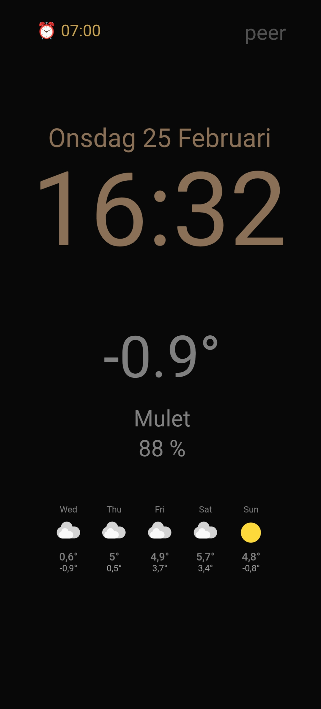

## TL;DR – Quick Start

This project consists of two parts:
1. A **Home Assistant dashboard** (visual screensaver)
2. **Android automation** (to make it behave like a real screensaver)

### Minimal Working Setup (Dashboard Only)

This gives you a static, manually managed/always-on dashboard in Fully Kiosk:

1. **Register the dashboard in Home Assistant**
   - Add this to your `configuration.yaml`:
     ```yaml
     lovelace:
       dashboards:
         dashboard-screensaver:  # Creates URL path: https://your-ha-url/dashboard-screensaver
           mode: yaml
           filename: dashboards/screensaver.yaml
           title: Screensaver
           icon: mdi:monitor-dashboard
           show_in_sidebar: true
     ```
   - This makes the dashboard accessible at `https://your-ha-url/dashboard-screensaver/home?kiosk`
   - The `?kiosk` parameter hides the Home Assistant sidebar and header for a clean display

2. **Copy the dashboard**
   - Import `dashboards/screensaver.yaml` into your `dashboards/` directory.

3. **Create your local config**
   - Copy `packages/screensaver_local.yaml` and adapt:
     - sensor entities
     - weather entity
     - tap-action scripts
     - (optional) battery automation

4. **Install required HACS components**
   - `custom:button-card`
   - `card-mod`
   - `Browser Mod`

➡️ At this point, the screensaver dashboard itself works.

---

### Kiosk Behavior (Recommended)

To achieve **automatic activation, clean exit, and device-aware behavior**, additional Android automation is required:

5. **Install additional HACS component**
   - `kiosk-mode` (hides Home Assistant chrome for full-screen display)

6. **Install Fully Kiosk Browser**
   - Required for REST API access and reliable kiosk-mode operation
   - PLUS or Pro version needed for Remote Admin functionality

7. **Configure Fully Kiosk Browser URL**
   - In Fully Kiosk settings, set the **Start URL** to:
     ```
     https://your-ha-url/dashboard-screensaver/home?kiosk
     ```
   - Use HTTPS to let the Companion App open in normal mode for regular use
   - The `?kiosk` parameter hides Home Assistant chrome for a pure screensaver appearance
   - Enable **Keep Screen On** in FKB settings

8. **Install Tasker on the Android device**
   - Used to detect display timeout, charging state, and app activity

9. **Configure Fully Kiosk Remote Admin**
   - Enable Remote Admin
   - Set a password
   - Allow local REST API access (`localhost:2323`)

10. **Create Tasker profiles**
   - **Tablet:** Launch screensaver on *Display Off*
   - **Phone:** Launch screensaver on *Display Off + Wireless Charging*
   - **Exit handling:** Use Fully Kiosk REST API to cleanly exit screensaver

11. **Reference configuration examples** (Recommended)
   - `www/docs/fully-export.json` — Fully Kiosk Browser exported configuration (import via FKB settings)
   - `www/docs/tasker-backup.xml` — Tasker profiles export for both tablet and phone (import via Tasker)

➡️ This is what turns the dashboard into a *true screensaver* rather than a static wall display.
➡️ If you are not interested in Android automation, you can still use the dashboard as a clean, always-on wall display.

Everything below explains **why this architecture exists**, how the Tasker logic differs between tablets and phones, and how to run the system reliably long-term.

# Screensaver Dashboard Architecture

## Overview

This solution transforms Android devices (tablets or phones) into dedicated information displays that balance aesthetics with technical durability. The system is built to feel like an integrated interior design element rather than a generic device running an app.

The dashboard achieves a true kiosk-mode experience while preserving normal operation through careful orchestration of **Home Assistant**, **Fully Kiosk Browser**, **Android system timeout**, and **Tasker automation**. It works equally well on:

- **Wall-mounted tablets** — Always-on displays in kitchens, living rooms, or hallways
- **Mobile phones** — Charging-dock screensavers that activate when the phone is on a wireless charger

Both configurations use the same Home Assistant dashboard architecture with device-specific Tasker profiles.

### Visual Example



The dashboard displays time, date, temperature, weather, and 5-day forecast in a clean, minimalist design optimized for wall mounting. If an alarm is set on the device running the screensaver, the next alarm time appears at the top of the display. Anti-burn-in animations run continuously at imperceptible speeds to protect OLED/LCD panels.

**Notes:**
- Date and time formats can be localized (see "Configuring Date Locale" section below)
- Weather forecast text and icons depend on which weather service you configure (e.g., SMHI for Sweden, Weather.com for US, etc.)

---

## Part 1: Home Assistant Dashboard Design

### Why custom:button-card?

Instead of relying on Home Assistant's standard cards (Markdown, Entity cards, etc.), this dashboard uses `custom:button-card` as the foundation. This choice provides several critical advantages:

- **Total Control:** Enables precise management of font size, weight, and color that standard core cards cannot match.
- **CSS Grid Layout:** Provides a stable vertical stacking system where all content centers as a unified, coherent group.
- **Dynamic Logic:** Allows advanced JavaScript execution directly within the card for real-time text formatting and value calculations.

### Visual Hierarchy & Relative Scaling

The layout implements a clear information priority system designed to be readable in under one second:

1. **Time (32vw)** — Largest and most prominent element
2. **Temperature (18vw)** — Secondary focal point
3. **Date & Climate (7-8vw)** — Tertiary information

**Using `vw` (Viewport Width) Units:** By using relative viewport units instead of fixed pixels, the design becomes completely hardware-independent. The layout maintains exact proportions regardless of screen size or resolution, making the dashboard adaptable to any tablet dimensions.

### CSS Grid Layout Structure

The button-card uses a grid system with six rows stacked vertically:

```yaml
grid-template-rows: auto auto auto auto auto auto
grid-template-areas:
  - "date"
  - "time"
  - "temp"
  - "climate"
  - "climate_details"
  - "forecast"
```

Each element is centered using `justify-items: center` and `align-content: center`, creating a balanced, symmetric composition.

### Optional: Intelligent Temperature Display Logic (Diff-Logic)

The generic screensaver simply displays whatever value your temperature sensor provides. However, you can implement context-aware temperature logic in your sensor definition:

- **Standard Display:** When the difference between front and back side sensors is **< 2°C**, show only an average value for a clean view
- **Deviation Display:** When the difference is **≥ 2°C**, show both minimum and maximum values in the format `min° | max°`

**Custom-Sensor Pattern:** Some outdoor installations use several sensors to handle sun exposure. Morning and midday sun create significant temperature differences; at night or during winter, they read nearly the same.
This can be locally implemented using a custom sensor; see `packages/screensaver_local.yaml` for a concrete example of this pattern using a template sensor.

### Anti-Burn-in & Color Palette

**Drift Animations:** To protect the screen from image persistence (burn-in), every element continuously moves in an irregular pattern at different speeds using CSS keyframe animations:

- `drift-slow`: 240-second animation cycle with larger movement (8px, 6px offsets)
- `drift-fast`: 180-200 second animation cycle with smaller movement (6px, 4px offsets)

These animations operate at imperceptible speeds to the human eye—just fast enough to prevent pixel fatigue without being noticeable.

**Color Scheme:**
- **Background:** Very dark (`#080808`) to minimize light pollution at night
- **Primary Text:** Warm gold/copper tones (`#8A7057`) for time display
- **Secondary Text:** Muted grey (`#808080`) for temperature and climate data

This palette creates a calming, "ambient display" feeling that's easy on the eyes.

### Dynamic Content via JavaScript

The button-card uses JavaScript custom fields to fetch and format live data:

```javascript
// Date: Returns Swedish-formatted date (e.g., "Monday 04 January")
return new Date().toLocaleDateString('sv-SE', { weekday: 'long', day: '2-digit', month: 'long' });

// Time: Pulls from sensor.time entity
return states['sensor.time']?.state ?? '';

// Temperature: Reads from temperature sensor
return states['sensor.screensaver_display_temperature']?.state + '°';

// Climate: Weather description
return states['sensor.screensaver_display_weather']?.state ?? '';

// Climate Details: Humidity and wind with error handling
const humidity = states['sensor.screensaver_display_humidity']?.state;
const wind = states['sensor.screensaver_display_wind_speed']?.state;
// Returns valid values or empty string if unavailable
```

### Full-Screen Panel Configuration

The dashboard uses `panel: true` to:
- Hide Home Assistant's standard header and sidebar
- Make the card fill 100% of the viewport (`100vh` × `100vw`)
- Remove scroll effects for a seamless, full-screen experience

This is essential for the kiosk-mode wall panel aesthetic.

### User Interactions (Tap Actions)

Despite being a passive screensaver, the dashboard supports intentional user interactions:

- **Single Tap:** User-configurable action via `script.tablet_tap`
- **Double Tap:** User-configurable action via `script.tablet_double_tap`
- **Hold Action:** User-configurable action via `script.tablet_hold`

---

## Part 2: Android & System Architecture

Achieving true kiosk-mode operation while preserving normal functionality requires sophisticated coordination between multiple Android components and Home Assistant. This is not a simple screensaver plugin.

### The Critical Problem: Fully Kiosk Screensaver Lock

The original challenge was this: Fully Kiosk Browser has a built-in screensaver feature, but when active, it **locks the interface**. Even with extensive attempts using Tasker and ADB commands, there was no reliable way to pause the screensaver to show other apps.

**This made Fully's native screensaver unsuitable** for a dual-mode system (passive wall display + active cooking app).

### The Solution: Android System Timeout + Tasker + Fully Kiosk REST API

Instead of relying on Fully's screensaver, the system leverages three key components:

1. **Android's built-in display timeout** — Hardware-level power management
2. **Tasker automation** — Event detection and system control
3. **Fully Kiosk REST API** — Clean, programmatic screensaver exit (via `localhost:2323`)

Together, these create a seamless mode-switching experience where Tasker detects events and uses the Fully Kiosk REST API to cleanly shut down the screensaver when needed (phone removed from charger, app launch, etc.):

---

## Fully Kiosk REST API Setup: Clean Screensaver Exit

### Overview

The foundation of reliable screensaver exit is the **Fully Kiosk REST API**, which allows Tasker (or any external system) to send a clean shutdown command to Fully Kiosk. This is far superior to force-killing the process because:

- ✅ Fully Kiosk closes cleanly without data loss
- ✅ No root access or advanced permissions required
- ✅ Works consistently across Android versions
- ✅ Uses local loopback (`localhost`), not network requests

The REST API command is simple:
```
http://localhost:2323/?cmd=exit&password=YOUR_PASSWORD
```

### Requirements

- **Fully Kiosk PLUS** (Pro version or higher)
- **Remote Admin** enabled in Fully Kiosk settings
- A secure password configured for Remote Admin authentication

### Step 1: Enable Remote Admin in Fully Kiosk

1. Open **Fully Kiosk Browser** on your device
2. Tap **☰ Menu** (three horizontal lines) in the top-left corner
3. Select **Settings**
4. Scroll down to **Advanced** section
5. Enable the toggle for **Remote Admin**
6. A new field appears: **Remote Admin Password**

### Step 2: Configure the Remote Admin Password

1. Tap the **Remote Admin Password** field
2. Enter a strong, unique password (e.g., `SecurePass123!`)
   - Use a mix of letters, numbers, and symbols
   - Avoid simple passwords like "123456"
3. Tap **Save** to apply the setting
4. **Write down this password** — you'll use it in Tasker tasks

### Step 3: Verify Remote Admin Configuration

To confirm Remote Admin is working, test the API endpoint from a web browser on the device:

1. Open any web browser on the device
2. Navigate to: `http://localhost:2323/?cmd=info&password=YOUR_PASSWORD`
   - Replace `YOUR_PASSWORD` with your Remote Admin password
3. You should see a JSON response with device information
4. If you see valid JSON, Remote Admin is properly configured

**Example response:**
```json
{"version":"1.39.9","device":"OnePlus13","deviceId":"...","batteryLevel":85}
```

If you get an error, verify:
- Remote Admin toggle is **ON** in Fully Kiosk settings
- Password is entered **exactly** as configured (case-sensitive)
- No spaces or typos in the password

### Screensaver Exit Command

Once Remote Admin is enabled and verified, use this command to cleanly exit the screensaver:

```
http://localhost:2323/?cmd=exit&password=YOUR_PASSWORD
```

This command:
- Closes Fully Kiosk cleanly
- Returns focus to the Android home screen or previous app
- Works equally on tablets and phones

### Integration with Tasker

In your Tasker exit tasks (described in the sections below), use the **HTTP Request** action to call this endpoint:

**Tasker Action Setup:**
1. **Action:** Net → HTTP Request
2. **Method:** GET
3. **URL:** `http://localhost:2323/?cmd=exit&password=YOUR_PASSWORD`
4. **Timeout:** 5 seconds
5. Leave other settings at defaults

Tasker will execute this HTTP request, cleanly exiting Fully Kiosk when the profile triggers its exit task.

### Security Notes

**Password Safety:**
- Your Remote Admin password is sent over **localhost only** (not network traffic)
- The loopback interface (`localhost:2323`) is only accessible from the device itself
- Even on a WiFi network, external devices **cannot** access the screensaver control
- Change your password periodically if you're concerned about device-level access

**Best Practices:**
- Use a strong password (at least 12 characters, mixed case and numbers)
- Store the password securely (password manager or secure note)
- Don't share the password unless someone has direct device access

---

## Wall-Mounted Tablet Setup

### How It Works

1. **Idle State (Display Off after configurable timeout):**
   - When no cooking app is running, the tablet's screen turns off after your configured display timeout (e.g., 15-30 seconds)
   - Tasker detects the "Display Off" event
   - Tasker immediately turns the display back on
   - Tasker forces Fully Kiosk Browser to the foreground
   - The screensaver dashboard appears on the wall

2. **Active State (Display stays on):**
   - When an app (e.g., recipe, music, or other application) starts, Tasker detects it
   - Tasker instructs Android to keep the display on for 1 hour
   - The app runs normally without interruption
   - Fully Kiosk remains in the background but available

3. **Return to Screensaver:**
   - When the app closes, the 1-hour timeout expires
   - The display turns off again after the remaining timeout period
   - Tasker's "Display Off" trigger fires, restarting the screensaver cycle

### Why This Approach?

- **No software conflicts:** Using Android's system timeout avoids the interface-locking issue with Fully's screensaver
- **Seamless switching:** The tablet automatically transitions between display modes without user intervention
- **Reliable:** Tasker's trigger-action system is stable and responsive
- **No root access required:** Uses only standard Android APIs and publicly available automation tools

### Critical: Tablet Charging State Handling

⚠️ **Important:** Unlike phones, the tablet screensaver should **NOT** check charging state when launching Fully Kiosk.

**Why?** The tablet is always connected to AC power (with the battery protection automation controlling charge cycles via a smart plug). If you add a charging state condition to the screensaver trigger, the screensaver will fail to launch whenever the charger is temporarily disconnected (e.g., during a power cycle or battery protection adjustment).

**Configuration rule:** Set the screensaver to launch whenever the display times out—without any charging conditions. Only phones need charging state checks.

### Tasker: The Invisible Brain

While Fully Kiosk handles the visual display, Tasker manages system-level events and transitions:

**Key Tasker Profiles:**

- **Force Dashboard:** Ensures Fully Kiosk always comes to the foreground when the display turns on
- **Dynamic Timeout Management:**
  - Detects when applications become active
  - Sets Android timeout to 1 hour (keeps screen on during active use)
  - Monitors for app closure
  - Returns timeout to 15-30 seconds (allows display to turn off for screensaver)

This automation is transparent to the user—the tablet simply appears to transition between "wall display mode" and "active app mode" seamlessly.

---

## Mobile Phone Setup

### Architecture Difference: Charging-Conditional Activation

On a mobile phone, the screensaver should only activate when the device is on a **wireless charger** (not every time the display times out). This prevents the screensaver from interrupting normal phone use while allowing it to display when the phone is docked.

### Key Difference from Tablet

| Device | Trigger | Behavior |
|--------|---------|----------|
| **Tablet** | Display Off | Always launch screensaver |
| **Phone** | Display Off + Wireless Charging | Launch screensaver only while charging |

### Tasker Configuration for Mobile

Two Tasker profiles work together to implement charging-conditional activation:

#### Profile 1: "Display Off While Charging"

**Type:** Event profile

**Trigger:**
- Event: Display → Display Off
- Condition: State → Power → Wireless (charging state)

**Entry Task:**
```
Wait: 500ms
Turn Display On
Launch App → Fully Kiosk Browser (set "Keep Screen On" in FKB)
```

**Exit Task:** None (events don't have exits)

**Purpose:** When the display times out while the phone is on a wireless charger, immediately turn the display back on and show the screensaver.

#### Profile 2: "Wireless Charging Exit Handler"

**Type:** State profile

**Trigger:** State → Power → Wireless (active)

**Entry Task:** Empty

**Exit Task:**
```
HTTP Request: http://localhost:2323/?cmd=exit&password=YOUR_PASSWORD
```

**Purpose:** When the phone is removed from the wireless charger, the exit task sends the REST API command to cleanly shut down Fully Kiosk. As a consequence, the home screen or lock screen automatically appears.

### Why Two Profiles?

In Tasker, **event profiles don't have exit tasks**—they only detect when an event occurs. To properly handle both "entering charging mode" and "exiting charging mode," we need:

1. **Event profile** → Detects Display Off while charging, launches screensaver
2. **State profile** → Detects when device leaves charging dock, cleans up and locks

Together, they create a complete charging lifecycle.

### Fully Kiosk Configuration for Mobile

**FKB Settings (OnePlus 13 as example):**
- **Keep Screen On:** Enabled (essential) — Prevents display timeout while screensaver is active on the charger. Without this, the screensaver will blank the screen during inactivity.
- **Unlock Screen:** Enabled (essential) — **Absolutely required** to display the screensaver dashboard over the phone's lockscreen. This is what allows the kiosk interface to appear without unlocking the device. Corresponds to `forceScreenUnlock: true` in FKB JSON configuration.
- **Device Admin:** Disabled (not needed for charging-based activation)
- **Background Restrictions:** "Begränsa bakgrund" (restricted) — Allows Android to manage FKB lifecycle naturally

### Tested Scenarios (All Passed ✓)

| Scenario | Expected Behavior | Result |
|----------|-------------------|--------|
| Locked → Place on Charger | FKB shows over lockscreen | ✓ Works |
| Unlocked → Charger → Timeout | Display times out, FKB shows, phone locks | ✓ Works |
| Pick up while screensaver active | FKB closes, phone stays locked | ✓ Works |
| Unlock while charging → Timeout | FKB reappears after inactivity | ✓ Works |
| Unlock while charging → Pick up | FKB closes, phone stays unlocked | ✓ Works |

### Lock State Behavior

When the screensaver is active (phone on charger), the phone **remains locked**. Users must swipe to reveal the lockscreen, then unlock to access phone functions. This maintains security while showing the dashboard.

### Configuration File Examples

This project includes exported configuration files to simplify setup on your devices:

**1. Fully Kiosk Browser Configuration**
- **File:** `www/docs/fully-export.json`
- **Purpose:** Pre-configured FKB settings including Remote Admin, Keep Screen On, Unlock Screen, and start URL
- **How to import:**
  1. Open Fully Kiosk Browser
  2. Navigate to **Settings → Advanced → Import/Export**
  3. Select **Import configuration from file**
  4. Choose `fully-export.json`
  5. Adjust the start URL if your Home Assistant instance is at a different address
- **What it includes:** Remote Admin enabled, Keep Screen On, Unlock Screen, Display Control, Background Restrictions

**2. Tasker Profiles (Tablet and Phone)**
- **File:** `www/docs/tasker-backup.xml`
- **Purpose:** Ready-to-import Tasker profiles configured for phones with wireless charging. For tablets, remove the charging condition from the profiles.
- **How to import:**
  1. Open Tasker
  2. Go to **Profiles tab**
  3. Long-press anywhere, select **Import**
  4. Choose `tasker-backup.xml`
  5. Review all imported profiles
- **Device-specific setup:**
  - **Phone:** Keep profiles as-is (Display Off + Wireless Charging detection)
  - **Tablet:** Remove the wireless charging condition from the profiles to trigger on Display Off alone
- **Includes:**
  - FKB launch and dashboard foreground enforcement
  - REST API exit handling for charging removal (relevant for phones)

**Important:** After importing, verify that device-specific settings (URLs, passwords, device names) match your environment before enabling. For tablets, edit the imported profiles to remove the charging state condition as described in the "Wall-Mounted Tablet Setup" section above.

### Known Issues & Workarounds

**FKB Remains in Background After Charging Exit**

- **Issue:** After removing the phone from the charger, Fully Kiosk may continue running in the background instead of force-stopping
- **Root Cause:** OxygenOS doesn't respond to the ADB command `am force-stop de.ozerov.fully` (returns error 255)
- **Current Workaround:** Android background restriction "Begränsa bakgrund" allows the system to manage FKB's lifecycle naturally
- **Practical Impact:** FKB idles peacefully in the background (doesn't consume significant resources) and won't interfere with normal phone use
- **Status:** Not an issue in practice—the screensaver functions correctly with or without explicit force-stop

---

## Shared Architecture: Fully Kiosk Browser Integration

### Home Assistant Integration (via HACS)

Home Assistant includes a dedicated Fully Kiosk Browser integration that creates sensors for:
- Battery level
- Charging status
- Screen brightness
- Device motion
- Other hardware metrics

This integration is essential for:
- Battery protection automation (see below)
- Device status monitoring
- Programmatic control of Fully settings

**Kiosk Configuration:**
- Uses `panel: true` to hide Home Assistant chrome
- Dashboard runs exclusively in Fully Kiosk, not in a web browser
- Prevents accidental navigation or app switching

### Battery Management

Long-term device health requires active battery protection to prevent degradation (tablets) and swelling (phones).

**Critical Requirement: Use Fully Kiosk Integration for Battery Monitoring**

Battery level monitoring **must** use the Fully Kiosk Browser integration (installed via HACS), not the native Android device entity. This is a hard requirement based on real-world testing:

- **Previous attempts with native Android entity failed:** Direct battery sensors from the Android system proved unreliable in a kiosk environment, with inconsistent updates and frequent "unavailable" states
- **Fully Kiosk integration is dependable:** Provides consistent, rapid battery level updates specifically designed for dedicated device deployment
- **Why the difference?** Fully Kiosk's integration bypasses Android's standard polling delays and is optimized for devices running continuously in the foreground

**Battery Voltage Protection (20-80% range) — Tablet Only**

For wall-mounted tablets, use active battery protection to maintain the optimal 20-80% charge range:

1. **Fully Kiosk provides battery level data** to Home Assistant via the HACS integration
   - Install: `HACS → Integrations → Fully Kiosk Browser`
   - This creates entities for battery level, charging status, screen brightness, etc.
2. **Home Assistant monitors the battery sensor** from Fully (typically `sensor.kitchen_tablet_battery_level` or similar)
3. **A Shelly smart plug controls power** to the tablet charger
   - Home Assistant automation evaluates the battery level from Fully
   - When battery reaches **80% charge:** Automation cuts power to the Shelly plug (stops charging)
   - When battery drops to **20% charge:** Automation restores power via the Shelly plug (resumes charging)

**Hardware Setup:**
- Tablet charger is connected to a **Shelly smart plug**
- Shelly plug is integrated into Home Assistant via the native **Shelly integration** — highly stable and reliable
- Home Assistant can toggle the plug on/off based on battery thresholds with minimal latency

**Why This Approach?**
- Maintains battery in optimal 20-80% range, preventing degradation and swelling
- Fully Kiosk's integration is the only reliable source of battery data for wall-mounted kiosk devices
- Shelly plug provides accessible control without requiring access to device internals

**Mobile Phone Battery Management**

Mobile phones typically use built-in charging optimizations (e.g., OxygenOS, OneUI) that manage battery health automatically when connected to a charger. No additional automation is required. The screensaver itself consumes minimal power while idle.

**For tablets specifically:** This approach significantly extends tablet lifespan by managing charge cycles intelligently.

### Browser Mod Setup & Device Registration

Browser Mod enables device-aware tap actions: the screensaver can execute different scripts depending on which tablet or phone is running it. This allows a single dashboard to adapt behavior per device.

**1. Installation & Integration**

1. **Download:** Install **Browser Mod** via HACS.
2. **Enable:** Navigate to **Settings > Devices & Services > Add Integration**. Search for **Browser Mod** and add it.
3. **Restart:** Restart Home Assistant to load the new sidebar panel and actions.

**2. Device Identification (Perform on EACH device)**

Open Home Assistant on the specific tablet or phone you wish to configure:

1. **Open Sidebar:** Click the **Browser Mod** icon in the Home Assistant sidebar.
2. **Identify:** Find the section labeled **"This Browser"**.
3. **Set ID:** Click the pencil icon next to **Browser ID** and enter a **unique, permanent, semantic name**.
   - Recommendations:
     - Tablets: `kitchen_tablet`, `living_room_tablet`
     - Phones running FKB: Use the suffix `_fkb` to distinguish from the Companion App (e.g., `phone_fkb`, `bedroom_phone_fkb`)
   - These IDs are permanent and used to identify which device is running the screensaver, enabling device-specific sensor mapping (alarm data, battery, etc.)
4. **Register:** Toggle **"Register"** to **ON**. This creates the device and associated entities (sensor, light, media_player) in Home Assistant.

**For Kiosk Mode (Phone Screensaver):**

If the screensaver is running in FKB kiosk mode (no sidebar visible):

1. **Edit FKB Start URL:** In Fully Kiosk settings, temporarily remove the `?kiosk` parameter from the end of the URL
   - Before: `https://your-ha-url/dashboard-screensaver?kiosk`
   - After: `https://your-ha-url/dashboard-screensaver` (reload)
2. **Access Browser Mod:** Now the HA sidebar is visible. Click **Browser Mod** icon.
3. **Find "This Browser"** section and set your Browser ID to something meaningful (e.g., `phone_screensaver`)
4. **Toggle "Register"** to register the device
5. **Restore the URL:** Re-add the `?kiosk` parameter to the FKB Start URL to hide the sidebar again

**3. Validation**

* Go to **Developer Tools > Actions** and run `browser_mod.debug`.
* A popup will appear on the device confirming that the **Browser ID** matches the name you assigned.

**4. Script Configuration**

Update the `tablet_tap`, `tablet_double_tap`, and `tablet_hold` scripts in your Home Assistant configuration to conditionally execute different actions based on `browser_id`:

```yaml
script:
  tablet_tap:
    sequence:
      - choose:
          - conditions:
              - condition: template
                value_template: "{{ browser_id == 'kitchen_tablet' }}"
            sequence:
              # Actions for kitchen tablet
              - action: script.scenario_toggle_mc
          - conditions:
              - condition: template
                value_template: "{{ browser_id == 'bedroom_phone' }}"
            sequence:
              # Different actions for bedroom phone
              - action: script.other_action
```

The screensaver dashboard automatically passes the `browser_id` to these scripts via the `fire-dom-event` action, so the same dashboard configuration works across all your devices.

**5. Dynamic Sensor Mapping — Alarm Display Example**

The screensaver uses JavaScript to dynamically map the correct Home Assistant sensor based on the device's Browser ID. This is crucial for features like the next alarm display, which needs to show data specific to the device running the screensaver.

**How it works:**
1. JavaScript reads the device's Browser ID from Browser Mod's localStorage (e.g., `phone_fkb`, `kitchen_tablet`)
2. The dashboard dynamically constructs the sensor entity name based on a pattern: `sensor.{browser_id}_next_alarm`
3. For example:
   - Phone with ID `phone_fkb` → queries `sensor.phone_fkb_next_alarm`
   - Tablet with ID `kitchen_tablet` → queries `sensor.kitchen_tablet_next_alarm`
4. This pattern allows each device to display its own alarm data without requiring separate dashboard configurations

**Setup requirement:**
- Ensure the Home Assistant Companion App on your device exposes a `next_alarm` sensor with the device's Browser ID in the entity name
- The entity should be named: `sensor.{your_browser_id}_next_alarm`
- Example: If your Browser ID is `bedroom_phone_fkb`, enable the "Next Alarm" sensor in Companion App settings, and it will be available as `sensor.bedroom_phone_fkb_next_alarm`

This dynamic mapping pattern can be extended to other sensor types (battery level, charging state, etc.) using the same Browser ID-based naming convention.

---

## Part 3: Integration Architecture

### Information Flow — Tablet (Always-On)

```
Android Display Timeout (configurable: e.g., 15-30 seconds)
    ↓
Tasker Detects "Display Off" Event
    ↓
Tasker Turns Display Back On
    ↓
Tasker Forces Fully Kiosk to Foreground
    ↓
Fully Kiosk Displays Home Assistant Dashboard
    ↓
Button Card Renders with Live Data
    ↓
JavaScript Updates Time/Temperature/Weather in Real-Time
    ↓
Anti-Burn-In Animations Run Continuously
```

### Information Flow — Phone (Charging-Conditional)

```
Phone Placed on Wireless Charger
    ↓
Display Timeout (natural inactivity)
    ↓
Tasker Detects "Display Off" + "Wireless Charging" (both)
    ↓
Tasker Turns Display Back On
    ↓
Tasker Forces Fully Kiosk to Foreground
    ↓
Fully Kiosk Displays Home Assistant Dashboard
    ↓
Screensaver Shows While Phone is Docked
    ↓
Phone Removed from Charger
    ↓
Tasker Detects Wireless Charging Exit
    ↓
Fully Kiosk Closes, Phone Locks
```

### Mode Switching (Tablet Only: Passive ↔ Active)

```
Application Starts
    ↓
Tasker Detects App Launch
    ↓
Tasker Sets Timeout to 1 Hour
    ↓
App Runs Normally (Fully in Background)
    ↓
User Closes App
    ↓
Timeout Expires, Display Turns Off
    ↓
Tasker Detects "Display Off"
    ↓
Screensaver Cycle Begins Again
```

### Battery Protection Loop

```
Fully Kiosk Reports Battery Level → Home Assistant
    ↓
Automation Evaluates Charge Status
    ↓
IF Battery ≥ 80% → Disconnect Power (Stop Charging)
IF Battery ≤ 20% → Connect Power (Resume Charging)
    ↓
Battery Remains in Safe 20-80% Range
```

---

## Key Technical Advantages

### Robustness
- No root access or advanced ADB commands required
- Relies on stable, publicly available tools (Tasker, Fully Kiosk)
- Android system timeout is a core OS feature, not a third-party dependency

### Visual Calm
- No graphs, charts, or distracting icons
- Minimal color palette reduces cognitive load
- Anti-burn-in animations are imperceptible to the human eye

### Long-Term Durability
- Active battery protection prevents hardware failure through controlled charging
- Display animations prevent OLED/LCD burn-in
- Minimal software complexity reduces crash likelihood

### Seamless User Experience
- Automatic mode switching (no manual intervention)
- Transparent to end users (appears as simple wall display)
- Responsive to cooking app launches/closures

---

## Customization Points

### Locale Configuration

The screensaver automatically creates an `input_select.screensaver_locale` helper with default value `en-US`. To customize:

1. **Via UI:** Settings → Devices & Services → Helpers → Screensaver Locale
2. **Via YAML:** Edit `packages/screensaver.yaml` to modify the `input_select.screensaver_locale` options list

The date display will reflect your selected locale immediately (e.g., "Monday 04 January" for en-US, "Måndag 04 januari" for sv-SE).

### Adjusting Visual Hierarchy

Modify the `vw` (viewport width) values in `custom_fields` styling:
- Time: `font-size: 32vw` (increase for more prominence)
- Temperature: `font-size: 18vw` (decrease for less focus)
- Date/Climate: `font-size: 7-8vw` (adjust tertiary information size)

### Changing Color Scheme

Update the hex color values in `custom_fields`:
- `#8A7057` — Primary text color (time, date)
- `#808080` — Secondary text color (temperature, climate)
- `#080808` — Background color

### Adjusting Anti-Burn-In Animation Speed

Modify the keyframe animation durations in `card_mod`:
- `drift-slow`: 240s (increase = slower animation)
- `drift-fast`: 180s (increase = slower animation)

### Configuring Date Locale

The screensaver includes an `input_select.screensaver_locale` helper to control date and time formatting. Supported locales include:
- `en-US` (default)
- `en-GB`
- `sv-SE` (Swedish)
- `da-DK` (Danish)
- `no-NO` (Norwegian)
- `de-DE` (German)
- `fr-FR` (French)
- And others

Change the locale via Home Assistant UI:
1. Settings → Devices & Services → Helpers → Screensaver Locale
2. Select your preferred locale
3. The date display updates immediately

To add additional locales, edit the `input_select.screensaver_locale` helper options in `packages/screensaver.yaml`.

### Changing Sensor Sources

Replace entity references in JavaScript custom fields with your own sensors:
- Temperature sensor (currently: `sensor.screensaver_display_temperature`)
- Weather description sensor (currently: `sensor.screensaver_display_weather`)
- Humidity sensor (currently: `sensor.screensaver_display_humidity`)
- Wind speed sensor (currently: `sensor.screensaver_display_wind_speed`)
- Weather forecast entity (currently: `weather.forecast_love8`)

### Customizing Tap Actions

Define the following scripts in your Home Assistant configuration to customize tap interactions:
- `script.tablet_tap` — Called on single tap
- `script.tablet_double_tap` — Called on double tap
- `script.tablet_hold` — Called on long press

If these scripts don't exist, taps will be silently ignored.

### Generic Implementation: packages/screensaver.yaml

The screensaver system provides generic tap action scripts in `packages/screensaver.yaml`:

- **Device-aware routing:** Map browser IDs to specific actions using the `scenario_map` and `action_map` pattern
- **Error handling:** Graceful fallback logging for unknown devices
- **Multiple devices:** Single dashboard configuration working across different tablets and phones
- **Customizable maps:** Edit the maps in each script to wire your device IDs to your actions

This package is device-agnostic and reusable across any Home Assistant setup.

### Local Implementation Example: packages/screensaver_local.yaml

For a concrete, working example of how to implement the screensaver locally, see `packages/screensaver_local.yaml`. This package demonstrates:

- **Sensor aggregation:** Temperature, humidity, wind, and weather sensor setup for the screensaver display
- **Battery management:** Automation to maintain tablet battery in the 20-80% range using Fully Kiosk integration (tablet-specific)
- **Mapping example:** Shows how to customize the tap action maps in `packages/screensaver.yaml` for your device
- **Browser ID registration:** Documents how to register devices in Browser Mod for device-aware tap actions

Use this as a template for your own setup. The `scenario_map` and `action_map` patterns scale easily—just add new browser IDs and their corresponding actions as needed.

**Adapting for Mobile Devices:**

The same dashboard and configuration patterns work equally well for phones. To adapt `screensaver_local.yaml` for a phone:

1. Update the Tasker profiles to use the charging-conditional activation (see "Mobile Phone Setup" section above)
2. Optionally omit battery management automation (phones handle charging optimizations natively)
3. Register the phone's Browser ID in Browser Mod
4. Create a tap action map for the phone device ID alongside the tablet mappings

The Home Assistant dashboard, sensors, and scripts remain identical.

---

## Monitoring & Maintenance

### Health Checks

Regularly verify:
1. **Battery level** — Confirm it stays in the 20-80% range
2. **Display uniformity** — Look for signs of burn-in (faint ghost images)
3. **Temperature accuracy** — Verify sensors match actual conditions
4. **Animation smoothness** — Ensure drift animations are running (no static elements)

### Tasker Profile Validation

Confirm Tasker tasks are firing correctly:
- Display turns off after your configured timeout (e.g., 15-30 seconds of inactivity)
- Screensaver appears automatically
- Cooking apps can interrupt the screensaver
- Return to screensaver occurs after app closure

### Sensor Reliability

Check Home Assistant's entity registry:
- All sensor entities are reporting valid states (not "unavailable")
- Time sensor updates every minute
- Temperature sensor updates within expected intervals

---

## Known Limitations

### Motion Detection Not Supported

The tablet's built-in motion sensor (Fully Kiosk motion detection) **cannot be used** for automations or detection scripts because:

- Motion events trigger Tasker/Android system actions that interrupt the screensaver cycle
- The continuous motion polling interferes with the display timeout mechanism
- Enabling motion detection causes unpredictable screensaver state transitions

**Workaround:** If motion detection is needed, use a separate motion sensor (e.g., wall-mounted PIR sensor) in a different room or on a different device, not on the tablet itself.

---

## Summary: Why This Architecture?

This design represents a pragmatic balance between:

- **Aesthetics:** Feels like a designed object, not a tech hack
- **Reliability:** No complex system integration or custom kernel modifications
- **Durability:** Active protection against common failure modes (tablets) and natural management (phones)
- **Usability:** Seamless operation whether always-on (tablet) or charging-dock (phone)
- **Maintainability:** Uses standard, well-documented tools and Home Assistant patterns
- **Flexibility:** Generic tap handlers allow any use case via user-defined scripts
- **Device-Agnostic:** Single dashboard configuration works across multiple device types

The result is a versatile screensaver system that works equally well on wall-mounted tablets (always-on ambient displays) or mobile phones (charging-dock dashboards)—fully integrated into the Home Assistant ecosystem.
