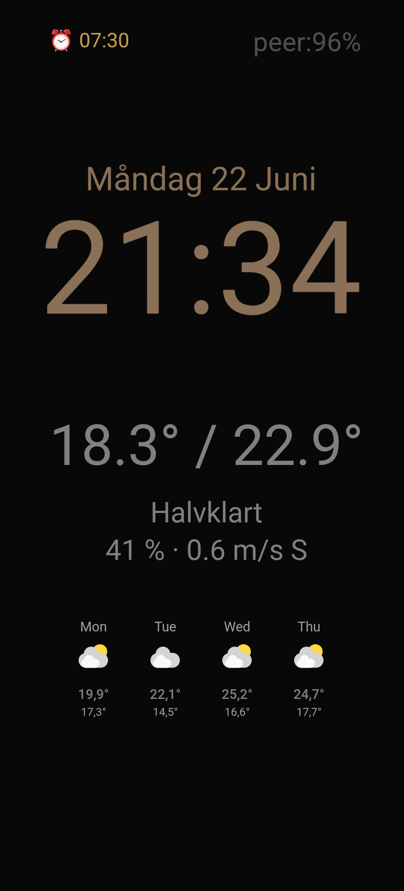
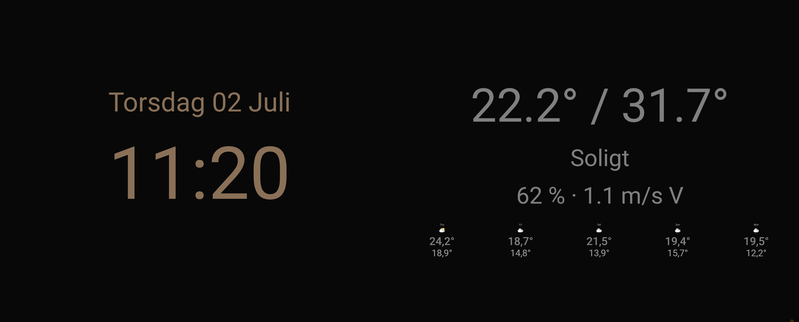

# Screensaver: Wall-Panel Display for Home Assistant

Transforms Android tablets and phones into always-on information displays. Shows time, weather, and forecast in a clean, minimal layout optimized for wall mounting. Screensaver behaviour is driven by Tasker and Fully Kiosk Browser — activates automatically when the device is idle or charging, exits cleanly on interaction.

---

## TL;DR – Quick Start

This project consists of two parts:
1. A **Home Assistant dashboard** (visual screensaver)
2. **Android automation** (to make it behave like a real screensaver)
3. Optional: extend with the **[Triangulation project](../triangulation/README.md)** for location-aware behaviour (show different content depending on which room the tablet is in).

### Minimal Working Setup (Dashboard Only)

This gives you a static, manually managed/always-on dashboard in Fully Kiosk:

1. **Register the dashboards in Home Assistant**
   - Add this to your `configuration.yaml`:
     ```yaml
     lovelace:
       dashboards:
         dashboard-screensaver:  # Main display: https://your-ha-url/dashboard-screensaver
           mode: yaml
           filename: dashboards/screensaver.yaml
           title: Screensaver
           icon: mdi:monitor-dashboard
           show_in_sidebar: true
     ```
   - Register `dashboard-bt-triangulation` as well **only if you also install the triangulation
     package** — a dashboard entry whose file is missing appears in the sidebar and errors when
     opened. Its own README covers that setup.
   - **Main screensaver:** Accessible at `https://your-ha-url/dashboard-screensaver/home?kiosk`
     - Use `?kiosk` parameter to hide sidebar/header for clean display


2. **Copy the dashboard**
   - Import `dashboards/screensaver.yaml` into your `dashboards/` directory.

3. **Copy package files to packages/ directory**
   - Copy `screensaver_settings.yaml` and `screensaver_local.yaml` into your
     `packages/screensaver/` directory — the first ships as-is, the second holds the
     local/customizable sensors, automations and entity mappings
   - See the Triangulation project README for location detection package setup

   ⚠️ **The clock needs `sensor.time`, which Home Assistant does not provide by default.** The
   display reads `states['sensor.time']`, so without this the largest element on the screen is
   simply blank — no error, nothing in the log. Add the `time_date` platform anywhere in your
   configuration; a `packages/common.yaml` of your own is a good home for it, since other packages
   tend to want the same sensor:

   ```yaml
   sensor:
     - platform: time_date
       display_options:
         - 'time'
         - 'date'
   ```

   Only `sensor.time` is read by the display — the date line is computed in the browser from its
   own clock. `date` is included above because it costs nothing and other packages commonly want it.

4. **Add packages directive to configuration.yaml**
   - If not already present, add this to your `configuration.yaml`:
     ```yaml
     homeassistant:
       packages:
         !include_dir_named packages/
     ```
   - This enables Home Assistant to load YAML files from the `packages/` directory

5. **Customize screensaver_local.yaml for your setup**
   - Replace entity IDs with your local sensor/device names
   - Update weather entity, temperature sensors, tap action mappings
   - See **"Customization & Local Adaptation"** section below for detailed guidance

6. **Install required HACS components**

   **HACS itself is a prerequisite** — it is not part of Home Assistant and has to be installed
   first; see [hacs.xyz](https://hacs.xyz) for its own instructions. Once it is in place, HACS
   opens from the **sidebar**.

   The screensaver is deliberately built from few components — the whole display is button-card
   and CSS. All four are required:

   - `button-card` — every element on the display: clock, weather, temperature, tap targets
   - `decluttering-card` — the card template each display element is stamped from
   - `card-mod` — CSS styling, including the portrait/landscape layout switch
   - `browser-mod` — supplies the Browser ID that makes tap actions device-aware

   ⚠️ **`browser-mod` needs a second step the others do not.** It is an integration as well as a
   card, so after installing it from HACS you must also add it under **Settings → Devices &
   Services → Add Integration → Browser Mod**, and restart if prompted. Skipping it fails quietly:
   the display renders, but every device reports the same identity and tap routing goes to the
   wrong room.

➡️ At this point, the screensaver dashboard itself works.

---

### Kiosk Behavior (Recommended)

To achieve **automatic activation, clean exit, and device-aware behavior**, additional Android automation is required:

7. **Install additional HACS component**
   - `kiosk-mode` — Chrome removal and edge case handling for Fully Kiosk

8. **Install Fully Kiosk Browser**
   - Required for REST API access and reliable kiosk-mode operation
   - PLUS or Pro version needed for Remote Admin functionality

9. **Configure Fully Kiosk Browser URL**
   - In Fully Kiosk settings, set the **Start URL** to:
     ```
     https://your-ha-url/dashboard-screensaver/home?kiosk
     ```
   - The `?kiosk` parameter hides Home Assistant chrome for a pure screensaver appearance
   - Enable **Keep Screen On** in FKB settings

   **Which URL: local vs. remote — decide based on where the phone charges**

   `http://192.168.x.x:8123/...` only works on your home network. If a phone charges *away* from home (e.g. wireless charging in a car) and the screensaver profile fires there, the local URL leaves FKB stuck on a "Loading..." screen.

   There are two ways to handle this — pick one:

   - **Recommended for phones — keep the local URL and gate the screensaver to home WiFi.** The screensaver is tailored for home use (home weather, alarm, and location-aware music scenarios that need home Bluetooth beacons); away from home its location logic resolves to `unknown` and the music control is meaningless. So restrict the phone's screensaver Tasker profile to fire only on home WiFi (see the Tasker step below). It then never launches away, the local URL is all you need, it loads faster, and — importantly — the FKB Browser ID stays **stable** (see the per-origin note below).

   - **Alternative — use your Nabu Casa / remote URL** so the screensaver loads both at home and away:
     ```
     https://xxxxx.ui.nabu.casa/dashboard-screensaver/home?kiosk
     ```
     Choose this only if you genuinely want the full home screensaver to appear away from home.

   > ⚠️ **Per-origin gotcha — pick ONE URL and stick with it.** The HA login *and* the Browser Mod Browser ID are stored per *origin* (scheme + host + port), so `http://192.168.1.41:8123` and `https://…nabu.casa` are different origins. Switching FKB between them logs it out and gives it a *different* Browser ID — which breaks any tap-action / scenario logic that keys on the id (it comes up as an anonymous `browser_mod_*` id instead of e.g. `my_phone_fkb`). Do the login and Browser-ID naming once, on whichever origin you commit to.

   **This does not interfere with the HA Companion App.** FKB and the Companion App are separate browsers with separate Browser IDs (e.g. `my_phone_fkb` vs `my_phone`). Each registers independently in Browser Mod and behaves independently — kiosk mode in FKB has no effect on the Companion App.

10. **Install Tasker on the Android device**
   - Used to detect display timeout, charging state, and app activity

11. **Configure Fully Kiosk Remote Admin**
   - Enable Remote Admin
   - Set a password
   - Allow local REST API access (`localhost:2323`)

12. **Create Tasker profiles**
   - **Tablet:** Launch screensaver on *Display Off*
   - **Phone:** Launch screensaver on *Display Off + Wireless Charging*
     - **Restrict to home** (if the phone also charges away, e.g. in a car): add a **State → Net → WiFi Connected** context so the profile fires only on your home network. Enter your home SSID in the field; if you have several home SSIDs sharing a prefix, use a wildcard (e.g. `p2r-*`), or list them separated by `/`. This keeps the home-tailored screensaver from launching away from home and lets you use the local Start URL (stable Browser ID). Alternatively, gate on reachability of the HA server IP for a name-independent "am I home" check.
   - **Exit handling:** Use Fully Kiosk REST API to cleanly exit screensaver

13. **Reference configuration examples** (Recommended) — all three are in `screensaver/docs/`
   - `docs/fully-export.json` — Fully Kiosk Browser exported configuration (import via FKB settings)
   - `docs/tasker-mobile.xml` — Tasker profiles for the phone (wireless-charging activation + BT scan; import via Tasker)
   - `docs/tasker-kitchentablet.xml` — Tasker profiles for the kitchen tablet (always-on activation; import via Tasker)

➡️ This is what turns the dashboard into a *true screensaver* rather than a static wall display.
➡️ If you are not interested in Android automation, you can still use the dashboard as a clean, always-on wall display.

---

## What You Get



Time, date, temperature, weather, and 5-day forecast in a clean, minimalist layout optimized for wall mounting. If an alarm is set on the device, the next alarm time appears at the top. If the device exposes a battery level sensor, its charge level is shown at the top right, combined with the detected charger location as `location:84%` (reliable on phones; on kiosk tablets the native battery sensor can be intermittent — see Battery Management). Anti-burn-in animations run continuously at imperceptible speeds to protect OLED/LCD panels.

---

## Customization & Local Adaptation

The screensaver ships two package files — one generic, one you adapt — plus one Home Assistant
sensor you configure yourself:

## Package Structure

### `screensaver_settings.yaml` (Generic)
Ships as-is:
- **`input_select.screensaver_locale`** — date and alarm-time format; see *Locale Configuration*

**You should NOT need to edit this file**, beyond adding a locale to the options list.

### `sensor.time` (configured by you, not shipped)
The clock reads `states['sensor.time']`. It comes from the built-in `time_date` platform, which is
not enabled by default — see the ⚠️ note in installation step 3 for the four lines that provide it.

### `screensaver_local.yaml` (Local / Customizable)
Contains sensors and automations specific to your setup that you will adapt:
- **Temperature sensor** — Reads from your local temperature sensors (currently: `garage_framsidan`, `relax_baksidan`)
- **Weather sensor** — Reads your weather entity and maps conditions to local language (currently: Swedish translations)
- **Humidity & Wind sensors** — Read from local weather stations
- **Tap action scripts** — Define what happens when you tap/double-tap/hold the screensaver:
  - Single tap: Randomize music in the detected scenario
  - Double tap: Toggle scenario (on/off)
  - Hold: Show volume control popup
- **Battery management** — Keeps kitchen tablet battery between 20-80% (currently: hardcoded for `koksplatta`)

**You MUST adapt this file for your setup:**
1. **Temperature sensors:** Replace entity IDs to match your local sensors
2. **Weather entity:** Change `weather.forecast_home` to your weather integration entity ID
3. **Humidity & wind sensors:** Update to your local weather station entities
4. **Tap actions:** Modify scenario names, time thresholds, and device mappings to match your setup — **or remove them; they require two other packages, see below**
5. **Battery automation:** Customize or remove if not using kitchen tablet

⚠️ **The shipped tap actions depend on the MusicCast and Triangulation packages.** They are the
worked example from one real house, not a self-contained feature:

| What it needs | From | Used for |
|---|---|---|
| `script.musiccast_scenario_toggle`, `script.musiccast_scenario_mixer`, `script.musiccast_adjust_volume` | MusicCast | the three tap gestures |
| `sensor.musiccast_scenarios`, `input_text.musiccast_active_scenario` | MusicCast | deciding which scenario a tap applies to |
| `input_text.bt_device_charger_locations`, `sensor.dashboard_logic_config` | Triangulation | routing the tap to the room the device is charging in |

The gestures in `dashboards/screensaver.yaml` call three local wrapper scripts —
`script.screensaver_tap`, `script.screensaver_double_tap` and `script.screensaver_hold`
(`screensaver_local.yaml`) — and it is those wrappers, together with
`script.screensaver_resolve_scenario`, that reach into MusicCast and Triangulation.

**If you want only the wall display,** empty the three wrapper scripts of their MusicCast calls, or
delete them along with the `tap_action` / `double_tap_action` / `hold_action` blocks in the
dashboard. Everything else — clock, weather, temperature, battery — works on its own. Leaving them
calling scripts you have not installed is the one thing not to do: HA resolves a missing script to
nothing, so the taps fail silently and it looks like a broken display rather than a missing package.

## How to Adapt

1. **Edit `screensaver_local.yaml`** for your environment:
   - Keep the structure (template sensors, scripts, automations)
   - Replace entity IDs with your local sensor/device names
   - Adjust time thresholds (e.g., morning is 05:00-10:00, kitchen midday is 10:00-17:00)
   - Add/remove devices from the tap action device mappings

2. **Edit dashboard JavaScript** in `dashboards/screensaver.yaml` if:
   - Your browser_id values differ from examples (e.g., not using FKB suffix)
   - You want to customize tap action behavior

3. **Location detection** is handled by the Triangulation package. See the Triangulation project README for setup and configuration.

4. **`sensor.time`** — enable the `time_date` platform if you have not already (installation step 3).
   The clock is blank without it.
   - If you already have a common/shared package file, add the four lines there rather than
     creating a new one

---

# Use Cases

### Kitchen Tablet

I have a tablet permanently mounted on the kitchen wall. Most of the time it simply shows the time and weather.

When I enter the kitchen in the morning, I'll often tap it to start some audio — usually the news. Later in the day it might be music while cooking or during dinner. When cooking, I unlock the tablet and open the app I need: recipes, thermometers, or other cooking apps.

When I'm done, I close the cooking app (or leave it idling) and let the screensaver take over again.


### Phone

The phone behaves similarly when it's placed on a wireless charger. While docked, it shows the time, next alarm, and weather. I can glance at it without picking it up, and the phone remains locked.

I can also tap it to start audio — news in the morning, instrumental background while working, or something calmer in the evening.

When I pick it up, the screensaver goes away immediately and the phone behaves normally.

---

## Wall-Mounted Tablet Setup

### How It Works

1. **Idle State (Display Off after configurable timeout):**
   - When no cooking app is running, the tablet's screen turns off after your configured display timeout (e.g., 15-30 seconds)
   - Tasker detects the "Display Off" event
   - Tasker immediately turns the display back on
   - Tasker forces Fully Kiosk Browser to the foreground
   - The screensaver dashboard appears on the wall

2. **Active State (Display stays on):**
   - When an app (e.g., recipe, music, or other application) starts, Tasker detects it
   - Tasker instructs Android to keep the display on for 1 hour
   - The app runs normally without interruption
   - Fully Kiosk remains in the background but available

3. **Return to Screensaver:**
   - When the app closes, the 1-hour timeout expires
   - The display turns off again after the remaining timeout period
   - Tasker's "Display Off" trigger fires, restarting the screensaver cycle

### Why This Approach?

- **No software conflicts:** Using Android's system timeout avoids the interface-locking issue with Fully's screensaver
- **Seamless switching:** The tablet automatically transitions between display modes without user intervention
- **Reliable:** Tasker's trigger-action system is stable and responsive
- **No root access required:** Uses only standard Android APIs and publicly available automation tools

### Critical: Tablet Charging State Handling

⚠️ **Important:** Unlike phones, the tablet screensaver should **NOT** check charging state when launching Fully Kiosk.

**Why?** The tablet is always connected to AC power (with the battery protection automation controlling charge cycles via a smart plug). If you add a charging state condition to the screensaver trigger, the screensaver will fail to launch whenever the charger is temporarily disconnected (e.g., during a power cycle or battery protection adjustment).

**Configuration rule:** Set the screensaver to launch whenever the display times out—without any charging conditions. Only phones need charging state checks.

### Tasker: The Invisible Brain

While Fully Kiosk handles the visual display, Tasker manages system-level events and transitions:

**Key Tasker Profiles:**

- **Force Dashboard:** Ensures Fully Kiosk always comes to the foreground when the display turns on
- **Dynamic Timeout Management:**
  - Detects when applications become active
  - Sets Android timeout to 1 hour (keeps screen on during active use)
  - Monitors for app closure
  - Returns timeout to 15-30 seconds (allows display to turn off for screensaver)

This automation is transparent to the user—the tablet simply appears to transition between "wall display mode" and "active app mode" seamlessly.

---

## Mobile Phone Setup

### Architecture Difference: Charging-Conditional Activation

On a mobile phone, the screensaver should only activate when the device is on a **wireless charger** (not every time the display times out). This prevents the screensaver from interrupting normal phone use while allowing it to display when the phone is docked.
ALso, by using wireless charging as the trigger, the phone does not trigger the screensaver when connected to a powerbank. 
Conditions can of course be adjusted to more spcific needs, eg based on geolocation, SSID, etc.

### Key Difference from Tablet

| Device | Trigger | Behavior |
|--------|---------|----------|
| **Tablet** | Display Off | Always launch screensaver |
| **Phone** | Display Off + Wireless Charging | Launch screensaver only while charging |

### Tasker Configuration for Mobile

Two Tasker profiles work together to implement charging-conditional activation:

#### Profile 1: "Display Off => FKB + BT Scan"

**Type:** Event profile

**Trigger:**
- Event: Display → Display Off
- Condition: State → Power → Wireless (charging state)
- *Optional:* Condition: State → Net → WiFi Connected (restrict to home — see [Restricting Activation to Home WiFi](#restricting-activation-to-home-wifi-phones-that-also-charge-away) below)

**Entry Task:** Calls a master "Docked" task that orchestrates both screensaver launch and Bluetooth scanning asynchronously. The master task executes:
1. **UI Task (Start FKB):** Standard priority → launches screensaver immediately
2. **Wait 1 second** → gives the screensaver launch a head start before the scan starts competing for resources
3. **BT Scan Task:** Lower priority (%priority - 1) → detects charger location in background (5+ seconds)

By using asynchronous execution, the screensaver appears the moment the phone touches the charger, while location detection runs silently in the background.

**Exit Task:** None (events don't have exits)

**Purpose:** When the display times out while the phone is on a wireless charger, immediately turn the display back on and show the screensaver.

#### Profile 2: "Wireless Charging Exit Handler"

**Type:** State profile

**Trigger:** State → Power → Wireless (active)

**Entry Task:** Empty

**Exit Task:** a named, reusable task — **"Charger Disconnected"** — that performs the full teardown:
```
1. Stop the "BT Scan" task (kills a scan still in flight)
2. Go Home
3. HTTP Request: http://localhost:2323/?cmd=exitApp&password=YOUR_PASSWORD
   (Continue Task After Error: ON — fails silently if Fully Kiosk isn't running)
4. Send the phone_charger_disconnect webhook (clears the stored charger location in HA)
```

**Purpose:** When the phone is removed from the wireless charger, the exit task cleanly shuts down Fully Kiosk and clears the HA-side charger location. As a consequence, the home screen or lock screen automatically appears. Keep this task **named** — Profile 3 below reuses it.

### Why Two Profiles with Asynchronous Execution?

In Tasker, **event profiles don't have exit tasks**—they only detect when an event occurs. To properly handle both "entering charging mode" and "exiting charging mode," we need two profiles. Additionally, sequential task execution would block the screensaver launch while the 5-second Bluetooth scan runs, causing noticeable lag. The solution uses asynchronous task execution: the master "Docked" task launches both UI and data tasks with different priorities, allowing the screensaver to appear immediately while the scan runs in the background.

**Result:** Zero UI lag, complete charging lifecycle, and location detection without blocking.

### Restricting Activation to Home WiFi (phones that also charge away)

The screensaver is tailored for **home** use: it shows home weather and alarm, and its music-scenario logic depends on home Bluetooth beacons (location detection). If the phone also wireless-charges away from home — for example in a car — Profile 1 would otherwise fire there too, launching a home dashboard whose location resolves to `unknown` and whose music controls do nothing. It would also force you onto a remote (Nabu Casa) Start URL just to make that dashboard load where it isn't useful.

The fix is to add a **home-WiFi condition** to Profile 1 so it only ever activates at home. Then you can keep the **local** Start URL (`http://192.168.1.41:8123/...`), which loads faster and keeps a stable Browser ID (see the per-origin note in the setup steps).

**Step-by-step:**

1. Open **Tasker** → **Profiles** tab.
2. Long-press the **"Display Off => FKB + BT Scan"** profile → **Add** (a context).
3. Choose **State** → **Net** → **WiFi Connected**.
4. In the **SSID** field, enter the network(s) that mean "home":
   - **Shared prefix (recommended):** if all your home access points / mesh nodes share a prefix, use a wildcard — e.g. `p2r-*` matches `p2r-2G`, `p2r-5G`, `p2r-guest`, every node, and nothing elsewhere. New APs are covered automatically as long as they keep the prefix.
   - **Explicit list:** enter each SSID separated by a forward slash, e.g. `HomeNet-2G/HomeNet-5G`.
   - Leave **MAC** and **IP** blank.
5. Press **back** to save. The profile now shows **three** contexts (Display Off event + Wireless state + WiFi Connected state), all combined with **AND** — so it fires only when the display turns off *while wireless-charging on home WiFi*.
6. **Grant the permission Tasker needs to read the SSID.** On Android 8+ the WiFi Connected context can only see the SSID if Tasker has **Location permission** *and* **Location services are turned on** (system-wide). If the context never matches at home, this is almost always why: Android → Settings → Apps → Tasker → Permissions → **Location = Allow all the time**, and toggle Location services on.

**Test it:**
- Dock at home on WiFi → screensaver launches as before.
- Turn WiFi off (or dock in the car) → docking no longer launches the screensaver; the phone shows its normal charging / lock screen.

**Alternative — reachability check (name-independent):** instead of SSID matching, gate on whether the HA server is reachable. Replace the WiFi condition with a **State → Variable** condition driven by a small task that does an **HTTP Get** to `http://192.168.1.41:8123/` (the Manifest or any lightweight path) with a short timeout, setting a flag variable on success. This matches "actually on the home LAN" regardless of SSID names, mesh, or even a wired dock — at the cost of a little more setup than the one-field wildcard.

#### Profile 3: "Home WiFi Exit Handler" (companion to the home-WiFi gating)

**Type:** State profile — active only while **both** states hold

**Contexts:**
- State → Net → **WiFi Connected**, SSID = your home pattern (e.g. `p2r-*`) — identical to the Profile 1 gating context
- State → Power → **Wireless**

**Entry Task:** none (empty)

**Exit Task:** the same **"Charger Disconnected"** task Profile 2 uses — no new task needed

**Purpose:** the launch gating above cannot distinguish "docked at home" from "docked in a car on the driveway" — the WiFi looks identical, so the screensaver still launches there. Without this profile, driving off would leave Fully Kiosk stuck showing a stale, unreachable local dashboard for the whole drive, because Profile 2 only exits when charging *stops*. This profile is active only while *docked on home WiFi*; the moment that combined state ends — home WiFi lost while still charging — the exit task closes Fully Kiosk and (if your webhooks use the remote-domain URL) clears the stored charger location over cellular.

**In practice, a car with wireless Android Auto defuses the scenario by itself:** the car's own WiFi comes up with the ignition — the same moment the charging pad powers on — and the phone hops onto it, leaving home WiFi before the launch conditions can line up. The launch gating alone then blocks the car case, and this profile serves as a **safety net** for what remains: the brief window before the phone switches networks, WiFi-less vehicles or chargers used within home WiFi range, and home-WiFi outages while docked (Fully Kiosk closes cleanly instead of sitting on a frozen dashboard, self-healing when WiFi returns).

**Why the Power → Wireless context is essential:** with the WiFi context alone, every WiFi loss while simply *using* the phone (walking out the front door) would run the exit task — whose **Go Home** action would yank you out of whatever app you're in. With both contexts, WiFi loss while not charging fires nothing, because the profile was never active.

**Self-healing at home:** a momentary WiFi blip while docked closes the screensaver; the next display timeout (still charging, WiFi restored) relaunches it with a fresh location scan.

**Undock overlap (harmless):** removing the phone from the charger at home deactivates both Profile 2 and this profile, so "Charger Disconnected" may run twice — the second exit call fails silently (Continue After Error), and Go Home / the webhook are idempotent.

**Testing gotcha:** a State profile only becomes *active* on a context **transition** to true. If you create or edit this profile while the phone is already docked on home WiFi, both states are already true, the profile stays inactive, and the exit will never fire — a test right then falsely fails. Undock and redock once after any context edit, then test.

### Fully Kiosk Configuration for Mobile

**FKB Settings (OnePlus 13 as example):**
- **Keep Screen On:** Enabled (essential) — Prevents display timeout while screensaver is active on the charger. Without this, the screensaver will blank the screen during inactivity.
- **Unlock Screen:** Enabled (essential) — **Absolutely required** to display the screensaver dashboard over the phone's lockscreen. This is what allows the kiosk interface to appear without unlocking the device. Corresponds to `forceScreenUnlock: true` in FKB JSON configuration.
- **Device Admin:** Disabled (not needed for charging-based activation)
- **Background Restrictions:** "Begränsa bakgrund" (restricted) — Allows Android to manage FKB lifecycle naturally

### Tested Scenarios (All Passed ✓)

| Scenario | Expected Behavior | Result |
|----------|-------------------|--------|
| Locked → Place on Charger | FKB shows over lockscreen | ✓ Works |
| Unlocked → Charger → Timeout | Display times out, FKB shows, phone locks | ✓ Works |
| Pick up while screensaver active | FKB closes, phone stays locked | ✓ Works |
| Unlock while charging → Timeout | FKB reappears after inactivity | ✓ Works |
| Unlock while charging → Pick up | FKB closes, phone stays unlocked | ✓ Works |

### Lock State Behavior

When the screensaver is active (phone on charger), the phone **remains locked**. Users must swipe to reveal the lockscreen, then unlock to access phone functions. This maintains security while showing the dashboard.

### Configuration File Examples

This project includes exported configuration files to simplify setup on your devices:

**1. Fully Kiosk Browser Configuration**
- **File:** `docs/fully-export.json`
- **Purpose:** Pre-configured FKB settings including Remote Admin, Keep Screen On, Unlock Screen, and start URL
- **How to import:**
  1. Open Fully Kiosk Browser
  2. Navigate to **Settings → Advanced → Import/Export**
  3. Select **Import configuration from file**
  4. Choose `fully-export.json`
  5. Adjust the start URL if your Home Assistant instance is at a different address
- **What it includes:** Remote Admin enabled, Keep Screen On, Unlock Screen, Display Control, Background Restrictions

**2. Tasker Profiles**

Two separate Tasker exports are provided for device-specific configurations:

**For Mobile Phones:**
- **File:** `docs/tasker-mobile.xml`
- **Purpose:** Ready-to-import Tasker profiles optimized for wireless charging activation and BT location detection
- **How to import:**
  1. Open Tasker
  2. Go to **Profiles tab**
  3. Long-press anywhere, select **Import**
  4. Choose `tasker-mobile.xml`
  5. Review all imported profiles and tasks
- **Includes:**
  - **"Charging" profile:** Detects wireless charging state (triggers BT scan and screensaver launch)
  - **"Display Off => FKB" profile:** Display timeout handling and Fully Kiosk management
  - **"Charger Disconnected" task:** Explicit exit process management - stops BT scan, clears FKB, sends power-disconnect webhook to HA
  - **"BT Scan" task:** Performs Bluetooth scan of anchor devices, builds JSON payload, sends to HA webhook (unless interrupted by Task Stop when device removed from charger)
- **Not included (optional, add manually):** the home-WiFi additions for phones that also charge away from home — the WiFi Connected gating context on the launch profile and the "Home WiFi Exit Handler" profile (Profile 3). Both are quick to add in Tasker's UI; see "Restricting Activation to Home WiFi" and "Profile 3" above.
- **Charger Location Detection Features (Multi-Device Support):**
  - Automatically detects which charger location the device is placed on via Bluetooth anchor triangulation
  - Sends `browser_id` parameter to HA for device-specific location storage
  - Supports multiple devices with independent location tracking (each device's location stored separately in JSON mapping)
  - Automatically clears location when device removed from charger
- **Configuration required before importing:**
  - Replace `[YOUR_HA_IP]` with your actual Home Assistant IP address in all HTTP POST actions
  - Verify your Home Assistant instance is accessible from the phone on the local network
  - FKB Remote Admin password must match the password set in Fully Kiosk settings
- **Exit process (undocking):**
  - Task Stop immediately kills the BT scan, preventing ghost docking data after removal
  - Exit webhook (power_disconnected) guaranteed to be final message to HA
  - FKB closes and device returns to home screen
  - Location automatically cleared in HA for this device
- **Device-specific setup:**
  - Keep profiles as-is (charging-conditional activation)
  - Test BT scan on each charger location to verify location detection
  - Verify exit task properly cleans up FKB and returns to home screen

**For Wall-Mounted Tablets:**
- **File:** `docs/tasker-kitchentablet.xml`
- **Purpose:** Ready-to-import Tasker profiles optimized for always-on screensaver activation
- **How to import:**
  1. Open Tasker
  2. Go to **Profiles tab**
  3. Long-press anywhere, select **Import**
  4. Choose `tasker-kitchentablet.xml`
  5. Review all imported profiles
- **Includes:**
  - Display Off trigger (no charging conditions)
  - App detection for cooking apps (Recipe Keeper, Weber iGrill, MEATER)
  - Timeout management: 30 seconds (idle) and 60 minutes (active app)
  - Fully Kiosk lifecycle management
- **Device-specific setup:**
  - Profiles are already configured for tablet use (Display Off trigger alone)
  - Update app package names if using different cooking apps
  - Adjust timeout values (currently 30s idle, 60 min active) if needed

**Important:** After importing either file, verify that device-specific settings (URLs, passwords, device names) match your environment before enabling. Replace placeholder values like `YOUR_REMOTE_ADMIN_PASSWORD` with your actual Fully Kiosk Remote Admin password.

### Advanced: Tasker Location Detection (Charger-Based)

For homes with multiple wireless chargers in different rooms, the screensaver can detect which charger the phone is on and adjust behavior accordingly (e.g., show different scenarios, scenarios, or media based on location).

#### How Location Detection Works

When the phone detects power (charger connected), Tasker performs a brief **Bluetooth scan** to identify which nearby "anchor" device (eg BT speakers or plugs) has the strongest signal. 
The data is sent to Home Assistant, which analyses the signals and maps it to a location that can be used for screensaver logic.
Debug output from Bluetooth RSSI analysis is currently logged to **Home Assistant system logs**.

**Why Bluetooth instead of WiFi/GPS?**
- **Bluetooth RSSI** is stable and accurate when the phone is physically stationary on the charger
- No continuous scanning needed (battery efficient—only 5 seconds on power connect)
- Works even while phone is locked (Tasker has system-level permissions)
- Uses existing hardware (no new sensors required)

#### Scan Data Storage: Why Transient (In-Memory) Only

The Bluetooth scan data received from Tasker is **stored in memory only** and is **not persisted to disk**. This is an intentional design decision based on the following rationale:

**Why Transient Storage?**

1. **Data Nature:** The BT scan data is inherently transient:
   - Captured only when the phone docks on a charger (typically 1-2× daily)
   - Contains real-time Bluetooth signal strengths that change over time
   - Not needed after location detection is complete (only 100-200 ms of processing)
   - Does not need to survive Home Assistant restarts

2. **Eliminates SD Card Write Wear:**
   - File-based storage would write to disk on every webhook trigger
   - SD cards have limited write cycles (~100,000 cycles per cell)
   - Unnecessary writes accelerate card degradation
   - In-memory storage eliminates this issue entirely

3. **Architecture Simplicity:**
   - Uses Home Assistant's webhook-triggered template sensors (native feature)
   - No file I/O, shell scripts, or complex persistence logic needed
   - Scan data flows: Tasker webhook → template sensor attributes → dashboard
   - Backward compatible with all existing scripts and dashboards

4. **Performance:**
   - Memory access is faster than disk I/O
   - No file system latency or timeout issues
   - Webhook data captured immediately and available to scripts

**Technical Implementation:**

- **Template Sensor:** `sensor.bt_latest_scan_full` (webhook-triggered)
- **Storage:** Sensor attributes (16KB+ capacity, no 255-char state limit)
- **Data Access:** `state_attr('sensor.bt_latest_scan_full', 'devices')` returns the device array
- **Lifecycle:** Populated on webhook trigger, clears on HA restart (acceptable for transient data)

**What About Dashboard Display?**

The latest scan is visible in the triangulation dashboard (`/dashboard-bt-triangulation`) under "Latest BT Scan" card, showing:
- All beacons detected in the current scan
- RSSI values and device names
- Weak signal indicators (italic + faded)
- Globally ignored beacons (strikethrough)

This is updated automatically when Tasker sends a new scan.

**For Persistent Data (Fingerprints):**

If you need data that survives Home Assistant restarts, the system uses **file-based storage with sensor attributes**:
- Fingerprints: stored in `/config/packages/triangulation/data/bt_fingerprints.json`
- Accessed via: `state_attr('sensor.bt_fingerprint_database_file', 'fingerprints')`
- Read on HA startup and whenever referenced

This pattern separates transient operational data (scans) from persistent configuration data (fingerprints), each using the most appropriate storage strategy.

#### Prerequisites

This feature requires:
1. **Tasker** with elevated Bluetooth permissions (via ADB)
2. **OxygenOS security settings** adjusted to allow background scanning
3. **Home Assistant webhook** to receive location data
4. **Anchor devices** in each room: Blutooth beacons like MusiCast speakers or Shelly Plug with Bluetooth enabled, but more or less any powered on BT device can be used.

#### Tasker Task Configuration: "Send BT Raw Data"

This task acts as the data collector, transforming raw Bluetooth signals into JSON for Home Assistant.

**Action 1: Bluetooth Info**
- **Category:** `Net` → `Bluetooth Info`
- **Type:** `Scan Devices`
- **Timeout (Seconds):** `5`
- **Purpose:** Triggers a fresh BT scan. Populates Tasker's local arrays (`%bt_address()`, `%bt_name()`, `%bt_signal_strength()`) with current data from Shellys and MusicCast speakers.

**Action 2: JavaScriptlet**
- **Category:** `Code` → `JavaScriptlet`
- **Code:**
```javascript
var devices = [];
for (var i = 0; i < bt_address.length; i++) {
    devices.push({
        mac: bt_address[i],
        name: bt_name[i],
        rssi: parseInt(bt_signal_strength[i])
    });
}
var payload = JSON.stringify({ devices: devices });
```
- **Purpose:** Converts Tasker's internal variables into a structured JSON object. Loops through discovered devices, pairing MAC address, name, and signal strength (RSSI).

**Action 3: HTTP Request**
- **Category:** `Net` → `HTTP Request`
- **Method:** `POST`
- **URL:** `http://[YOUR_HA_IP]:8123/api/webhook/phone_charger_bt`
- **Headers:** `Content-Type:application/json`
- **Body:** `%payload`
- **Purpose:** Transmits the JSON to Home Assistant webhook.

  **The local IP is the right default.** It works on every HA install with no extra setup, and with the screensaver gated to home WiFi (see "Restricting Activation to Home WiFi") the BT scan only ever fires at home anyway.

  **Use your remote domain instead if webhooks must fire away from home.** This applies if you *don't* gate to home WiFi, or you charge the phone away and want the disconnect webhook to still clear the stored location (e.g. dock at home → drive off while charging → undock in the car: with a local-IP URL that disconnect call fails silently and the stale location persists until the next home scan). Note the modest stakes: the next docking's fresh scan overwrites the stale entry anyway, so the worst case is a few seconds of stale scenario content while that scan completes — weigh that against the setup cost before bothering with remote access. It requires remote access (Nabu Casa or a custom domain with HTTPS) — replace the URL with `https://[YOUR_HA_DOMAIN]/api/webhook/...` — **and** enabling remote webhook access in HA, since HA rejects webhook requests arriving via remote access by default. Add `local_only: false` to both webhook triggers in `bt_triangulation.yaml`:
  ```yaml
  - platform: webhook
    webhook_id: phone_charger_bt
    allowed_methods:
      - POST
      - PUT
    local_only: false
  ```
  ```yaml
  - trigger: webhook
    webhook_id: phone_charger_disconnect
    local_only: false
  ```
  The disconnect webhook clears the stored location when the phone is removed from the charger. Without `local_only: false`, it never fires via remote access, and the stale location persists into the next docking session. (Harmless to leave enabled even if you later switch back to local URLs.)

**Action 4: Flash (Optional Verification)**
- **Category:** `Alert` → `Flash`
- **Text:** `Sent: %payload`
- **Long:** `Checked`
- **Purpose:** Provides visual confirmation that data was captured and sent successfully. Use for debugging.

#### Tasker Profile: Power Trigger

**Profile Name:** `"Phone Charging - BT Scan"`

**Trigger Type:** `State` profile
- **Trigger:** `State` → `Power` → `Source: Any` (detects charger connection)
- **Entry Task:** Link to "Send BT Raw Data" task above
- **Exit Task:** None (optional: could reset location to "unknown" when unplugged)

Note: the task can (should?) be embedded in the profile that starts the screensaver as the last task after launching Fully Kiosk Browser.

#### Home Assistant Setup (Webhook Receiver & Triangulation)

The Bluetooth triangulation system is fully documented as a standalone system with its own setup guide. See **the Triangulation project README** for complete instructions on:
- Configuring location names
- Capturing fingerprints
- Verifying detection
- Refining beacon selection
- Advanced algorithm tuning

**Quick summary:** The system sends location data to `input_text.bt_device_charger_locations`, which the screensaver can use for location-aware logic via tap action scripts — and other, possibly automated, actions (e.g. starting a scenario automatically when the phone is detected in a given room). Full end-to-end setup (including Tasker configuration, HACS components, and fingerprint workflow) is documented in the triangulation README.

---

## Desktop / Landscape Display

In addition to portrait wall tablets and phones, the screensaver also runs on **wide / landscape screens** such as a desktop PC monitor. The layout adapts automatically — no separate dashboard and no device-rotation handling.



**How it adapts**
- **Portrait (phones, tablets):** the original single-column stack (date, time, temperature, conditions, forecast) — unchanged.
- **Wide / landscape:** a two-column layout — a **clock** (date + time) on the left, a **weather summary** (temperature, conditions, humidity/wind) on the right, with the **5-day forecast beneath the weather summary in the right column** (the left side of that row stays empty).

The switch is driven by a CSS `@media (min-aspect-ratio: …)` query, so it reflects the real window shape and re-flows automatically when the window is resized — no JavaScript or orientation polling. A *narrow* landscape window falls back to the single-column layout (the large fonts would otherwise overflow the half-width columns).

**Running it on a PC**
1. Open the kiosk URL in any browser: `https://your-ha-url/dashboard-screensaver/home?kiosk`
2. Press **F11** for full-screen. Combined with `panel: true` and `?kiosk`, you get an edge-to-edge display with no browser or HA chrome.

Device-specific fields degrade gracefully on a PC: the **alarm**, **charger location** and **battery** fields simply stay blank when there's no Companion App / charger / battery sensor for that browser — no errors. (Tap/double-tap/hold still fire the configured scripts, but with no charger location they generally do nothing on a desktop.)

**Tuning the breakpoint**

The wide layout activates when the viewport is at least 1.5× as wide as it is tall. The threshold is a single anchor near the top of `dashboards/screensaver.yaml`:
```yaml
landscape_breakpoint: &landscape_breakpoint "3/2"   # width >= 1.5x height
```
Raise it toward `16/9` to require a wider screen before switching, or lower it toward `7/5` to switch on a less-wide screen. This is a YAML value, **not** a UI helper — CSS media queries can't read a runtime `input_number`/`var()` value.

### Running it as a real (idle-activated) screensaver on Windows

The step above shows it as a manual full-screen window. To make it behave like an actual screensaver — auto-appear when the PC is idle, dismiss on input — use a **web-page screensaver** that renders the kiosk URL.

**Chosen tool:** [`muro-dot/Webview2_WebPage_Screensaver`](https://github.com/muro-dot/Webview2_WebPage_Screensaver) — a WebView2 (Edge/Chromium) `.scr` that renders the HA frontend correctly. It passed the key test: it **exits on keyboard input but passes mouse events through to the page** (so a click can still control the dashboard). A screensaver is an executable running a browser engine with your HA session, so review the source/releases before installing. (Other WebView2 options exist — avoid any that don't exit on input.)

**Setup:**
1. Install the tool and set its URL to your kiosk dashboard. Prefer the **local** URL (e.g. `http://<your-ha-ip>:8123/dashboard-screensaver/home?kiosk`) so it keeps working if your internet / remote access is down.
2. Set it as the Windows screensaver (Settings → Personalization → Lock screen → Screen saver) with an idle timeout. Make sure the **display-sleep** timeout is *longer* than the screensaver timeout, or the monitor blanks over it.

**Logging in (the keyboard-exit catch):** the screensaver webview is a fresh browser context, so it first shows the HA login — but you can't type, because any keypress exits the screensaver. Two ways around it:
- **Auto-login** via HA's `trusted_networks` auth provider (no password needed). Simple, but without a fixed IP it trusts the whole subnet — weigh the security trade-off (even a non-admin user can reach the menu / control devices; HA has no read-only user).
- **Mouse-only paste-trick** (no HA change): keyboard exits, but **mouse paste/cut still work**. Copy your **username and password joined into one string** to the clipboard; in the login form, **right-click → Paste** it into *both* fields, then **mouse-select and Cut** the wrong half out of each field (drag to select → right-click → Cut). Tick **"Keep me logged in"** so the session persists in the webview's profile. Done entirely with the mouse.

**Optional — let a mouse click control music:** muro-dot passes clicks through to the dashboard, so a click fires the tap action (see "Customizing Tap Actions"). For that to do anything, the screensaver webview needs a **known Browser Mod Browser ID** that your tap logic recognizes. Give it a clean name:
1. Temporarily point the screensaver tool at `http://<your-ha-ip>:8123/browser-mod`.
2. Trigger the screensaver; in **"This Browser → Browser ID"** set a name (mouse: triple-click the field, right-click → Paste). Turn on **Register** and **"Sync Browser ID to login session."**
3. Point the tool back at the dashboard URL, and map that Browser ID in your tap-action config.

**⚠️ Per-origin gotcha:** the HA login **and** the Browser Mod Browser ID are stored per *origin* (scheme + host + port). If you switch the URL between your remote (e.g. Nabu Casa) and local address, the webview is logged out and gets a *different* Browser ID. **Pick one URL** and do the login + Browser-ID naming on that origin.

**Tip — find an unnamed webview's Browser ID:** trigger the screensaver, leave it ~30–60 s, then dismiss it; the Browser Mod `*_browser_id` sensor whose state flips offline at that moment is the screensaver's — its connect/disconnect tracks the screensaver showing and hiding.

### Always-on wall display vs. turning the screen off

Two independent Windows idle timers run side by side: the screensaver fires at *its* timeout, but the **"Turn off display after"** and **Sleep** timers keep counting and will blank/suspend the panel regardless — that's why a running screensaver can go black after a while. They're separate settings; decide what you want:

**Always on** (e.g. a centrally-located hallway/landing wall display): set **"Turn off display"** and **Sleep** to **Never**. Whether that's safe for the panel long-term depends on the display type:
- **LCD / LED-backlit (IPS, VA)** — most desktop monitors: **no permanent burn-in.** The continuous anti-burn-in drift animations plus the near-black (`#080808`) background make leaving it on indefinitely a non-issue. **Note on light spill near a bedroom:** the dark palette does *not* dim an LCD — the backlight is always on, so `#080808` and pure `#000000` emit the same light, and a large IPS panel (e.g. Dell U3818DW) throws noticeable glow through an open door. Reduce it with the monitor's **brightness/backlight** (the actual light lever), **Windows Night Light** (shifts warm, cuts blue — easier on sleep), or turning the panel off — *not* by darkening the background color. The only reason to ever turn an LCD off is **power** (a large panel is tens of watts) or that residual light.
- **OLED**: the drift animations + dark background mitigate a lot, but OLED still ages under hours of static-ish bright content. Prefer letting it sleep after a longer idle, or use a scheduled off-window (below), rather than truly never.

**Off on a schedule** (e.g. overnight): Windows' power timers are idle-based, not clock-based, so a fixed window needs **Task Scheduler** — one task to blank the monitor at the start time (a PowerShell `SC_MONITORPOWER` "off" message, or `nircmd monitor off`) and one to wake it at the end (a 1-pixel mouse nudge, which **won't** dismiss a keyboard-exit screensaver like muro-dot). The screensaver keeps running underneath the whole time; only the panel power toggles.

---

## Customization Points

### Locale Configuration

`packages/screensaver/screensaver_settings.yaml` defines an `input_select.screensaver_locale` helper,
defaulting to `en-US`. To customize:

1. **Via UI:** Settings → Devices & Services → Helpers → *Set date format*
2. **Via YAML:** edit the `options:` list in `packages/screensaver/screensaver_settings.yaml` to add tags,
   then reload helpers (Developer Tools → YAML → Input selects). Any BCP 47 tag the browser knows
   works — the value is passed straight to the browser's `Intl` API.

The date display picks up the change on its next refresh, within a minute. Example: "Monday 04
August" for `en-US`, "måndag 04 augusti" for `sv-SE`.

⚠️ **The clock is not affected** — it stays 24-hour in every locale. See *The clock is always
24-hour, whatever the locale* under Known Limitations.

**Without the package** — a dashboard-only install — the helper does not exist, and the dashboard
falls back to the `locale` anchor near the top of `dashboards/screensaver.yaml`. Edit that value
instead.

### Adjusting Visual Hierarchy

Modify the `vw` (viewport width) values in `custom_fields` styling:
- Time: `font-size: 32vw` (increase for more prominence)
- Temperature: `font-size: 18vw` (decrease for less focus)
- Date/Climate: `font-size: 7-8vw` (adjust tertiary information size)

### Changing Color Scheme

Update the hex color values in `custom_fields`:
- `#8A7057` — Primary text color (time, date)
- `#808080` — Secondary text color (temperature, climate)
- `#080808` — Background color (near-black, deliberately *not* pure `#000000`: keeps OLED pixels faintly lit so the drifting anti-burn-in elements don't smear as they cross the background)

### Adjusting Anti-Burn-In Animation Speed

Modify the keyframe animation durations in `card_mod`:
- `drift-slow`: 240s (increase = slower animation)
- `drift-fast`: 180s (increase = slower animation)

### Configuring Date Locale

The `input_select.screensaver_locale` helper controls date and alarm-time formatting — **not the
clock**, which is always 24-hour (see Known Limitations). It ships with
eleven options — `en-US` (default), `en-GB`, `da-DK`, `de-DE`, `es-ES`, `fi-FI`, `fr-FR`, `it-IT`,
`nb-NO`, `nl-NL`, `sv-SE`.

Change it via Settings → Devices & Services → Helpers → *Set date format*. The display
picks it up on its next refresh, within a minute.

The list is only a convenience: the value goes straight to the browser's `Intl` API, so any BCP 47
tag it recognises works. Add yours to `options:` in `packages/screensaver/screensaver_settings.yaml` and
reload helpers. See *Locale Configuration* above for the dashboard-only fallback.

### Changing Sensor Sources

Replace entity references in JavaScript custom fields with your own sensors:
- Temperature sensor (currently: `sensor.screensaver_display_temperature`)
- Weather description sensor (currently: `sensor.screensaver_display_weather`)
- Humidity sensor (currently: `sensor.screensaver_display_humidity`)
- Wind speed sensor (currently: `sensor.screensaver_display_wind_speed`)
- Weather forecast entity (currently: `weather.forecast_home`)

### Customizing Tap Actions

Define the following scripts in your Home Assistant configuration to customize tap interactions:
- `script.screensaver_tap` — Called on single tap
- `script.screensaver_double_tap` — Called on double tap
- `script.screensaver_hold` — Called on long press

If these scripts don't exist, taps will be silently ignored.

### Local Implementation: screensaver_local.yaml

The `screensaver_local.yaml` package demonstrates environment-specific customization and device-aware routing:

**Core Features:**
- **Sensor aggregation:** Temperature, humidity, wind, and weather sensor setup for the screensaver display
- **Device-aware routing:** Map browser IDs to specific actions using the `scenario_map` and `action_map` pattern
- **Battery management:** Automation to maintain tablet battery in the 20-80% range using Fully Kiosk integration (tablet-specific)
- **Browser ID registration:** Documents how to register devices in Browser Mod for device-aware tap actions
- **Error handling:** Graceful fallback logging for unknown devices

Use this as a template for your own setup. The `scenario_map` and `action_map` patterns scale easily—just add new browser IDs and their corresponding actions as needed.

**Adapting for Mobile Devices:**

The same dashboard and configuration patterns work equally well for phones. To adapt `screensaver_local.yaml` for a phone:

1. Update the Tasker profiles to use the charging-conditional activation (see "Mobile Phone Setup" section above)
2. Optionally omit battery management automation (phones handle charging optimizations natively)
3. Register the phone's Browser ID in Browser Mod
4. Create a tap action map for the phone device ID alongside the tablet mappings

The Home Assistant dashboard, sensors, and scripts remain identical.

---

## Monitoring & Maintenance

### Health Checks

Regularly verify:
1. **Battery level** — Confirm it stays in the 20-80% range
2. **Display uniformity** — Look for signs of burn-in (faint ghost images)
3. **Temperature accuracy** — Verify sensors match actual conditions
4. **Animation smoothness** — Ensure drift animations are running (no static elements)

### Tasker Profile Validation

Confirm Tasker tasks are firing correctly:
- Display turns off after your configured timeout (e.g., 15-30 seconds of inactivity)
- Screensaver appears automatically
- Cooking apps can interrupt the screensaver
- Return to screensaver occurs after app closure

### Sensor Reliability

Check Home Assistant's entity registry:
- All sensor entities are reporting valid states (not "unavailable")
- Time sensor updates every minute
- Temperature sensor updates within expected intervals

---

## Known Limitations

<details>
<summary><strong>The clock is always 24-hour, whatever the locale</strong></summary>

`input_select.screensaver_locale` changes the **date** and the **alarm time**, but not the big
clock. The clock renders `sensor.time` from Home Assistant's `time_date` platform, which only ever
emits `HH:MM` — the locale never reaches it. Selecting `en-US` gives you an American date above a
24-hour time.

Fixing it means formatting the time in the browser (`toLocaleTimeString`) and keeping `sensor.time`
only as the per-minute refresh trigger. That is a small change on its own, but 12-hour locales then
render `11:47 PM` where `23:47` used to fit, and the clock is the largest element on the screen at
32vw — so the layout needs work at the same time. Not attempted yet.

</details>

<details>
<summary><strong>Landscape: narrow windows fall back to single column</strong></summary>

Landscape / wide screens are supported (see **"Desktop / Landscape Display"**). The two-column wide layout only activates above the configured aspect-ratio breakpoint (default width ≥ 1.5× height). A *narrow* landscape window — closer to square — intentionally falls back to the single-column portrait layout, because the viewport-relative fonts would otherwise overflow the half-width columns. Adjust the `landscape_breakpoint` anchor in `dashboards/screensaver.yaml` if you want the switch to happen sooner or later.

</details>

<details>
<summary><strong>Android's built-in Screen saver must not auto-start while charging</strong></summary>

If Android's Screen saver (Daydream) is set to start **while charging**, it silently breaks the screensaver launch on that device: at the display timeout the dream starts *instead of* the screen turning off, so Tasker's **Display Off event never fires** and the launch profile never runs. Docking the phone (especially with the screen already off) then shows the system clock/photos screen saver instead of the dashboard.

**Turn the Screen saver feature off entirely** (the master toggle at the top of its settings page). Note that some skins — OxygenOS on OnePlus among them — offer no "Never" choice under "When to start", only charging variants, so the master toggle is the only safe setting. If you want a clock while charging *away* from home (e.g. in a car), don't use auto-start — have a Tasker profile enable the feature only there: contexts *Power → Wireless* + *WiFi Connected [your home SSID] inverted*, entry task setting the secure setting `screensaver_enabled` to 1 (exit task back to 0) via **Custom Setting** — requires a one-time ADB grant of `WRITE_SECURE_SETTINGS` to Tasker. (On ROMs that allow manually started dreams, the built-in **Display → Daydream** action is a simpler no-ADB alternative.) The home flow stays untouched either way.

Related: the Always-On Display is a conflict-free alternative for away-charging (at home, Tasker intercepts the timeout before AOD matters) — but note the AOD is portrait-only and never rotates.

</details>

<details>
<summary><strong>Motion Detection Not Supported</strong></summary>

The tablet's built-in motion sensor (Fully Kiosk motion detection) **cannot be used** for automations or detection scripts because:

- Motion events trigger Tasker/Android system actions that interrupt the screensaver cycle
- The continuous motion polling interferes with the display timeout mechanism
- Enabling motion detection causes unpredictable screensaver state transitions

**Workaround:** If motion detection is needed, use a separate motion sensor (e.g., wall-mounted PIR sensor) in a different room or on a different device, not on the tablet itself.

</details>

<details>
<summary><strong>Device Location Mapping Size Limit</strong></summary>

The `input_text.bt_device_charger_locations` helper that stores device-to-charger mappings has a **255 character limit**. This is sufficient for most homes:

- Example mapping: `{"work_phone": "office", "kitchen_tablet": "kitchen", "private_phone": "bedroom"}` ≈ 80 characters

**If you exceed the limit:** The system will stop updating the mapping. To fix, consider archiving old device entries or using shorter device and/or location names.

</details>

---

## Potential Enhancements

- **Landscape / desktop layout:** ✅ Implemented — see **"Desktop / Landscape Display"**. (Remaining: confirm tap behaviour on desktop browsers, where there's no charger location.)

---

# Technical Reference

<details>
<summary><strong>Overview</strong></summary>

This solution transforms Android devices (tablets or phones) into dedicated information displays that balance aesthetics with technical durability. The system is built to feel like an integrated interior design element rather than a generic device running an app.

The dashboard achieves a true kiosk-mode experience while preserving normal operation through careful orchestration of **Home Assistant**, **Fully Kiosk Browser**, **Android system timeout**, and **Tasker automation**. It works equally well on:

- **Wall-mounted tablets** — Always-on displays in kitchens, living rooms, or hallways
- **Mobile phones** — Charging-dock screensavers that activate when the phone is on a wireless charger

Both configurations use the same Home Assistant dashboard architecture with device-specific Tasker profiles.


**Notes:**
- Date and time formats can be localized (see "Configuring Date Locale" section below)
- Weather forecast text and icons depend on which weather service you configure (e.g., SMHI for Sweden, Weather.com for US, etc.)
- ⚠️ **Alarm display requires the Home Assistant Companion App** with "Next Alarm" sensor enabled on the device running the screensaver. Without this, alarm times will not appear. 
  If the sensor does not exist for a device, the alarm row will remain empty.
- **Battery charge** (top right, combined with the charger location as `location:84%`) is device-agnostic — it's mapped per-device from the Browser ID to `sensor.{device_id}_battery_level` (see "Dynamic Sensor Mapping" below), so it shows on any device exposing that sensor (e.g. the Home Assistant Companion App's "Battery Level"), whether phone or tablet. It always shows the current level (independent of charging state). The location and charge fall back independently: `location:84%` when both are present, just `84%` when no charger location is detected (e.g. launched manually off-charger), just `location` if the battery sensor is missing/unavailable. Note: on kiosk tablets the native Android battery sensor can be intermittent (see Battery Management), so the charge may be empty or stale there even though it resolves.

</details>

<details>
<summary><strong>Part 1: Home Assistant Dashboard Design</strong></summary>

### Why custom:button-card?

Instead of relying on Home Assistant's standard cards (Markdown, Entity cards, etc.), this dashboard uses `custom:button-card` as the foundation. This choice provides several critical advantages:

- **Total Control:** Enables precise management of font size, weight, and color that standard core cards cannot match.
- **CSS Grid Layout:** Provides a stable vertical stacking system where all content centers as a unified, coherent group.
- **Dynamic Logic:** Allows advanced JavaScript execution directly within the card for real-time text formatting and value calculations.

### Visual Hierarchy & Relative Scaling

The layout implements a clear information priority system designed to be readable in under one second:

1. **Time (32vw)** — Largest and most prominent element
2. **Temperature (18vw)** — Secondary focal point
3. **Date & Climate (7-8vw)** — Tertiary information

**Using `vw` (Viewport Width) Units:** By using relative viewport units instead of fixed pixels, the design becomes completely hardware-independent. The layout maintains exact proportions regardless of screen size or resolution, making the dashboard adaptable to any tablet dimensions.

### CSS Grid Layout Structure

The button-card uses a grid system with six rows stacked vertically:

```yaml
grid-template-rows: auto auto auto auto auto auto
grid-template-areas:
  - "date"
  - "time"
  - "temp"
  - "climate"
  - "climate_details"
  - "forecast"
```

Each element is centered using `justify-items: center` and `align-content: center`, creating a balanced, symmetric composition.

### Optional: Intelligent Temperature Display Logic (Diff-Logic)

The generic screensaver simply displays whatever value your temperature sensor provides. However, you can implement context-aware temperature logic in your sensor definition:

- **Standard Display:** When the difference between front and back side sensors is **< 2°C**, show only an average value for a clean view
- **Deviation Display:** When the difference is **≥ 2°C**, show both minimum and maximum values in the format `min° | max°`

**Custom-Sensor Pattern:** Some outdoor installations use several sensors to handle sun exposure. Morning and midday sun create significant temperature differences; at night or during winter, they read nearly the same.
This can be locally implemented using a custom sensor; see `screensaver_local.yaml` for a concrete example of this pattern using a template sensor.

### Anti-Burn-in & Color Palette

**Drift Animations:** To protect the screen from image persistence (burn-in), every element continuously moves in an irregular pattern at different speeds using CSS keyframe animations:

- `drift-slow`: 240-second animation cycle with larger movement (8px, 6px offsets)
- `drift-fast`: 180-200 second animation cycle with smaller movement (6px, 4px offsets)

These animations operate at imperceptible speeds to the human eye—just fast enough to prevent pixel fatigue without being noticeable.

**Color Scheme:**
- **Background:** Near-black (`#080808`), deliberately not pure `#000000` — keeps pixels faintly lit so the drifting anti-burn-in elements don't smear on OLED. (This is *not* a light-pollution control: on an LCD the backlight is always on, so `#080808` and `#000000` emit the same light. To cut light spill near a bedroom, lower the monitor brightness / use Windows Night Light / turn the panel off — see "Always-on wall display vs. turning the screen off".)
- **Primary Text:** Warm gold/copper tones (`#8A7057`) for time display
- **Secondary Text:** Muted grey (`#808080`) for temperature and climate data

This palette creates a calming, "ambient display" feeling that's easy on the eyes.

### Dynamic Content via JavaScript

The button-card uses JavaScript custom fields to fetch and format live data:

```javascript
// Date: Returns Swedish-formatted date (e.g., "Monday 04 January")
return new Date().toLocaleDateString('sv-SE', { weekday: 'long', day: '2-digit', month: 'long' });

// Time: Pulls from sensor.time entity
return states['sensor.time']?.state ?? '';

// Temperature: Reads from temperature sensor
return states['sensor.screensaver_display_temperature']?.state + '°';

// Climate: Weather description
return states['sensor.screensaver_display_weather']?.state ?? '';

// Climate Details: Humidity and wind with error handling
const humidity = states['sensor.screensaver_display_humidity']?.state;
const wind = states['sensor.screensaver_display_wind_speed']?.state;
// Returns valid values or empty string if unavailable
```

### Full-Screen Panel Configuration

Three complementary mechanisms work together to achieve full-screen display:

1. **`panel: true`** — Home Assistant dashboard setting
   - Makes the card fill 100% of the viewport (`100vh` × `100vw`)
   - Removes scroll effects for a seamless, full-screen experience

2. **`?kiosk` URL parameter** — Home Assistant parameter
   - Hides the Home Assistant header and sidebar
   - Provides a clean dashboard view without HA chrome

3. **`kiosk-mode` HACS component** — Fully Kiosk integration
   - Removes remaining edge cases and visual artifacts in Fully Kiosk
   - Handles platform-specific chrome hiding not covered by the URL parameter

Together, these create a true full-screen kiosk experience suitable for wall-mounted displays.

### User Interactions (Tap Actions)

Despite being a passive screensaver, the dashboard supports intentional user interactions via three customizable scripts: tap, double-tap, and hold actions. See **"Browser Mod Setup & Device Registration"** section below for detailed configuration and device-specific routing.

</details>

<details>
<summary><strong>Part 2: Android & System Architecture</strong></summary>

Achieving true kiosk-mode operation while preserving normal functionality requires sophisticated coordination between multiple Android components and Home Assistant. This is not a simple screensaver plugin.

### The Critical Problem: Fully Kiosk Screensaver Lock

The original challenge was this: Fully Kiosk Browser has a built-in screensaver feature, but when active, it **locks the interface**. Even with extensive attempts using Tasker and ADB commands, there was no reliable way to pause the screensaver to show other apps.

This made Fully's native screensaver unsuitable for a dual-mode system (passive wall display + active cooking app).

### The Solution: Android System Timeout + Tasker + Fully Kiosk REST API

Instead of relying on Fully's screensaver, the system leverages three key components:

1. **Android's built-in display timeout** — Hardware-level power management
2. **Tasker automation** — Event detection and system control
3. **Fully Kiosk REST API** — Clean, programmatic screensaver exit (via `localhost:2323`)

Together, these create a seamless mode-switching experience where Tasker detects events and uses the Fully Kiosk REST API to cleanly shut down the screensaver when needed (phone removed from charger, app launch, etc.):

**Fully Kiosk Browser Background Behavior**

- **Mobile Phones:**
  Set FKB to **Restricted** in Android's battery/background settings. This prevents FKB from consuming touch events after the screensaver exits (phone removed from charger), which could fire tap actions while the device is being picked up and unlocked.

- **Wall-Mounted Tablets:**
  FKB must be allowed to run in the background. Since there is no explicit screensaver exit action on tablets, FKB remains active to smoothly transition between screensaver display and cooking app mode. Restricting background execution may cause errors or prevent proper mode switching.

</details>

<details>
<summary><strong>Fully Kiosk REST API Setup: Clean Screensaver Exit</strong></summary>

### Overview

The foundation of reliable screensaver exit is the **Fully Kiosk REST API**, which allows Tasker (or any external system) to send a clean shutdown command to Fully Kiosk. This is far superior to force-killing the process because:

- ✅ Fully Kiosk closes cleanly without data loss
- ✅ No root access or advanced permissions required
- ✅ Works consistently across Android versions
- ✅ Uses local loopback (`localhost`), not network requests

The REST API command is simple:
```
http://localhost:2323/?cmd=exitApp&password=YOUR_PASSWORD
```

### Requirements

- **Fully Kiosk PLUS** (Pro version or higher)
- **Remote Admin** enabled in Fully Kiosk settings
- A secure password configured for Remote Admin authentication

### Step 1: Enable Remote Admin in Fully Kiosk

1. Open **Fully Kiosk Browser** on your device
2. Tap **☰ Menu** (three horizontal lines) in the top-left corner
3. Select **Settings**
4. Scroll down to **Advanced** section
5. Enable the toggle for **Remote Admin**
6. A new field appears: **Remote Admin Password**

### Step 2: Configure the Remote Admin Password

1. Tap the **Remote Admin Password** field
2. Enter a strong, unique password (e.g., `SecurePass123!`)
   - Use a mix of letters, numbers, and symbols
   - Avoid simple passwords like "123456"
3. Tap **Save** to apply the setting
4. **Write down this password** — you'll use it in Tasker tasks

### Step 3: Verify Remote Admin Configuration

To confirm Remote Admin is working, test the API endpoint from a web browser on the device:

1. Open any web browser on the device
2. Navigate to: `http://localhost:2323/?cmd=info&password=YOUR_PASSWORD`
   - Replace `YOUR_PASSWORD` with your Remote Admin password
3. You should see a JSON response with device information
4. If you see valid JSON, Remote Admin is properly configured

**Example response:**
```json
{"version":"1.39.9","device":"OnePlus13","deviceId":"...","batteryLevel":85}
```

If you get an error, verify:
- Remote Admin toggle is **ON** in Fully Kiosk settings
- Password is entered **exactly** as configured (case-sensitive)
- No spaces or typos in the password

### Screensaver Exit Command

Once Remote Admin is enabled and verified, use this command to cleanly exit the screensaver:

```
http://localhost:2323/?cmd=exitApp&password=YOUR_PASSWORD
```

This command:
- Closes Fully Kiosk cleanly
- Returns focus to the Android home screen or previous app
- Works equally on tablets and phones

### Integration with Tasker

In your Tasker exit tasks (described in the sections below), use the **HTTP Request** action to call this endpoint:

**Tasker Action Setup:**
1. **Action:** Net → HTTP Request
2. **Method:** GET
3. **URL:** `http://localhost:2323/?cmd=exitApp&password=YOUR_PASSWORD`
4. **Timeout:** 5 seconds
5. Leave other settings at defaults

Tasker will execute this HTTP request, cleanly exiting Fully Kiosk when the profile triggers its exit task.

### Security Notes

**Password Safety:**
- Your Remote Admin password is sent over **localhost only** (not network traffic)
- The loopback interface (`localhost:2323`) is only accessible from the device itself
- Even on a WiFi network, external devices **cannot** access the screensaver control
- Change your password periodically if you're concerned about device-level access

**Best Practices:**
- Use a strong password (at least 12 characters, mixed case and numbers)
- Store the password securely (password manager or secure note)
- Don't share the password unless someone has direct device access

</details>

<details>
<summary><strong>Shared Architecture: Fully Kiosk Browser Integration</strong></summary>

### Home Assistant Integration (via HACS)

Home Assistant includes a dedicated Fully Kiosk Browser integration that creates sensors for:
- Battery level
- Charging status
- Screen brightness
- Device motion
- Other hardware metrics

This integration is essential for:
- Battery protection automation (see below)
- Device status monitoring
- Programmatic control of Fully settings

**Kiosk Configuration:**
- Dashboard configured with `panel: true` to fill the viewport, combined with `?kiosk` URL parameter and `kiosk-mode` component to achieve full-screen display
- Dashboard runs exclusively in Fully Kiosk, not in a web browser
- Prevents accidental navigation or app switching

### Battery Management


Long-term device health requires active battery protection to prevent degradation (tablets) and swelling (phones).

**Critical Requirement: Use Fully Kiosk Integration for Battery Monitoring**

Battery level monitoring **must** use the Fully Kiosk Browser integration (installed via HACS), not the native Android device entity. This is a hard requirement based on real-world testing:

- **Previous attempts with native Android entity failed:** Direct battery sensors from the Android system proved unreliable in a kiosk environment, with inconsistent updates and frequent "unavailable" states
- **Fully Kiosk integration is dependable:** Provides consistent, rapid battery level updates specifically designed for dedicated device deployment
- **Why the difference?** Fully Kiosk's integration bypasses Android's standard polling delays and is optimized for devices running continuously in the foreground

**Battery Voltage Protection (20-80% range) — Tablet Only**

For wall-mounted tablets, use active battery protection to maintain the optimal 20-80% charge range:

1. **Fully Kiosk provides battery level data** to Home Assistant via the HACS integration
   - Install: `HACS → Integrations → Fully Kiosk Browser`
   - This creates entities for battery level, charging status, screen brightness, etc.
2. **Home Assistant monitors the battery sensor** from Fully (typically `sensor.kitchen_tablet_battery_level` or similar)
3. **A Shelly smart plug controls power** to the tablet charger
   - Home Assistant automation evaluates the battery level from Fully
   - When battery reaches **80% charge:** Automation cuts power to the Shelly plug (stops charging)
   - When battery drops to **20% charge:** Automation restores power via the Shelly plug (resumes charging)

**Hardware Setup:**
- Tablet charger is connected to a **Shelly smart plug**
- Shelly plug is integrated into Home Assistant via the native **Shelly integration** — highly stable and reliable
- Home Assistant can toggle the plug on/off based on battery thresholds with minimal latency

**Why This Approach?**
- Maintains battery in optimal 20-80% range, preventing degradation and swelling
- Fully Kiosk's integration is the only reliable source of battery data for wall-mounted kiosk devices
- Shelly plug provides accessible control without requiring access to device internals

**Mobile Phone Battery Management**

Mobile phones typically use built-in charging optimizations (e.g., OxygenOS, OneUI) that manage battery health automatically when connected to a charger. No additional automation is required. The screensaver itself consumes minimal power while idle.

**For tablets specifically:** This approach significantly extends tablet lifespan by managing charge cycles intelligently.


### Browser Mod Setup & Device Registration

Browser Mod enables device-aware tap actions: the screensaver can execute different scripts depending on which tablet or phone is running it. This allows a single dashboard to adapt behavior per device.

**1. Installation & Integration**

1. **Download:** Install **Browser Mod** via HACS.
2. **Enable:** Navigate to **Settings > Devices & Services > Add Integration**. Search for **Browser Mod** and add it.
3. **Restart:** Restart Home Assistant to load the new sidebar panel and actions.

**2. Device Identification (Perform on EACH device)**

Open Home Assistant on the specific tablet or phone you wish to configure:

1. **Open Sidebar:** Click the **Browser Mod** icon in the Home Assistant sidebar.
2. **Identify:** Find the section labeled **"This Browser"**.
3. **Set ID:** Click the pencil icon next to **Browser ID** and enter a **unique, permanent, semantic name**.
   - Recommendations:
     - Tablets: `kitchen_tablet`, `living_room_tablet`
     - Phones running FKB: Use the suffix `_fkb` to distinguish from the Companion App (e.g., `phone_fkb`, `bedroom_phone_fkb`)
   - These IDs are permanent and used to identify which device is running the screensaver, enabling device-specific sensor mapping (alarm data, battery, etc.)
     The FKB browser ID is transformed to a regular entity id using the customizable `sensor.dashboard_logic_config`. 
4. **Register:** Toggle **"Register"** to **ON**. This creates the device and associated entities (sensor, light, media_player) in Home Assistant.

**For Kiosk Mode (Phone Screensaver):**

If the screensaver is running in FKB kiosk mode (no sidebar visible):

1. **Edit FKB Start URL:** In Fully Kiosk settings, temporarily remove the `?kiosk` parameter from the end of the URL
   - Before: `https://your-ha-url/dashboard-screensaver/home?kiosk`
   - After: `https://your-ha-url/dashboard-screensaver/home` (reload)
2. **Access Browser Mod:** Now the HA sidebar is visible. Click **Browser Mod** icon.
3. **Find "This Browser"** section and set your Browser ID to something meaningful (e.g., `phone_screensaver`)
4. **Toggle "Register"** to register the device
5. **Restore the URL:** Re-add the `?kiosk` parameter to the FKB Start URL to hide the sidebar again

**3. Validation**

* Go to **Developer Tools > Actions** and run `browser_mod.debug`.
* A popup will appear on the device confirming that the **Browser ID** matches the name you assigned.

**4. Script Configuration**

Update the `screensaver_tap`, `screensaver_double_tap`, and `screensaver_hold` scripts in your Home Assistant configuration to conditionally execute different actions based on `browser_id`:

```yaml
script:
  tablet_tap:
    sequence:
      - choose:
          - conditions:
              - condition: template
                value_template: "{{ browser_id == 'kitchen_tablet' }}"
            sequence:
              # Actions for kitchen tablet
              - action: script.musiccast_scenario_toggle
          - conditions:
              - condition: template
                value_template: "{{ browser_id == 'bedroom_phone' }}"
            sequence:
              # Different actions for bedroom phone
              - action: script.other_action
```

The screensaver dashboard automatically passes the `browser_id` to these scripts via the `fire-dom-event` action, so the same dashboard configuration works across all your devices.

**5. Dynamic Sensor Mapping — Alarm Display Example**

The screensaver uses JavaScript to dynamically map the correct Home Assistant sensor based on the device's Browser ID. This is crucial for features like the next alarm display, which needs to show data specific to the device running the screensaver.

**How it works:**
1. JavaScript reads the device's Browser ID from Browser Mod's localStorage (e.g., `phone_fkb`, `kitchen_tablet`)
2. The dashboard dynamically constructs the sensor entity name based on a pattern: `sensor.{browser_id}_next_alarm`
3. For example:
   - Phone with ID `phone_fkb` → queries `sensor.phone_fkb_next_alarm`
   - Tablet with ID `kitchen_tablet` → queries `sensor.kitchen_tablet_next_alarm`
4. This pattern allows each device to display its own alarm data without requiring separate dashboard configurations

**Setup requirement:**
- Ensure the Home Assistant Companion App on your device exposes a `next_alarm` sensor with the device's Browser ID in the entity name
- The entity should be named: `sensor.{your_browser_id}_next_alarm`
- Example: If your Browser ID is `bedroom_phone_fkb`, enable the "Next Alarm" sensor in Companion App settings, and it will be available as `sensor.bedroom_phone_fkb_next_alarm`

**Extended to battery charge:**

The same pattern drives the battery charge level, which shares the top-right field with the charger location (rendered as `location:84%`). The Browser ID is transformed to `sensor.{device_id}_battery_level`, and the value is shown as a percentage (e.g. `67%`).

- Replacement attribute: `battery_level_replacement: "sensor.$1_battery_level"` on `sensor.dashboard_logic_config` (alongside `alarm_id_replacement`)
- Example: Browser ID `peers_mobil_fkb` → `sensor.peers_mobil_battery_level`
- **Setup:** enable the "Battery Level" sensor in the Companion App so `sensor.{your_browser_id}_battery_level` exists; otherwise only the location (or nothing) is shown
- Location and charge fall back independently: `location:84%` (both), `84%` (no charger location — e.g. launched manually off-charger), `location` (no battery sensor)
- Shows the level regardless of charging state (the screensaver normally runs while docked, but the value still appears if launched manually off-charger)

This dynamic mapping pattern can be extended to further sensor types (charging state, etc.) using the same Browser ID-based naming convention.

</details>

<details>
<summary><strong>Part 3: Integration Architecture</strong></summary>

### Information Flow — Tablet (Always-On)

```
Android Display Timeout (configurable: e.g., 15-30 seconds)
    ↓
Tasker Detects "Display Off" Event
    ↓
Tasker Turns Display Back On
    ↓
Tasker Forces Fully Kiosk to Foreground
    ↓
Fully Kiosk Displays Home Assistant Dashboard
    ↓
Button Card Renders with Live Data
    ↓
JavaScript Updates Time/Temperature/Weather in Real-Time
    ↓
Anti-Burn-In Animations Run Continuously
```

### Information Flow — Phone (Charging-Conditional)

```
Phone Placed on Wireless Charger
    ↓
Display Timeout (natural inactivity)
    ↓
Tasker Detects "Display Off" + "Wireless Charging" (both)
    ↓
Tasker Turns Display Back On
    ↓
Tasker Forces Fully Kiosk to Foreground
    ↓
Fully Kiosk Displays Home Assistant Dashboard
    ↓
Screensaver Shows While Phone is Docked
    ↓
Phone Removed from Charger
    ↓
Tasker Detects Wireless Charging Exit
    ↓
Fully Kiosk Closes, Phone Locks
```

### Mode Switching (Tablet Only: Passive ↔ Active)

```
Application Starts
    ↓
Tasker Detects App Launch
    ↓
Tasker Sets Timeout to 1 Hour
    ↓
App Runs Normally (Fully in Background)
    ↓
User Closes App
    ↓
Timeout Expires, Display Turns Off
    ↓
Tasker Detects "Display Off"
    ↓
Screensaver Cycle Begins Again
```

### Battery Protection Loop

```
Fully Kiosk Reports Battery Level → Home Assistant
    ↓
Automation Evaluates Charge Status
    ↓
IF Battery ≥ 80% → Disconnect Power (Stop Charging)
IF Battery ≤ 20% → Connect Power (Resume Charging)
    ↓
Battery Remains in Safe 20-80% Range
```

</details>

<details>
<summary><strong>Key Technical Advantages</strong></summary>

### Robustness
- No root access or advanced ADB commands required
- Relies on stable, publicly available tools (Tasker, Fully Kiosk)
- Android system timeout is a core OS feature, not a third-party dependency

### Visual Calm
- No graphs, charts, or distracting icons
- Minimal color palette reduces cognitive load
- Anti-burn-in animations are imperceptible to the human eye

### Long-Term Durability
- Active battery protection prevents hardware failure through controlled charging
- Display animations prevent OLED/LCD burn-in
- Minimal software complexity reduces crash likelihood

### Seamless User Experience
- Automatic mode switching (no manual intervention)
- Transparent to end users (appears as simple wall display)
- Responsive to cooking app launches/closures

</details>

<details>
<summary><strong>Summary: Why This Architecture?</strong></summary>

This design represents a pragmatic balance between:

- **Aesthetics:** Feels like a designed object, not a tech hack
- **Reliability:** No complex system integration or custom kernel modifications
- **Durability:** Active protection against common failure modes (tablets) and natural management (phones)
- **Usability:** Seamless operation whether always-on (tablet) or charging-dock (phone)
- **Maintainability:** Uses standard, well-documented tools and Home Assistant patterns
- **Flexibility:** Generic tap handlers allow any use case via user-defined scripts
- **Device-Agnostic:** Single dashboard configuration works across multiple device types

The result is a versatile screensaver system that works equally well on wall-mounted tablets (always-on ambient displays) or mobile phones (charging-dock dashboards)—fully integrated into the Home Assistant ecosystem.

</details>
