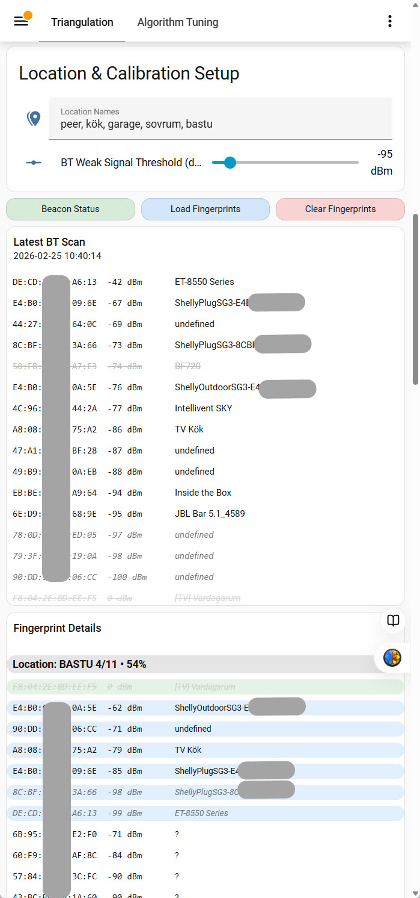
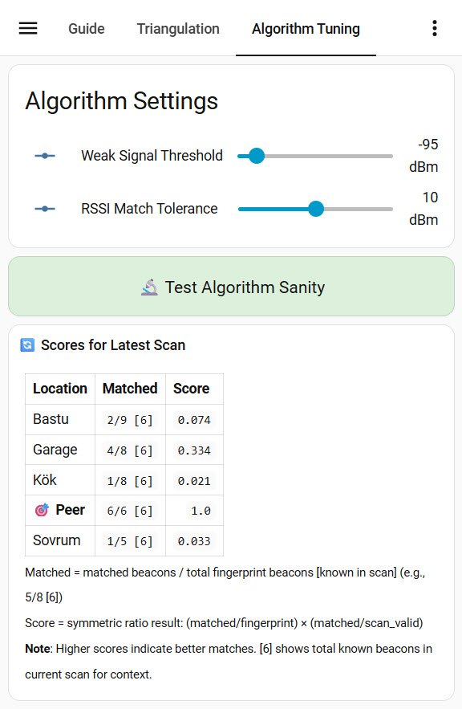

# Bluetooth Triangulation: Beacon Curation & Location Matching

BT location detection uses beacon signal strength (RSSI) to identify which room you're in. When you capture a location's fingerprint, you record which beacons are present and their signal strengths. However, **not all beacons are reliable**:

**Three problems degrade location detection:**

1. **Volatile beacons** — Your own devices with unstable signal strength
   - A beacon captured at -94 dBm might later appear at -96 dBm (below threshold), disappearing from scans
   - A printer's signal bounces off obstacles: -65 dBm one day, -40 dBm another day
   - When these beacons vanish or change, the fingerprint matching fails (missing beacons, low signal similarity)

2. **Alien devices** — Beacons from neighbors
   - A Bluetooth Party Speaker or a smart TV you don't own
   - These devices turn on/off unpredictably, adding random noise
   - They're unreliable regardless of signal strength or location - you don't control them

3. **Overlapping beacons** — Your own devices appearing in multiple rooms with different expected signals
   - A beacon strong in the GARAGE might be detected similarly in the KITCHEN
   - The algorithm can't distinguish rooms when they share too many similar beacons

**The solution: Beacon curation**

You manually identify and ignore problematic beacons:
- **Volatile beacons** → Ignore globally (mark as unreliable)
- **Alien devices** → Ignore globally (they don't belong to you)
- **Overlapping beacons** → Ignore locally from specific rooms (keep them where they're distinctive)

Beacon curation is **fully manual and reversible** — you run fingerprint captures, observe what's detected, use your domain knowledge to decide what to ignore, and toggle beacons on/off anytime without recalibrating.

---

## How to Use

### Setting Up Locations

1. Open the **BT Location Calibration** dashboard
2. Enter your room names in **Location Names** (e.g., kitchen, garage, bedroom)
3. Adjust **BT Weak Signal Threshold** if needed (default -95 dBm; beacons below this are automatically filtered out during capture and updates)

### Capturing Fingerprints

1. Go to each location with your phone/device
2. Long-press the location heading in **Fingerprint Details** to capture beacon signals for that location
3. The system records which beacons are detected and their signal strengths—beacons below the weak signal threshold and globally ignored beacons are automatically filtered out
4. Repeat for all locations

### Managing Beacons

In the **Fingerprint Details** section, you can adjust which beacons are used for each location:

**Ignore a beacon locally (single tap — while experimenting):**
1. Find the beacon in a location's fingerprint list
2. **Tap the beacon** to toggle it ignored/active for that location
3. The beacon stays in the fingerprint but is excluded from scoring

**Remove a beacon from fingerprint (double tap):**
1. Find the beacon in a location's fingerprint list
2. **Double-tap the beacon** to permanently remove it from this location's fingerprint
3. The beacon is gone from the fingerprint — recapture or merge to add it back

**Ignore a beacon globally (long press):**
1. Find the beacon in the latest scan or any location's fingerprint
2. **Hold the beacon** to toggle it globally ignored/active
3. When ignored: removed from all fingerprints and excluded everywhere, filtered out from future captures
4. When restored: counts when matching; recapture or merge to restore in relevant fingerprints

**View & Manage All Active Beacons:**

Visit the **Review** tab for three dedicated analysis tables:

1. **All Active Beacons** — Shows every beacon present across all locations with a list of locations where each beacon appears. Helpful for identifying overlapping beacons (appearing in multiple locations):
   - **Tap a beacon** to toggle local ignore in all locations at once (prevents it from affecting scoring everywhere)
   - **Hold a beacon** to toggle global ignore (removes from all fingerprints and future captures)

2. **Globally Ignored** — Shows all beacons you've marked as globally ignored:
   - All styled in grey with strikethrough to indicate ignored status
   - **Hold any beacon** to restore it (remove from global ignore list)

3. **Location Cross-Reference Matrix** — Shows location ambiguity by scoring each location as if scanned from another location's perspective. Use this to identify which locations share too many overlapping beacons.

**Check Status**
1. Click **Beacon Status** to see ignored/active beacons
2. Review **Review** tab for All Active Beacons, Globally Ignored, and Location Cross-Reference Matrix

### Validating Your Setup

After configuring locations and managing beacons:

1. Go to **Algorithm Tuning** tab
2. Click **Test Algorithm Sanity** to validate location detection accuracy
3. Review the **Algorithm Results** table to see how locations score for the current scan
4. Adjust beacon ignores if any locations have similar scores

### Understanding the Scoring

**How the algorithm scores locations:**
```
Score = (matched / fingerprint_total) × (matched / scan_valid)

- matched: Number of beacons found in both fingerprint and current scan
- fingerprint_total: Total unique beacons in this location's fingerprint
- scan_valid: Number of beacons in current scan that exist in at least one location's fingerprint
```

**This symmetric ratio approach:**
- **First term (matched/fingerprint):** Measures recall—how many of this location's expected beacons were found
- **Second term (matched/scan_valid):** Measures precision—how many beacons in the scan belong to this location
- **Result:** Bidirectional matching eliminates small-fingerprint bias and automatically penalizes unexpected beacons

Beacon curation improves these scores by removing beacons that hurt detection. Here's how each problem degrades scoring:

---

**Problem 1: Volatile Beacons (Signal Instability)**

A printer beacon was captured at -94 dBm (above threshold), but later appears at -96 dBm (below threshold):
```
Fingerprint: OFFICE has [Printer at -94 dBm, Desk lamp at -65 dBm, Router at -45 dBm]

Day 1 (Good): Scan finds [Printer at -94, Lamp at -65, Router at -45] (all 3 valid beacons)
- matched: 3 (all beacons found)
- fingerprint_total: 3
- scan_valid: 3
- Score: (3/3) × (3/3) = 1.0 × 1.0 = 1.0 ✅

Day 2 (Bad): Scan finds [Lamp at -65, Router at -45] (Printer at -96, below threshold)
- matched: 2 (only 2 of 3 found)
- fingerprint_total: 3
- scan_valid: 2 (only 2 valid beacons in scan)
- Score: (2/3) × (2/2) = 0.67 × 1.0 = 0.67 ❌

Solution: Ignore the volatile Printer beacon globally
- Fingerprint becomes [Desk lamp at -65, Router at -45]
- Both days: matched 2/2, scan_valid 2, Score: (2/2) × (2/2) = 1.0 ✅
```

---

**Problem 2: Alien Devices (Unreliable Neighbor Equipment)**

A JBL Party Speaker (not yours) appears randomly in scans with unpredictable signal:
```
Fingerprint: BEDROOM includes [Lamp at -60, Party Speaker at -75, Desk Speaker at -70]
(You forgot the Party Speaker is a neighbor's device when capturing)

Day 1 (Party Speaker on): Scan finds [Lamp at -60, Party Speaker at -74, Desk Speaker at -70]
- Matches all 3, scores well

Day 2 (Party Speaker off): Scan finds only [Lamp at -60, Desk Speaker at -70]
- beacon_match_ratio: 2/3 = 0.67, fingerprint_coverage: 2/3 = 0.67
- Score drops significantly because a "beacon" is missing

Day 3 (Party Speaker elsewhere): Scan finds [Lamp at -60, Party Speaker at -45, Desk Speaker at -70]
- signal_similarity crashes (Party Speaker is 30 dBm different)
- Score affected by signal mismatch

Solution: Ignore the Party Speaker globally
- Fingerprint becomes [Lamp at -60, Desk Speaker at -70]
- All days: Consistent matching, consistent scores ✅
```

---

**Problem 3: Overlapping Beacons (Same Beacon in Multiple Locations)**

An ENTRANCE beacon is strong in KITCHEN (-70 dBm) but also appears in GARAGE (-68 dBm):
```
KITCHEN Fingerprint: 15 beacons (includes ENTRANCE at -70 dBm)
GARAGE Fingerprint: 12 beacons (includes ENTRANCE at -68 dBm)
(Both share 10 other beacons with similar signal profiles)

When you're in KITCHEN and scan with 12 matching beacons and 2 valid scan beacons total:
- KITCHEN: (12/15) × (12/12) = 0.80 × 1.0 = 0.80
- GARAGE: (10/12) × (10/12) = 0.83 × 0.83 = 0.69

Result: KITCHEN wins, but margin is small (0.80 vs 0.69) — fragile detection
- The ENTRANCE beacon is shared, creating ambiguity
- When ENTRANCE signal varies even slightly, GARAGE could win

Solution: Ignore ENTRANCE from both KITCHEN and GARAGE
- KITCHEN: 14 beacons effective, 12 matched
- GARAGE: 11 beacons effective, 10 matched

New scores when in KITCHEN:
- KITCHEN: (12/14) × (12/12) = 0.86 × 1.0 = 0.86
- GARAGE: (10/11) × (10/12) = 0.91 × 0.83 = 0.75

Result: Larger margin (0.86 vs 0.75) = robust detection ✅
```

---

**When to Ignore Each Type:**

| Problem | Type | Ignore Scope | Why |
|---------|------|--------------|-----|
| Volatile signal | Your own device | Global | Can't stabilize signal variance |
| Alien device | Neighbor equipment | Global | Always unreliable |
| Overlapping beacon | Your own device | Local (per-location) | Keep if distinctive in other rooms |

---

## Visual Setup Guide

### Calibration Dashboard

This is the main interface for setting up and managing BT location detection. You configure locations, capture fingerprints, and monitor beacon signals here.



**What you see:**
- **Location Names** — Editable list of rooms where you want location detection (kitchen, garage, office, etc.)
- **BT Weak Signal Threshold** — Slider to ignore weak beacons that might cause false positives  (-95 dBm is a fair starting point)
- **Management Buttons** — Report beacon status, load or clear stored data
- **Latest BT Scan** — Bluetooth devices with signal strength (RSSI in dBm) and device names as reported by the most recent report
- **Fingerprint Details** — Captured beacon signatures for each location, showing which beacons are active vs ignored and how they match the latest scan
- **Review Tab** — Three dedicated analysis views: All Active Beacons (shows overlapping beacons across locations), Globally Ignored (centralized table of all globally ignored beacons), and Location Cross-Reference Matrix (visualizes location confusion risks)

### Algorithm Validation

After capturing fingerprints, validate the matching algorithm with this sanity check. It shows how well each location can be distinguished based on beacon signals.



**What you see:**
- **Test Algorithm Sanity** — Validates algorithm scoring against your current fingerprints
- **Algorithm Results Table** — Shows how each location scores for the latest scan:
  - **Matched** — How many beacons from the fingerprint were detected in the scan (format: matched/fingerprint [known_in_scan])
  - **Score** — Symmetric ratio result: (matched/fingerprint) × (matched/scan_valid) (higher = better match)

**Goal:** The expected location should have high scores with clear separation to others (e.g., 0.85 vs 0.62 shows good distinction).

---

## Common Tasks

### Refining Fingerprints

Review "Fingerprint Details" table for each location and identify overlapping beacons (beacons that appear in multiple locations with similar signal strength). Improve triangulation using these tools:

- **Tap a beacon** — Ignore in this location only (Fingerprint Details only) — block overlapping beacons from affecting this location (e.g., strong beacon in adjacent rooms). This preserves the beacon for other locations that need it. The beacon stays in the fingerprint but is excluded from scoring.
- **Double-tap a beacon** — Remove permanently from this location's fingerprint — use when a beacon is no longer relevant to this location and you don't want it counted. The beacon is gone from the fingerprint — recapture or merge to add it back.
- **Hold/long-press a beacon** — Ignore globally across all locations — remove irrelevant/volatile devices (e.g., neighbor's bluetooth party speaker). The beacon is removed from all fingerprints and excluded everywhere, filtered out from future captures.

**Hint:** Since BT beacons are inherently volatile, they will most likely change over time. By opening the settings and checking the fingerprints every now and then, you can gradually refine them by managing overlapping beacons. Use **tap** to temporarily ignore overlapping beacons while experimenting, **double-tap** to permanently remove beacons that don't belong, and **long-press** to mark truly irrelevant devices as globally ignored. Visit the **Review** tab to see all active beacons across locations, manage globally ignored beacons, and check the Location Cross-Reference Matrix to visualize overlapping locations.

### Task 1: Experiment with Overlapping Beacons (Single-Tap)

1. Identify locations where beacon causes ambiguity (similar RSSI values)
2. **Tap the beacon** to toggle it ignored/active for that location
3. Beacon remains in the fingerprint but is excluded from scoring
4. Run "Test Algorithm Sanity" to see if scores improve
5. If satisfied, you're done — beacon stays in fingerprint for recapture/merging
6. If unsure, leave it active for now — easy to toggle back

### Task 2: Permanently Remove a Beacon (Double-Tap)

1. Identify beacon that doesn't belong in this location's fingerprint
2. **Double-tap the beacon** to permanently remove it from this location's fingerprint
3. Beacon is gone — if you need it back later, recapture the location or merge fingerprints
4. Useful for removing false captures or stale beacons

### Task 3: Ignore an Irrelevant Device Globally (Long-Press)

1. Identify beacon that's generally unwanted (neighbor device noise, volatile)
2. **Hold/long-press the beacon** in latest scan or in any location's fingerprint
3. Beacon is removed from all locations' fingerprints and excluded everywhere
4. Beacon never matches any location and is filtered from future captures
5. All locations show that this MAC is ignored

### Task 4: Re-enable an Ignored Beacon

**Local ignore (single-tap toggle):**
1. Find the beacon in Fingerprint Details
2. **Tap the beacon** again to toggle it active (removes `:X` suffix)
3. Beacon now counts in scoring again for that location

**Global ignore (long-press toggle):**
1. Find the beacon in Latest BT Scan, Fingerprint Details, **Globally Ignored** table (Triangulation tab), or **All Active Beacons** table (Review tab)
2. **Hold/long-press the beacon** to restore it (remove from global list)
3. Beacon is removed from the Globally Ignored table
4. Beacon no longer appears with strikethrough in Latest BT Scan and Fingerprint Details
5. Note: Restoration removes it from global list but does NOT re-add to fingerprints — recapture or merge to restore in relevant locations. The **All Active Beacons** table (Review tab) provides a centralized view of all active beacons across locations, making it easy to find and restore specific beacons in bulk.

### Task 5: Check Current Ignore Status

1. Check `sensor.bt_ignored_beacons` state (shows count)
2. Go to `/lovelace/screensaver-settings`
3. Check "Fingerprint Details" table for per-location `:X` suffixes (red highlight)
4. Check "Beacon Coverage Summary" for active/ignored counts per location
5. Run `script.report_ignored_beacons` for detailed report

### Task 6: Reset All Ignores

1. Clear global ignored file (delete or empty `.cache/bt_ignored.csv`)
2. Recapture location fingerprints (removes `:X` suffixes):

---

# Technical Reference


## Key Features

✅ **Flexible Ignore**
- Per-location: Ignore beacon from specific locations where it causes ambiguity
- Global: Ignore beacon from all locations (neighbor device noise)
- Toggle on/off any time

✅ **Unlimited Capacity**
- Global ignored: File-based storage, supports 100+ beacons
- Per-location: Limited only by beacon count in fingerprint
- No entity size limits (uses sensor attributes)

✅ **Persistent Storage**
- Per-location: `:X` suffix in fingerprint CSV
- Global: File-backed sensor attributes
- Both survive HA restarts and YAML reloads

✅ **Algorithm Integration**
- Seamless filtering (no performance impact)
- Works with existing match_ratio algorithm
- Transparent to detection logic
- Prepared for alternative algorithms

✅ **User Interface**
- Visual indicators (colors, strikethrough)
- Coverage statistics
- Validation reports

✅ **Documentation**
- System overview in dashboard
- Curation guide with examples
- Detailed markdown documentation

## Algorithm Selection Background

Fingerprinting for indoor positioning (BT RSSI in a home) uses several main approaches:

### Distance-Based Methods (Simplest)

**k-Nearest Neighbors (k-NN)**
- Find k most similar fingerprints, select most common location via voting
- Advantages: Simple, no training needed, works well in small environments (homes, offices)
- Disadvantages: Can be slow with large databases, sensitive to noise
- Standard choice in most home solutions

**Weighted k-NN**
- Same as k-NN but closer points get higher weight
- Advantages: More stable results, better handles outliers
- **Recommendation: Standard choice for home BT fingerprinting**

**1-NN (Nearest Neighbor)**
- Select only closest point
- Fast but less stable than k-NN

### Probabilistic Methods

**Naive Bayes**
- Each beacon contributes probability, combined to select location
- Advantages: Better noise tolerance, needs less data
- Disadvantages: Assumes signal independence (not always true)

**Gaussian Models**
- Each location modeled as mean + standard deviation
- Selects location with best statistical fit
- More accurate than Naive Bayes with good training data

### Machine Learning Methods

**Random Forest**
- Multiple decision trees vote for location
- Advantages: Very robust, tolerates noise well
- Disadvantages: Requires training phase, more computationally expensive

**Support Vector Machines (SVM)**
- Creates decision boundaries between zones
- Good for multi-room classification

**Neural Networks**
- Advantages: Highest accuracy possible
- Disadvantages: Overkill for homes, needs large datasets

### Temporal Models

**Hidden Markov Models (HMM)**
- Considers previous location and movement constraints
- Example: Can't jump from kitchen to bedroom in 0.1 seconds
- Adds extra layer of stability

**Kalman Filter**
- Smooths positions over time, removes signal jitter
- Simple to implement, effective for temporal stability

### Algorithm Comparison Table

| Algorithm      | Type         | Complexity | Accuracy | Home Suitability |
|----------------|--------------|-----------|----------|-----------------|
| 1-NN           | Distance     | Very Easy | OK       | Yes             |
| k-NN           | Distance     | Easy      | Good     | Yes             |
| Weighted k-NN  | Distance     | Easy      | Good     | Yes (abandoned) |
| Naive Bayes    | Probability  | Medium    | Good     | Yes             |
| Gaussian       | Probability  | Medium    | Good     | Yes             |
| Random Forest  | ML           | Medium    | Very Good | Overkill        |
| SVM            | ML           | Medium    | Very Good | Rarely needed   |
| Neural Net     | ML           | Hard      | Highest  | No (too complex)|
| HMM            | Temporal     | Medium    | Stabilizes | Extra layer    |
| Kalman Filter  | Temporal     | Easy      | Stabilizes | Yes (optional) |
| Match Ratio    | Custom       | Easy      | Very Good | Yes (abandoned) |
| **Symmetric Ratio** | **Custom**   | **Easy**  | **Excellent** | **Yes (selected)** |

## Algorithm Choice: Symmetric Ratio (Approach 0)

**Chosen Algorithm:** Bidirectional beacon matching using symmetric ratio formula

**Formula:**
```
presence_score = (matched / fingerprint_total) × (matched / scan_valid)
```

**Why this approach:**

The problem with unidirectional matching (only checking "do fingerprint beacons appear in scan") is that it creates a **small-fingerprint bias**—locations with fewer beacons always appear to have better matches because it's easier to match 2 beacons than 5. This causes false positives when a location with few beacons happens to have lucky matches.

The Symmetric Ratio approach solves this by combining two complementary metrics:
- **matched/fingerprint (Recall):** What percentage of this location's expected beacons were found?
- **matched/scan_valid (Precision):** What percentage of the scan beacons belong to this location?

Together, these terms create a natural penalty system:
- **Small fingerprints no longer always win** — they must also account for unexpected beacons in the scan
- **Unexpected beacons are automatically penalized** — if a beacon unique to Location 2 appears in the scan, Location 1 is penalized through the precision term
- **No tuning parameters needed** — the formula is mathematically optimal for noise-filtered scans

**Key assumptions:**
- The scan is pre-filtered to contain only "valid" beacons (those existing in at least one location's fingerprint)
- This automatically eliminates alien/neighbor devices without requiring explicit configuration
- Beacon curation (global and per-location ignores) works seamlessly with the algorithm

**Result:** Bidirectional matching eliminates small-fingerprint bias. All locations detected correctly with clear score separation and natural robustness to signal drift.

**Advantages over alternatives:**
- ✅ No weight tuning (45/30/25 weighting no longer needed)
- ✅ No penalty parameters (missing beacon penalty eliminated)
- ✅ Mathematically elegant (combines recall and precision naturally)
- ✅ Works with any fingerprint size
- ✅ Scales to 50–120+ beacons without degradation

---

## Algorithm Analysis: Why Approach 0?

**Decision Process**

Four candidate algorithms were analyzed in depth (documented in `.claude/algorithm_tuning.md`):

1. **F1-Score-Based (Harmonic Mean)** — `2×matched / (fingerprint + scan)`
2. **Jaccard Index** — `matched / (fingerprint + scan - matched)`
3. **Asymmetric with Multi-Factor** — Complex confidence scoring
4. **Simplified Symmetric Ratio** — `(matched/fingerprint) × (matched/scan_valid)` ← **Selected**

**Why Symmetric Ratio (Approach 0) Won**

The symmetric ratio approach was selected because:

- **Mathematically Sound:** Combines Recall (do I see this location's beacons?) with Precision (do scanned beacons belong here?) in a single elegant formula
- **No Configuration Needed:** Pre-filtered scans eliminate alien noise automatically, so no weight tuning or penalty parameters are required
- **Solves the Core Problem:** Bidirectional matching eliminates the "small-fingerprint bias" that plagued previous algorithms
- **Cleanest Implementation:** Pure Jinja2, no external dependencies, O(n) performance
- **Validated by Multiple Sources:** Analysis confirmed by Claude Opus, Claude Sonnet, ChatGPT, and Gemini

**Key Insight:** The pre-filter assumption (scan contains only beacons existing in at least one fingerprint) is critical. This filter eliminates unknown/alien devices automatically, which simplifies the algorithm dramatically—no need for aggressive penalty tuning or multi-factor scoring.

---

## Algorithm Output Protocol

The code is prepared to handle pluggable algorithms via `script.bt_location_detect_algorithm_proxy`. The generic detection logic in `bt_beacon_triangulation.yaml` calls this proxy, which is implemented in `screensaver_local.yaml` (default: Symmetric Ratio algorithm). To swap algorithms, override the proxy implementation in your local package.

All location detection algorithms must return the following metrics for integration with the detection orchestrator:

| Metric | Type | Description |
|--------|------|-------------|
| `matched` | int | Number of beacons found in both fingerprint and current scan |
| `missing` | int | Number of beacons in fingerprint but not in current scan |
| `total_score` | float | Final composite score; higher = better match |

**Symmetric Ratio Algorithm Output Example:**
```yaml
matched: 12
missing: 3
total_score: 0.727  # (12/15) × (12/16.5) = 0.8 × 0.909 = 0.727
```

**Rationale:** This minimal protocol allows algorithm implementations to be swapped without changing detection logic, enabling future algorithm improvements or alternative matching strategies without affecting the orchestrator code. Algorithms with more complex output requirements must provide alternative visualization methods.

---

## Data Formats

### Global Ignore List
**File:** `.cache/bt_bt_ignored.csv`

**Stored (newline-separated):**
```
AA:BB:CC:DD:EE:FF
11:22:33:44:55:66
22:33:44:55:66:77
```

**When read (JSON array via sensor):**
```json
{
  "ignored": ["AA:BB:CC:DD:EE:FF", "11:22:33:44:55:66", "22:33:44:55:66:77"]
}
```

**Capacity:** Unlimited (supports 100+ beacons without issues)

### Per-Location Ignores
**File:** `.cache/bt_fingerprints.csv` (same as fingerprints)

**Format:**
```
0|AA:BB:CC:DD:EE:FF=-65,11:22:33:44:55:66=-72:X,22:33:44:55:66:77=-80:X
```

- `:X` suffix = ignored for this location only
- `:X` goes AFTER RSSI value
- Case-insensitive (normalized to uppercase in algorithm)

---

## Data Flow

### Reading Global Ignores
```
sensor.bt_ignored_beacons
  ↓ (reads from file via bash command)
ignored array in sensor attributes
  ↓ (available in scripts via state_attr())
Algorithm filters beacons immediately
```

### Writing Global Ignores
```
script.bt_beacon_toggle_global_ignored
  ↓ (reads from sensor attribute)
  ↓ (adds/removes MAC)
  ↓ (writes to file via shell_command)
homeassistant.update_entity
  ↓ (refreshes sensor)
Algorithm automatically uses updated list
```

### Filtering During Detection
```
BT scan → script.detect_location_from_signals
  ↓ (loads fingerprints + global ignored)
  ↓ (filters out ignored beacons)
script.bt_location_symmetric_ratio
  ↓ (uses only active beacons for scoring)
Returns best match location
```

---

## Technical Implementation

### Algorithm Filtering Logic
```jinja2
# Skip ignored beacons when counting
for beacon in fingerprint:
    if beacon.endswith(':X'):
        continue  # Skip local ignored
    if beacon_mac in global_ignored_list:
        continue  # Skip global ignored
    # Count as active beacon
    score += calculate_match(beacon, scan)
```

### Performance Impact
- **Storage:** +2 bytes per ignored beacon (minimal)
- **Algorithm:** O(n) filtering, happens once per scan
- **UI:** Generated from existing data, no extra queries

### Data Consistency
- Local ignored stored with fingerprint (always together)
- Global ignored in file with sensor attributes (independent)
- Filtering applied consistently in algorithm
- UI reads same data as algorithm

---

## Scripts & Services

| Script | Purpose | Input |
|--------|---------|-------|
| `script.bt_beacon_toggle_location_ignored` | Toggle beacon ignored status at specific location (single-tap) | location_index, mac |
| `script.bt_beacon_remove_from_fingerprint` | Remove beacon entirely from specific location's fingerprint (double-tap) | location_index, mac |
| `script.bt_beacon_toggle_global_ignored` | Toggle beacon ignored status globally across all locations (long-press) | mac |
| `script.report_ignored_beacons` | Check ignore status | (none) |
| `script.test_algorithm_sanity_check` | Test with ignored beacons | (none) |

### Service Call Examples

**Toggle beacon ignored status for specific location (single-tap):**
```yaml
service: script.bt_beacon_toggle_location_ignored
data:
  location_index: 0
  mac: "AA:BB:CC:DD:EE:FF"
```

**Remove beacon from specific location's fingerprint (double-tap):**
```yaml
service: script.bt_beacon_remove_from_fingerprint
data:
  location_index: 0
  mac: "AA:BB:CC:DD:EE:FF"
```

**Toggle beacon ignored status globally (long-press):**
```yaml
service: script.bt_beacon_toggle_global_ignored
data:
  mac: "11:22:33:44:55:66"
```

**Report ignored beacons:**
```yaml
service: script.report_ignored_beacons
```

**Test algorithm validation:**
```yaml
service: script.test_algorithm_sanity_check
```

---

## Important Notes

### CSV Format is Critical
- `:X` must come AFTER RSSI value: `MAC=RSSI:X`
- No spaces around `=` or `,`
- Case-insensitive (normalized to uppercase)

### Storage Patterns
- **File + Sensor Attributes:** Same proven pattern as fingerprints and scans
- **No Entity Size Limits:** Uses sensor attributes, not state
- **Unlimited Capacity:** File system limited, not Home Assistant

### Algorithm Changes are Safe
- Only affects scoring/filtering logic
- All ignored beacons are skipped
- Both local and global ignored checked
- Performance remains constant

---
