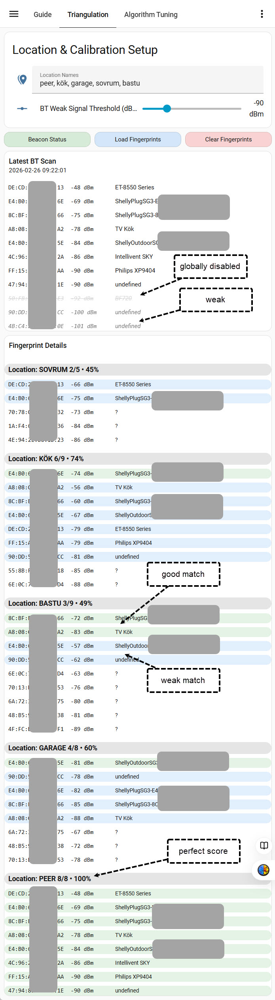
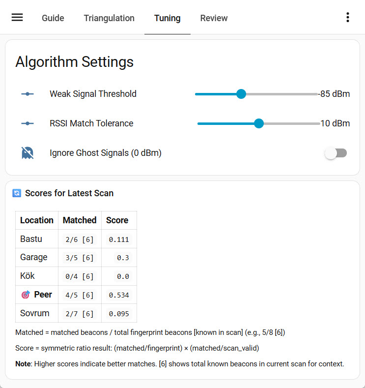
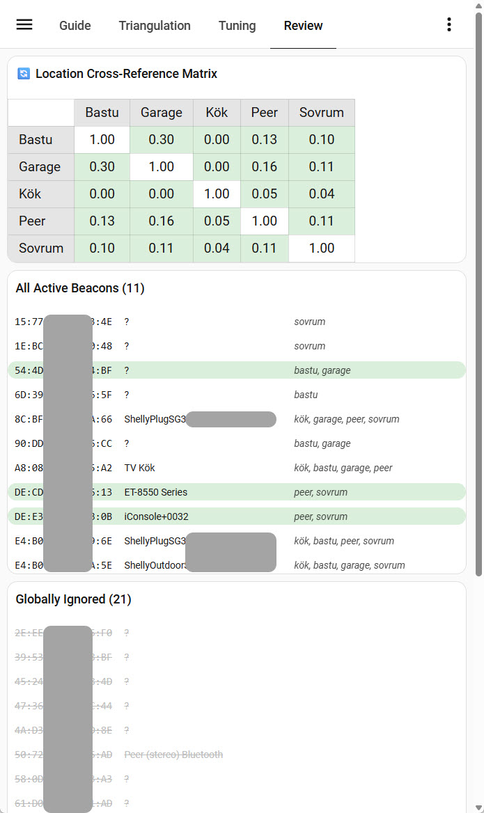

# Bluetooth Triangulation: Location Detection for Home Assistant

Bluetooth triangulation uses beacon signal strength (RSSI) to detect which room you're in. The system works by capturing a unique "fingerprint" of Bluetooth devices at each location, then matching live scans against those fingerprints to determine your position. It integrates seamlessly with Home Assistant automations and the screensaver system.

**What you get:** A single `input_text` entity (`input_text.device_charger_locations`) that reports the detected location, updated whenever your phone docks on a charger or manual trigger occurs. Use this in automations for location-aware actions.

---

## TL;DR – Quick Start

**Setup takes ~10 minutes. Here's what you'll do:**

1. Register the BT Triangulation dashboard in Home Assistant's `configuration.yaml`
2. Copy the dashboard and package files to your `dashboards/` and `packages/` directories
3. Reload packages in Home Assistant (Developer Tools → YAML → Packages)
4. Open the BT Triangulation dashboard and enter your location names (e.g., "kitchen, garage, bedroom")
5. Install HACS components if not already present (primarily `button-card`, `card-mod`, `browser-mod`)
6. Configure your scan source:
   - **For Android with Tasker:** Set up the "Phone Charging - BT Scan" task/profile to send Bluetooth data on charger connect
   - **For other sources:** Post JSON to the webhook endpoint (see Scan Sources section)
7. Visit each location with your phone and capture fingerprints (long-press location heading in Fingerprint Details)
8. Review the "Scores for Latest Scan" table to validate detection accuracy
9. Use `input_text.device_charger_locations` in your automations for location-aware logic

---

## What You Get

After setup, you'll have:

- **Location entity:** `input_text.device_charger_locations` — reports the detected location (e.g., "kitchen", "garage")
- **Live scanning dashboard:** View Bluetooth signals in real-time, manage beacon fingerprints, and tune the algorithm
- **Persistent fingerprints:** Automatically saved after each capture; survives Home Assistant restarts
- **Beacon management:** Ignore unreliable beacons globally or per-location with a tap/hold gesture

**Example automation using the location entity:**

```yaml
automation:
  - alias: "Different Scenarios by Location"
    trigger:
      platform: state
      entity_id: input_text.device_charger_locations
    action:
      service: script.set_screensaver_scenario
      data:
        scenario: "{{ states('input_text.device_charger_locations') }}"
```

---

## Prerequisites

### Required Files

Ensure you have the triangulation package and dashboard in your Home Assistant config:

```
H:/
├── dashboards/
│   └── bt_triangulation.yaml
├── packages/
│   └── triangulation/
│       ├── bt_triangulation.yaml
│       └── bt_location_symmetric_ratio.yaml
└── www/
    └── docs/
        └── triangulation-README.md  (this file)
```

### Required HACS Components

Install these via HACS (Settings → Devices & Services → HACS):

- `button-card`
- `card-mod`
- `browser-mod`
- `mushroom-template-card`
- `mushroom-chips-card`
- `mushroom-title-card`
- `stack-in-card`
- `slider-entity-row`
- `auto-entities`
- Optional: `config-template-card`, `scheduler-card`

---

## Installation

### 1. Register the BT Location Calibration Dashboard

Add this to your `configuration.yaml`:

```yaml
lovelace:
  dashboards:
    dashboard-bt-triangulation:
      mode: yaml
      filename: dashboards/bt_triangulation.yaml
      title: BT Triangulation
      icon: mdi:bluetooth
      show_in_sidebar: true
```

The dashboard will be accessible at: `https://your-ha-url/dashboard-bt-triangulation`

### 2. Copy Dashboard & Package Files

- Copy files from `dashboards/` to your `dashboards/` directory
- Copy all files from `packages/triangulation/` to your `packages/triangulation/` directory
  - The `data/` subdirectory will be created automatically after the first scan

### 3. Verify Packages Are Loaded

Ensure your `configuration.yaml` includes:

```yaml
homeassistant:
  packages:
    !include_dir_named packages/
```

### 4. Reload Packages

In Home Assistant:
- Go to Developer Tools → YAML
- Click "Reload Packages"
- Or restart Home Assistant entirely

---

## Scan Sources

The triangulation system accepts Bluetooth scan data from any source that can POST JSON to a webhook endpoint. While Tasker on Android is the reference implementation, you can use any system capable of discovering Bluetooth devices and sending data to Home Assistant.

### Tasker on Android (Reference Implementation)

For most users, Tasker paired with a Bluetooth-capable device (phone, tablet) is the simplest approach. Tasker can automatically trigger on charger connection and send scan data.

<details>
<summary><strong>How Location Detection Works (Background)</strong></summary>

When the phone detects power (charger connected), Tasker performs a brief **Bluetooth scan** to identify which nearby "anchor" devices (e.g., BT speakers, plugs) have the strongest signals.

The data is sent to Home Assistant, which analyzes the signals and maps them to a location. This is done via Bluetooth RSSI (Received Signal Strength Indicator), which measures signal power. The stronger the signal, the closer the device is to the Bluetooth beacon.

**Why Bluetooth instead of WiFi/GPS?**
- **Bluetooth RSSI** is stable and accurate when the phone is physically stationary on the charger
- No continuous scanning needed (battery efficient—only 5 seconds on power connect)
- Works even while phone is locked (Tasker has system-level permissions)
- Uses existing hardware (no new sensors required)

</details>

<details>
<summary><strong>Android Prerequisites</strong></summary>

This feature requires:

1. **Tasker** — Install from Google Play Store (paid, ~$3 USD)
2. **Elevated Bluetooth permissions** — Via ADB (Android Debug Bridge):
   ```bash
   adb shell pm grant net.dinglisch.android.taskerm android.permission.BLUETOOTH_SCAN
   adb shell pm grant net.dinglisch.android.taskerm android.permission.BLUETOOTH_CONNECT
   ```
3. **Home Assistant webhook** — Already available (configured below)
4. **Anchor devices** — Bluetooth beacons in each room (MusicCast speakers, Shelly Plugs with BT enabled, etc.)

</details>

<details>
<summary><strong>Why Transient Storage? (Technical Rationale)</strong></summary>

The Bluetooth scan data from Tasker is **stored in memory only** and **not persisted to disk**. This is an intentional design decision:

1. **Data Nature:** The BT scan is inherently transient:
   - Captured only when the phone docks on a charger (typically 1-2× daily)
   - Contains real-time signal strengths that change over time
   - Not needed after location detection is complete (only 100-200 ms of processing)
   - Does not need to survive Home Assistant restarts

2. **Eliminates SD Card Write Wear:**
   - File-based storage would write to disk on every webhook trigger
   - SD cards have limited write cycles (~100,000 cycles per cell)
   - Unnecessary writes accelerate card degradation
   - In-memory storage eliminates this issue entirely

3. **Architecture Simplicity:**
   - Uses Home Assistant's webhook-triggered template sensors (native feature)
   - No file I/O, shell scripts, or complex persistence logic needed
   - Scan data flows: Tasker webhook → template sensor attributes → dashboard
   - Backward compatible with all existing scripts and dashboards

4. **Performance:**
   - Memory access is faster than disk I/O
   - No file system latency or timeout issues
   - Webhook data captured immediately and available to scripts

**Technical Implementation:**
- **Template Sensor:** `sensor.bt_latest_scan_full` (webhook-triggered)
- **Storage:** Sensor attributes (16KB+ capacity, no 255-char state limit)
- **Data Access:** `state_attr('sensor.bt_latest_scan_full', 'devices')` returns the device array
- **Lifecycle:** Populated on webhook trigger, clears on HA restart (acceptable for transient data)

</details>

#### Tasker Task: "Send BT Raw Data"

This task acts as the data collector, transforming raw Bluetooth signals into JSON for Home Assistant.

<details>
<summary><strong>Task Configuration</strong></summary>

**Action 1: Bluetooth Info**
- **Category:** `Net` → `Bluetooth Info`
- **Type:** `Scan Devices`
- **Timeout (Seconds):** `5`
- **Purpose:** Triggers a fresh BT scan. Populates Tasker's local arrays (`%bt_address()`, `%bt_name()`, `%bt_signal_strength()`) with current data from Bluetooth devices in range.

**Action 2: JavaScriptlet**
- **Category:** `Code` → `JavaScriptlet`
- **Code:**
```javascript
var devices = [];
for (var i = 0; i < bt_address.length; i++) {
    devices.push({
        mac: bt_address[i],
        name: bt_name[i],
        rssi: parseInt(bt_signal_strength[i])
    });
}
var payload = JSON.stringify({ devices: devices });
```
- **Purpose:** Converts Tasker's internal variables into a structured JSON object. Loops through discovered devices, pairing MAC address, name, and signal strength (RSSI).

**Action 3: HTTP Request**
- **Category:** `Net` → `HTTP Request`
- **Method:** `POST`
- **URL:** `http://[YOUR_HA_IP]:8123/api/webhook/phone_charger_bt`
- **Headers:** `Content-Type:application/json`
- **Body:** `%payload`
- **Purpose:** Transmits the JSON to Home Assistant webhook. Using port `8123` explicitly bypasses default port issues.

**Action 4: Flash (Optional Verification)**
- **Category:** `Alert` → `Flash`
- **Text:** `Sent: %payload`
- **Long:** `Checked`
- **Purpose:** Provides visual confirmation that data was captured and sent successfully. Useful for debugging.

</details>

#### Tasker Profile: Power Trigger

<details>
<summary><strong>Profile Configuration</strong></summary>

**Profile Name:** `"Phone Charging - BT Scan"`

**Trigger Type:** `State` profile
- **Trigger:** `State` → `Power` → `Source: Any` (detects charger connection)
- **Entry Task:** Link to "Send BT Raw Data" task (above)
- **Exit Task:** None (optional: could reset location to "unknown" when unplugged)

**Note:** The task can (and should) be embedded in the profile that starts the screensaver as the last task after launching Fully Kiosk Browser.

</details>

### Custom / Alternative Scan Sources

Any system capable of sending JSON to Home Assistant's webhook system can be a scan source. The required format is:

```json
{
  "devices": [
    {
      "mac": "AA:BB:CC:DD:EE:FF",
      "name": "BT Device Name",
      "rssi": -65
    },
    {
      "mac": "11:22:33:44:55:66",
      "name": "Another Device",
      "rssi": -72
    }
  ]
}
```

**Webhook URL:** `POST http://[YOUR_HA_IP]:8123/api/webhook/phone_charger_bt`

**Example:** Scan Bluetooth devices on a Linux machine and send to Home Assistant:

```bash
# Use bluetoothctl or similar to scan devices and generate JSON
# Then POST to the webhook:
curl -X POST http://your-ha-ip:8123/api/webhook/phone_charger_bt \
  -H "Content-Type: application/json" \
  -d '{"devices": [{"mac": "AA:BB:CC:DD:EE:FF", "name": "Device", "rssi": -65}]}'
```

---

## Configuration

### Setting Up Location Names

1. Open the **BT Location Calibration** dashboard (at `/dashboard-bt-triangulation`)
2. Enter your location names in **Location Names** field (e.g., "kitchen, garage, bedroom")
   - Comma-separated, lowercase preferred
   - **Important:** Order is permanent. Once you capture fingerprints, changing the order corrupts data. Renaming is OK; reordering is not.
3. Adjust **BT Weak Signal Threshold** if needed (default -95 dBm; beacons below this are filtered out)
4. Configure **Ignore Ghost Signals (0 dBm)** if needed (default: ON):
   - **ON:** Ignores RSSI=0 beacons in scoring (captured and visible but not used for triangulation)
   - **OFF:** Includes RSSI=0 beacons in scoring like any other signal

---

## How It Works

BT location detection uses beacon signal strength (RSSI) to identify which room you're in. When you capture a location's fingerprint, you record which beacons are present and their signal strengths. However, **not all beacons are reliable**:

**Three problems degrade location detection:**

1. **Volatile beacons** — Your own devices with unstable signal strength
   - A beacon captured at -94 dBm might later appear at -96 dBm (below threshold), disappearing from scans
   - A printer's signal bounces off obstacles: -65 dBm one day, -40 dBm another day
   - When these beacons vanish or change, the fingerprint matching fails

2. **Alien devices** — Beacons from neighbors
   - A Bluetooth Party Speaker or a smart TV you don't own
   - These devices turn on/off unpredictably, adding random noise
   - They're unreliable regardless of signal strength or location

3. **Overlapping beacons** — Your own devices appearing in multiple rooms with different expected signals
   - A beacon strong in the GARAGE might be detected similarly in the KITCHEN
   - The algorithm can't distinguish rooms when they share too many similar beacons

**The solution: Beacon curation**

You manually identify and ignore problematic beacons:
- **Volatile beacons** → Ignore globally (mark as unreliable)
- **Alien devices** → Ignore globally (they don't belong to you)
- **Overlapping beacons** → Ignore locally from specific rooms (keep them where they're distinctive)

Beacon curation is **fully manual and reversible** — you run fingerprint captures, observe what's detected, use your domain knowledge to decide what to ignore, and toggle beacons on/off anytime without recalibrating.

---

## Understanding the Scoring

**How the algorithm scores locations:**

```
Score = (matched / fingerprint_total) × (matched / scan_valid)

- matched: Number of beacons found in both fingerprint and current scan
- fingerprint_total: Total unique beacons in this location's fingerprint
- scan_valid: Number of beacons in current scan that exist in at least one location's fingerprint
```

**This symmetric ratio approach:**
- **First term (matched/fingerprint):** Measures recall—how many of this location's expected beacons were found
- **Second term (matched/scan_valid):** Measures precision—how many beacons in the scan belong to this location
- **Result:** Bidirectional matching eliminates small-fingerprint bias and automatically penalizes unexpected beacons

Beacon curation improves these scores by removing beacons that hurt detection. Here are three worked examples:

---

**Problem 1: Volatile Beacons (Signal Instability)**

A printer beacon was captured at -94 dBm (above threshold), but later appears at -96 dBm (below threshold):

```
Fingerprint: OFFICE has [Printer at -94 dBm, Desk lamp at -65 dBm, Router at -45 dBm]

Day 1 (Good): Scan finds [Printer at -94, Lamp at -65, Router at -45] (all 3 valid beacons)
- matched: 3 (all beacons found)
- fingerprint_total: 3
- scan_valid: 3
- Score: (3/3) × (3/3) = 1.0 × 1.0 = 1.0 ✅

Day 2 (Bad): Scan finds [Lamp at -65, Router at -45] (Printer at -96, below threshold)
- matched: 2 (only 2 of 3 found)
- fingerprint_total: 3
- scan_valid: 2 (only 2 valid beacons in scan)
- Score: (2/3) × (2/2) = 0.67 × 1.0 = 0.67 ❌

Solution: Ignore the volatile Printer beacon globally
- Fingerprint becomes [Desk lamp at -65, Router at -45]
- Both days: matched 2/2, scan_valid 2, Score: (2/2) × (2/2) = 1.0 ✅
```

---

**Problem 2: Alien Devices (Unreliable Neighbor Equipment)**

A JBL Party Speaker (not yours) appears randomly in scans with unpredictable signal:

```
Fingerprint: BEDROOM includes [Lamp at -60, Party Speaker at -75, Desk Speaker at -70]
(You forgot the Party Speaker is a neighbor's device when capturing)

Day 1 (Party Speaker on): Scan finds [Lamp at -60, Party Speaker at -74, Desk Speaker at -70]
- Matches all 3, scores well

Day 2 (Party Speaker off): Scan finds only [Lamp at -60, Desk Speaker at -70]
- beacon_match_ratio: 2/3 = 0.67, fingerprint_coverage: 2/3 = 0.67
- Score drops significantly because a "beacon" is missing

Day 3 (Party Speaker elsewhere): Scan finds [Lamp at -60, Party Speaker at -45, Desk Speaker at -70]
- signal_similarity crashes (Party Speaker is 30 dBm different)
- Score affected by signal mismatch

Solution: Ignore the Party Speaker globally
- Fingerprint becomes [Lamp at -60, Desk Speaker at -70]
- All days: Consistent matching, consistent scores ✅
```

---

**Problem 3: Overlapping Beacons (Same Beacon in Multiple Locations)**

An ENTRANCE beacon is strong in KITCHEN (-70 dBm) but also appears in GARAGE (-68 dBm):

```
KITCHEN Fingerprint: 15 beacons (includes ENTRANCE at -70 dBm)
GARAGE Fingerprint: 12 beacons (includes ENTRANCE at -68 dBm)
(Both share 10 other beacons with similar signal profiles)

When you're in KITCHEN and scan with 12 matching beacons and 2 valid scan beacons total:
- KITCHEN: (12/15) × (12/12) = 0.80 × 1.0 = 0.80
- GARAGE: (10/12) × (10/12) = 0.83 × 0.83 = 0.69

Result: KITCHEN wins, but margin is small (0.80 vs 0.69) — fragile detection
- The ENTRANCE beacon is shared, creating ambiguity
- When ENTRANCE signal varies even slightly, GARAGE could win

Solution: Ignore ENTRANCE from both KITCHEN and GARAGE
- KITCHEN: 14 beacons effective, 12 matched
- GARAGE: 11 beacons effective, 10 matched

New scores when in KITCHEN:
- KITCHEN: (12/14) × (12/12) = 0.86 × 1.0 = 0.86
- GARAGE: (10/11) × (10/12) = 0.91 × 0.83 = 0.75

Result: Larger margin (0.86 vs 0.75) = robust detection ✅
```

---

## Understanding 0 dBm "Ghost" Signals

When a sensor reports **0 dBm**, it's saying: *"I can detect this device's presence, but my hardware can't calculate the distance because the signal is too distorted or unstable."*

In other words, **presence is confirmed, but distance is unknown.**

### The Tradeoff

**Advantage of including 0 dBm signals:**
- A beacon with 0 dBm still counts as a "match," keeping your location score high
- Prevents your score from dropping to zero when a beacon flickers into a "0 dBm glitch state"
- Acts as a presence flag: "This beacon exists in range, even if we can't measure strength"

**Disadvantage:**
- Bluetooth signals travel through walls
- A 0 dBm signal from the Kitchen might be picked up by the Bedroom sensor
- Treats weak/distorted signal the same as accurately measured ones, risking location ambiguity

### How to Handle 0 dBm in Your Setup

1. **During Fingerprint Capture:**
   - If you capture a 0 dBm reading, discard that packet and wait for a real RSSI value (e.g., -70, -85 dBm)
   - Your master fingerprint should contain actual measured signal strengths, not glitched zeros

2. **During Runtime (Location Detection):**
   - All captured signals (including 0 dBm) are always visible in the latest scan
   - Whether 0 dBm signals contribute to location matching depends on the **Ignore Ghost Signals** toggle:
     - **ON:** 0 dBm signals are ignored in scoring/matching; presence is captured but not used for triangulation
     - **OFF:** 0 dBm signals are treated like any other signal and contribute to location matching

3. **The Algorithm's Special Rule:**
   - When a 0 dBm signal is included (toggle OFF), treat it as a "Logical Match" but a "Distance Outlier"
   - Count it in matched_beacons: `+1` (presence confirmed)
   - Skip RSSI tolerance checking: if `scan_rssi == 0`, automatically count as matched
   - This way: `matched_beacons` stays high → location score stays stable

---

## Setup Workflow: Capturing Fingerprints

### Step 1: Configure Location Names

Visit the **BT Location Calibration** dashboard at `/dashboard-bt-triangulation`:

1. Go to the **"Triangulation"** view
2. Find the **"Location Configuration"** card
3. Enter comma-separated location names (e.g., `office, kitchen, garage, bedroom`)
4. Press Enter to save

⚠️ **Important:** Location order is permanent. Once you capture fingerprints, changing the order will corrupt all data. Renaming locations is OK, but don't reorder them.

### Step 2: Capture Fingerprints at Each Location

For each location where you want to detect presence:

1. Place your phone at the location (let it sit 5+ seconds to stabilize signals)
2. Wait for auto-trigger (if using Tasker power trigger) or trigger the scan manually
3. In the **Fingerprint Details** section of the dashboard
4. Locate the location heading for the current location (e.g., "OFFICE", "KITCHEN", etc.)
5. **Hold (long-press)** the location heading to capture from scratch, OR **tap** to merge new beacons into existing fingerprint

Repeat for all configured locations.

### Step 3: Verify Detection via Fingerprint Details

The **Fingerprint Details** section is your main verification tool. Each location heading shows a **live match score** (e.g., `OFFICE 5/9 • 58%`):
- **Matched count** (5/9): How many beacons from the fingerprint are in the latest scan
- **Confidence %** (58%): Quality of the match (higher = more reliable detection)

To verify fingerprints are working:
1. After capturing fingerprints, check each location heading in Fingerprint Details
2. Look for match scores > 50% to indicate reliable detection
3. Beacons are color-coded by quality:
   - Green background = strong signal match (RSSI within ±5 dBm of fingerprint)
   - Blue background = weak signal match (large RSSI difference)
   - Strikethrough = ignored beacons (locally or globally)
   - Italic, faded = weak signals (below threshold, excluded)

### Step 4: Refine Beacon Selection (Optional)

If match scores are low (<50%):
- **Tap a beacon** in Fingerprint Details to locally ignore it (this location only)
- **Hold a beacon** to globally ignore it (all locations)
- Adjust **"Weak Signal Threshold"** (default: -95 dBm) if many weak signals interfere
- Re-capture fingerprints at problematic locations

### Step 5: Advanced Testing (Algorithm Tuning)

For detailed algorithm analysis:
1. Go to the **"Tuning"** view
2. Review the **"Scores for Latest Scan"** table to see how each location's fingerprint matches the latest scan
3. Look at match quality and score separation to identify any conflicting/ambiguous locations
4. Each row shows: location fingerprint, matched beacon count, and total score

**Expected Outcome:**
- Phone placed at each location → location entity shows the correct location name
- Location becomes available in your automations for location-aware scenario selection
- Scores should be highest for the actual location and noticeably lower for others

---

## Visual Setup Guide

### Calibration Dashboard

This is the main interface for setting up and managing BT location detection. You configure locations, capture fingerprints, and monitor beacon signals here.



**What you see:**
- **Location Names** — Editable list of rooms where you want location detection (kitchen, garage, office, etc.)
- **BT Weak Signal Threshold** — Slider to ignore weak beacons that might cause false positives (-95 dBm is a fair starting point)
- **Management Buttons** — Report beacon status, load or clear stored data
- **Latest BT Scan** — Bluetooth devices with signal strength (RSSI in dBm) and device names as reported by the most recent report
- **Fingerprint Details** — Captured beacon signatures for each location, showing which beacons are active vs ignored and how they match the latest scan
- **Review Tab** — Three dedicated analysis views: All Active Beacons (shows overlapping beacons across locations), Globally Ignored (centralized table of all globally ignored beacons), and Location Cross-Reference Matrix (visualizes location confusion risks)

### Tuning

**What it does:** Shows how the location detection algorithm matches current Bluetooth scans against saved fingerprints. Adjust algorithm parameters to improve detection accuracy for your environment.



**How to use:**

1. **Scores for Latest Scan** — Shows how each location's fingerprint matches the current scan with scoring details
2. **Review Algorithm Results Table** — Shows how each location matches:
   - **Matched** — How many beacons from the fingerprint were detected in the scan (format: matched/fingerprint [known_in_scan])
   - **Score** — Symmetric ratio result: (matched/fingerprint) × (matched/scan_valid) (higher = better match)
3. **Adjust algorithm parameters** in Algorithm Settings:
   - **Weak Signal Threshold** — Exclude very weak beacons that are unreliable (lower = stricter; higher = more lenient)
   - **RSSI Match Tolerance** — How closely scan signal strength must match fingerprint (lower = stricter matching; higher = more forgiving of signal variance)
   - **Ignore Ghost Signals (0 dBm)** — Toggle to exclude RSSI=0 "ghost" beacons (devices with dynamic MACs or no valid signal). **ON by default** preserves data quality; toggle **OFF** temporarily for diagnostic purposes

**Goal:** The expected location should have high scores with clear separation to others (e.g., 0.85 vs 0.62 shows good distinction). If scores are similar across locations, refine your fingerprints by managing overlapping beacons.

### Review

**What it does:** Provides three integrated analysis views for understanding beacon distribution across locations and diagnosing location overlap risks.



**What you see:**
- **Location Cross-Reference Matrix** — Scores each location's fingerprint against every other location to identify which pairs are confused (high scores = similar beacons = ambiguity risk)
- **All Active Beacons** — Complete list of beacons across all locations with indicators showing where each beacon appears; helps identify overlapping beacons
- **Globally Ignored Beacons** — Centralized view of all beacons marked as globally ignored with quick toggle to restore them

**Use this to:** Identify overlapping beacons (appearing in multiple locations with similar RSSI), detect location pairs that might confuse the algorithm, and manage global beacon ignores.

---

## Common Tasks

### Refining Fingerprints

Review "Fingerprint Details" table for each location and identify overlapping beacons (beacons that appear in multiple locations with similar signal strength). Improve triangulation using these tools:

- **Tap a beacon** — Ignore in this location only (Fingerprint Details only) — block overlapping beacons from affecting this location (e.g., strong beacon in adjacent rooms). This preserves the beacon for other locations that need it. The beacon stays in the fingerprint but is excluded from scoring.
- **Double-tap a beacon** — Remove permanently from this location's fingerprint — use when a beacon is no longer relevant to this location and you don't want it counted. The beacon is gone from the fingerprint — recapture or merge to add it back.
- **Hold/long-press a beacon** — Ignore globally across all locations — remove irrelevant/volatile devices (e.g., neighbor's bluetooth party speaker). The beacon is removed from all fingerprints and excluded everywhere, filtered out from future captures.

**Hint:** Since BT beacons are inherently volatile, they will most likely change over time. By opening the settings and checking the fingerprints every now and then, you can gradually refine them by managing overlapping beacons. Use **tap** to temporarily ignore overlapping beacons while experimenting, **double-tap** to permanently remove beacons that don't belong, and **long-press** to mark truly irrelevant devices as globally ignored. Visit the **Review** tab to see all active beacons across locations, manage globally ignored beacons, and check the Location Cross-Reference Matrix to visualize overlapping locations.

### Task 1: Experiment with Overlapping Beacons (Single-Tap)

1. Identify locations where beacon causes ambiguity (similar RSSI values)
2. **Tap the beacon** to toggle it ignored/active for that location
3. Beacon remains in the fingerprint but is excluded from scoring
4. Check the "Scores for Latest Scan" table to see if scores improve
5. If satisfied, you're done — beacon stays in fingerprint for recapture/merging
6. If unsure, leave it active for now — easy to toggle back

### Task 2: Permanently Remove a Beacon (Double-Tap)

1. Identify beacon that doesn't belong in this location's fingerprint
2. **Double-tap the beacon** to permanently remove it from this location's fingerprint
3. Beacon is gone — if you need it back later, recapture the location or merge fingerprints
4. Useful for removing false captures or stale beacons

### Task 3: Ignore an Irrelevant Device Globally (Long-Press)

1. Identify beacon that's generally unwanted (neighbor device noise, volatile)
2. **Hold/long-press the beacon** in latest scan or in any location's fingerprint
3. Beacon is removed from all locations' fingerprints and excluded everywhere
4. Beacon never matches any location and is filtered from future captures
5. All locations show that this MAC is ignored

### Task 4: Re-enable an Ignored Beacon

**Local ignore (single-tap toggle):**
1. Find the beacon in Fingerprint Details
2. **Tap the beacon** again to toggle it active (removes `:X` suffix)
3. Beacon now counts in scoring again for that location

**Global ignore (long-press toggle):**
1. Find the beacon in Latest BT Scan, Fingerprint Details, **Globally Ignored** table (Triangulation tab), or **All Active Beacons** table (Review tab)
2. **Hold/long-press the beacon** to restore it (remove from global list)
3. Beacon is removed from the Globally Ignored table
4. Beacon no longer appears with strikethrough in Latest BT Scan and Fingerprint Details
5. Note: Restoration removes it from global list but does NOT re-add to fingerprints — recapture or merge to restore in relevant locations. The **All Active Beacons** table (Review tab) provides a centralized view of all active beacons across locations, making it easy to find and restore specific beacons in bulk.

### Task 5: Check Current Ignore Status

1. Check `sensor.bt_ignored_beacons` state (shows count)
2. Go to `/dashboard-bt-triangulation`
3. Check "Fingerprint Details" table for per-location `:X` suffixes (red highlight)
4. Check "Beacon Coverage Summary" for active/ignored counts per location
5. Run `script.report_ignored_beacons` for detailed report

### Task 6: Reset All Ignores

1. Clear global ignored file (delete or empty `.cache/bt_ignored.csv`)
2. Recapture location fingerprints (removes `:X` suffixes):
   - Open dashboard, go to each location, long-press location heading to recapture
   - Or manually edit `.cache/bt_fingerprints.csv` and remove `:X` suffixes from each beacon
3. Verify in "Beacon Coverage Summary" that all beacons show as active
4. Check the "Scores for Latest Scan" table to confirm detection works with all beacons active

---

## Using Location in Automations

The detected location is stored in `input_text.device_charger_locations`. Use this entity in your automations to trigger location-aware actions.

### Example: Switch Screensaver Scenario by Location

```yaml
automation:
  - alias: "Set Screensaver Scenario by Location"
    trigger:
      platform: state
      entity_id: input_text.device_charger_locations
    action:
      service: input_select.select_option
      target:
        entity_id: input_select.screensaver_scenario
      data:
        option: "{{ states('input_text.device_charger_locations') }}"
```

### Example: Adjust Media or Smart Home Actions

```yaml
automation:
  - alias: "Play Location-Specific Music"
    trigger:
      platform: state
      entity_id: input_text.device_charger_locations
      to: "kitchen"
    action:
      service: script.play_kitchen_radio

  - alias: "Bedroom Night Mode"
    trigger:
      platform: state
      entity_id: input_text.device_charger_locations
      to: "bedroom"
    action:
      - service: light.turn_off
        target:
          entity_id: light.bedroom_lights
      - service: input_number.set_value
        target:
          entity_id: input_number.bedroom_brightness
        data:
          value: 10
```

---

## Post-Install Verification

After completing setup, verify everything is working correctly:

1. **Dashboard Access:** Navigate to `https://your-ha-url/dashboard-bt-triangulation` — should load without errors
2. **Location Names Saved:** Open the Triangulation view — your location names should be displayed
3. **Bluetooth Scans Received:** Check "Latest BT Scan" — should show detected Bluetooth devices with RSSI values
4. **Fingerprints Captured:** Go to "Fingerprint Details" — each location should show captured beacons (not empty)
5. **Algorithm Running:** Go to "Tuning" view and check "Scores for Latest Scan" — should show location scores for current scan
6. **Beacon Distribution & Overlap:** Go to "Review" view — check "Location Cross-Reference Matrix" for location confusion risks and "All Active Beacons" to spot overlapping beacons across locations

If any step fails, check the Troubleshooting section below.

---

## Troubleshooting

| Symptom | Cause | Fix |
|---------|-------|-----|
| "Latest BT Scan" is empty; no devices showing | Webhook not triggered OR Tasker not sending data | Check Tasker logs; manually trigger "Send BT Raw Data" task; verify webhook URL is correct |
| Fingerprints captured but very few beacons | Weak Signal Threshold too high (filtering out devices) | Lower threshold from -95 to -100 dBm; recapture fingerprints |
| Match scores always low (<30%) even after capture | Beacon volatility or poor signal quality | Review "All Active Beacons" table; globally ignore volatile beacons; recapture when signals are stable |
| Different locations score similarly (ambiguous) | Overlapping beacons with similar RSSI across rooms | Use Review tab "Location Cross-Reference Matrix" to identify overlapping pairs; locally ignore overlapping beacons |
| Location detection works some days, fails other days | Environmental Bluetooth interference (neighbors, devices turning on/off) | Increase RSSI Match Tolerance; ignore temporarily unstable beacons; retest at different times of day |

---

# Technical Reference

All technical details have been moved to collapsible sections below for easy reference without cluttering the main workflow.

<details>
<summary><strong>Key Features</strong></summary>

✅ **Flexible Ignore**
- Per-location: Ignore beacon from specific locations where it causes ambiguity
- Global: Ignore beacon from all locations (neighbor device noise)
- Toggle on/off any time

✅ **Unlimited Capacity**
- Global ignored: File-based storage, supports 100+ beacons
- Per-location: Limited only by beacon count in fingerprint
- No entity size limits (uses sensor attributes)

✅ **Persistent Storage**
- Per-location: `:X` suffix in fingerprint CSV
- Global: File-backed sensor attributes
- Both survive HA restarts and YAML reloads

✅ **Algorithm Integration**
- Seamless filtering (no performance impact)
- Works with existing match_ratio algorithm
- Transparent to detection logic
- Prepared for alternative algorithms

✅ **User Interface**
- Visual indicators (colors, strikethrough)
- Coverage statistics
- Validation reports

✅ **Documentation**
- System overview in dashboard
- Curation guide with examples
- Detailed markdown documentation

</details>

<details>
<summary><strong>Algorithm Selection Background</strong></summary>

Fingerprinting for indoor positioning (BT RSSI in a home) uses several main approaches:

### Distance-Based Methods (Simplest)

**k-Nearest Neighbors (k-NN)**
- Find k most similar fingerprints, select most common location via voting
- Advantages: Simple, no training needed, works well in small environments (homes, offices)
- Disadvantages: Can be slow with large databases, sensitive to noise
- Standard choice in most home solutions

**Weighted k-NN**
- Same as k-NN but closer points get higher weight
- Advantages: More stable results, better handles outliers
- **Recommendation: Standard choice for home BT fingerprinting**

**1-NN (Nearest Neighbor)**
- Select only closest point
- Fast but less stable than k-NN

### Probabilistic Methods

**Naive Bayes**
- Each beacon contributes probability, combined to select location
- Advantages: Better noise tolerance, needs less data
- Disadvantages: Assumes signal independence (not always true)

**Gaussian Models**
- Each location modeled as mean + standard deviation
- Selects location with best statistical fit
- More accurate than Naive Bayes with good training data

### Machine Learning Methods

**Random Forest**
- Multiple decision trees vote for location
- Advantages: Very robust, tolerates noise well
- Disadvantages: Requires training phase, more computationally expensive

**Support Vector Machines (SVM)**
- Creates decision boundaries between zones
- Good for multi-room classification

**Neural Networks**
- Advantages: Highest accuracy possible
- Disadvantages: Overkill for homes, needs large datasets

### Temporal Models

**Hidden Markov Models (HMM)**
- Considers previous location and movement constraints
- Example: Can't jump from kitchen to bedroom in 0.1 seconds
- Adds extra layer of stability

**Kalman Filter**
- Smooths positions over time, removes signal jitter
- Simple to implement, effective for temporal stability

### Algorithm Comparison Table

| Algorithm      | Type         | Complexity | Accuracy | Home Suitability |
|----------------|--------------|-----------|----------|-----------------|
| 1-NN           | Distance     | Very Easy | OK       | Yes             |
| k-NN           | Distance     | Easy      | Good     | Yes             |
| Weighted k-NN  | Distance     | Easy      | Good     | Yes (abandoned) |
| Naive Bayes    | Probability  | Medium    | Good     | Yes             |
| Gaussian       | Probability  | Medium    | Good     | Yes             |
| Random Forest  | ML           | Medium    | Very Good | Overkill        |
| SVM            | ML           | Medium    | Very Good | Rarely needed   |
| Neural Net     | ML           | Hard      | Highest  | No (too complex)|
| HMM            | Temporal     | Medium    | Stabilizes | Extra layer    |
| Kalman Filter  | Temporal     | Easy      | Stabilizes | Yes (optional) |
| Match Ratio    | Custom       | Easy      | Very Good | Yes (abandoned) |
| **Symmetric Ratio** | **Custom**   | **Easy**  | **Excellent** | **Yes (selected)** |

</details>

<details>
<summary><strong>Algorithm Choice: Symmetric Ratio (Approach 0)</strong></summary>

**Chosen Algorithm:** Bidirectional beacon matching using symmetric ratio formula

**Formula:**
```
presence_score = (matched / fingerprint_total) × (matched / scan_valid)
```

**Why this approach:**

The problem with unidirectional matching (only checking "do fingerprint beacons appear in scan") is that it creates a **small-fingerprint bias**—locations with fewer beacons always appear to have better matches because it's easier to match 2 beacons than 5. This causes false positives when a location with few beacons happens to have lucky matches.

The Symmetric Ratio approach solves this by combining two complementary metrics:
- **matched/fingerprint (Recall):** What percentage of this location's expected beacons were found?
- **matched/scan_valid (Precision):** What percentage of the scan beacons belong to this location?

Together, these terms create a natural penalty system:
- **Small fingerprints no longer always win** — they must also account for unexpected beacons in the scan
- **Unexpected beacons are automatically penalized** — if a beacon unique to Location 2 appears in the scan, Location 1 is penalized through the precision term
- **No tuning parameters needed** — the formula is mathematically optimal for noise-filtered scans

**Key assumptions:**
- The scan is pre-filtered to contain only "valid" beacons (those existing in at least one location's fingerprint)
- This automatically eliminates alien/neighbor devices without requiring explicit configuration
- Beacon curation (global and per-location ignores) works seamlessly with the algorithm

**Result:** Bidirectional matching eliminates small-fingerprint bias. All locations detected correctly with clear score separation and natural robustness to signal drift.

**Advantages over alternatives:**
- ✅ No weight tuning (45/30/25 weighting no longer needed)
- ✅ No penalty parameters (missing beacon penalty eliminated)
- ✅ Mathematically elegant (combines recall and precision naturally)
- ✅ Works with any fingerprint size
- ✅ Scales to 50–120+ beacons without degradation

</details>

<details>
<summary><strong>Algorithm Analysis: Why Approach 0?</strong></summary>

**Decision Process**

Four candidate algorithms were analyzed in depth:

1. **F1-Score-Based (Harmonic Mean)** — `2×matched / (fingerprint + scan)`
2. **Jaccard Index** — `matched / (fingerprint + scan - matched)`
3. **Asymmetric with Multi-Factor** — Complex confidence scoring
4. **Simplified Symmetric Ratio** — `(matched/fingerprint) × (matched/scan_valid)` ← **Selected**

**Why Symmetric Ratio (Approach 0) Won**

The symmetric ratio approach was selected because:

- **Mathematically Sound:** Combines Recall (do I see this location's beacons?) with Precision (do scanned beacons belong here?) in a single elegant formula
- **No Configuration Needed:** Pre-filtered scans eliminate alien noise automatically, so no weight tuning or penalty parameters are required
- **Solves the Core Problem:** Bidirectional matching eliminates the "small-fingerprint bias" that plagued previous algorithms
- **Cleanest Implementation:** Pure Jinja2, no external dependencies, O(n) performance
- **Validated by Multiple Sources:** Analysis confirmed by Claude Opus, Claude Sonnet, ChatGPT, and Gemini

**Key Insight:** The pre-filter assumption (scan contains only beacons existing in at least one fingerprint) is critical. This filter eliminates unknown/alien devices automatically, which simplifies the algorithm dramatically—no need for aggressive penalty tuning or multi-factor scoring.

</details>

<details>
<summary><strong>Algorithm Output Protocol</strong></summary>

All location detection algorithms must return the following metrics for integration with the detection orchestrator:

| Metric | Type | Description |
|--------|------|-------------|
| `matched` | int | Number of beacons found in both fingerprint and current scan |
| `missing` | int | Number of beacons in fingerprint but not in current scan |
| `total_score` | float | Final composite score; higher = better match |

**Symmetric Ratio Algorithm Output Example:**
```yaml
matched: 12
missing: 3
total_score: 0.727  # (12/15) × (12/16.5) = 0.8 × 0.909 = 0.727
```

**Rationale:** This protocol ensures consistent output from the algorithm for integration with the detection system.

</details>

<details>
<summary><strong>Data Formats</strong></summary>

### Global Ignore List

**File:** `.cache/bt_bt_ignored.csv`

**Stored (newline-separated):**
```
AA:BB:CC:DD:EE:FF
11:22:33:44:55:66
22:33:44:55:66:77
```

**When read (JSON array via sensor):**
```json
{
  "ignored": ["AA:BB:CC:DD:EE:FF", "11:22:33:44:55:66", "22:33:44:55:66:77"]
}
```

**Capacity:** Unlimited (supports 100+ beacons without issues)

### Per-Location Ignores

**File:** `.cache/bt_fingerprints.csv` (same as fingerprints)

**Format:**
```
0|AA:BB:CC:DD:EE:FF=-65,11:22:33:44:55:66=-72:X,22:33:44:55:66:77=-80:X
```

- `:X` suffix = ignored for this location only
- `:X` goes AFTER RSSI value
- Case-insensitive (normalized to uppercase in algorithm)

</details>

<details>
<summary><strong>Data Flow</strong></summary>

### Reading Global Ignores
```
sensor.bt_ignored_beacons
  ↓ (reads from file via bash command)
ignored array in sensor attributes
  ↓ (available in scripts via state_attr())
Algorithm filters beacons immediately
```

### Writing Global Ignores
```
script.bt_beacon_toggle_global_ignored
  ↓ (reads from sensor attribute)
  ↓ (adds/removes MAC)
  ↓ (writes to file via shell_command)
homeassistant.update_entity
  ↓ (refreshes sensor)
Algorithm automatically uses updated list
```

### Filtering During Detection
```
BT scan → script.detect_location_from_signals
  ↓ (loads fingerprints + global ignored)
  ↓ (filters out ignored beacons)
script.bt_location_symmetric_ratio
  ↓ (uses only active beacons for scoring)
Returns best match location
```

</details>

<details>
<summary><strong>Technical Implementation</strong></summary>

### Algorithm Filtering Logic
```jinja2
# Skip ignored beacons when counting
for beacon in fingerprint:
    if beacon.endswith(':X'):
        continue  # Skip local ignored
    if beacon_mac in global_ignored_list:
        continue  # Skip global ignored
    # Count as active beacon
    score += calculate_match(beacon, scan)
```

### Performance Impact
- **Storage:** +2 bytes per ignored beacon (minimal)
- **Algorithm:** O(n) filtering, happens once per scan
- **UI:** Generated from existing data, no extra queries

### Data Consistency
- Local ignored stored with fingerprint (always together)
- Global ignored in file with sensor attributes (independent)
- Filtering applied consistently in algorithm
- UI reads same data as algorithm

</details>

<details>
<summary><strong>Scripts & Services</strong></summary>

| Script | Purpose | Input |
|--------|---------|-------|
| `script.bt_beacon_toggle_location_ignored` | Toggle beacon ignored status at specific location (single-tap) | location_index, mac |
| `script.bt_beacon_remove_from_fingerprint` | Remove beacon entirely from specific location's fingerprint (double-tap) | location_index, mac |
| `script.bt_beacon_toggle_global_ignored` | Toggle beacon ignored status globally across all locations (long-press) | mac |
| `script.report_ignored_beacons` | Check ignore status | (none) |
| `script.test_algorithm_sanity_check` | Test with ignored beacons | (none) |

### Service Call Examples

**Toggle beacon ignored status for specific location (single-tap):**
```yaml
service: script.bt_beacon_toggle_location_ignored
data:
  location_index: 0
  mac: "AA:BB:CC:DD:EE:FF"
```

**Remove beacon from specific location's fingerprint (double-tap):**
```yaml
service: script.bt_beacon_remove_from_fingerprint
data:
  location_index: 0
  mac: "AA:BB:CC:DD:EE:FF"
```

**Toggle beacon ignored status globally (long-press):**
```yaml
service: script.bt_beacon_toggle_global_ignored
data:
  mac: "11:22:33:44:55:66"
```

**Report ignored beacons:**
```yaml
service: script.report_ignored_beacons
```

**Test algorithm validation:**
```yaml
service: script.test_algorithm_sanity_check
```

</details>

<details>
<summary><strong>Important Notes</strong></summary>

### CSV Format is Critical
- `:X` must come AFTER RSSI value: `MAC=RSSI:X`
- No spaces around `=` or `,`
- Case-insensitive (normalized to uppercase)

### Storage Patterns
- **File + Sensor Attributes:** Same proven pattern as fingerprints and scans
- **No Entity Size Limits:** Uses sensor attributes, not state
- **Unlimited Capacity:** File system limited, not Home Assistant

### Algorithm Changes are Safe
- Only affects scoring/filtering logic
- All ignored beacons are skipped
- Both local and global ignored checked
- Performance remains constant

</details>
