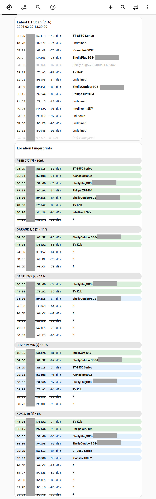
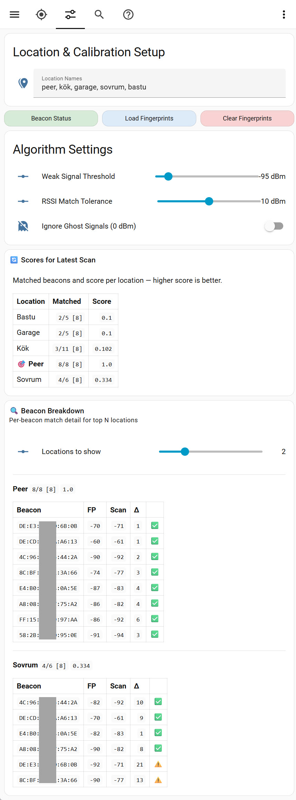
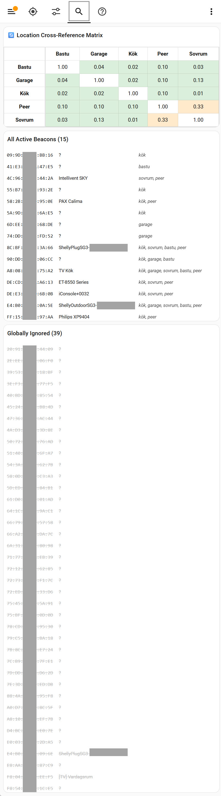

# Bluetooth Triangulation: Location Detection for Home Assistant

Bluetooth triangulation uses beacon signal strength (RSSI) to detect which room you're in. The system works by capturing a unique "fingerprint" of Bluetooth devices at each location, then matching live scans against those fingerprints to determine your position. It integrates seamlessly with Home Assistant automations and the screensaver system.

**What you get:** A single `input_text` entity (`input_text.device_charger_locations`) that reports the detected location, updated whenever your phone docks on a charger or manual trigger occurs. Use this in automations for location-aware actions.

---

## TL;DR – Quick Start

**Setup takes ~10 minutes. Here's what you'll do:**

1. Register the BT Triangulation dashboard in Home Assistant's `configuration.yaml`
2. Copy the dashboard and package files to your `dashboards/` and `packages/` directories
3. Reload packages in Home Assistant (Developer Tools → YAML → Packages)
4. Open the BT Triangulation dashboard and enter your location names (e.g., "kitchen, garage, bedroom")
5. Install HACS components if not already present (primarily `button-card`, `card-mod`, `browser-mod`)
6. Configure your scan source:
   - **For Android with Tasker:** Set up the "Phone Charging - BT Scan" task/profile to send Bluetooth data on charger connect
   - **For other sources:** Post JSON to the webhook endpoint (see Scan Sources section)
7. Visit each location with your phone and capture fingerprints
8. Review the "Scores for Latest Scan" table to validate detection accuracy
9. Use `input_text.device_charger_locations` in your automations for location-aware logic

---

## What You Get

After setup, you'll have:

- **Location entity:** `input_text.device_charger_locations` — reports the detected location (e.g., "kitchen", "garage")
- **Dashboard:** View the latest BT signals reported via webhook, manage beacon fingerprints, and tune the algorithm
- **Persistent fingerprints:** Automatically saved after each capture; survives Home Assistant restarts
- **Beacon management:** Ignore unreliable beacons globally or per-location with a tap/hold gesture
- **Scan history statistics:** Per-beacon signal history accumulated across captures and merges, powering the variance statistics (sample count and standard deviation)

**Example automation using the location entity:**

```yaml
automation:
  - alias: "Different Scenarios by Location"
    trigger:
      platform: state
      entity_id: input_text.device_charger_locations
    action:
      service: script.set_screensaver_scenario
      data:
        scenario: "{{ states('input_text.device_charger_locations') }}"
```

---

## Prerequisites

### Required Files

Ensure you have the triangulation package and dashboard in your Home Assistant config:

```
H:/
├── dashboards/
│   ├── bt_triangulation.yaml
│   └── ...
├── packages/
│   └── triangulation/
│       ├── bt_triangulation.yaml
│       ├── bt_location_symmetric_ratio.yaml
│       ├── data/
│       │   └── ...
│       └── ...
└── www/
    └── docs/
        └── triangulation-README.md  (this file)
```

### Required HACS Components

Install these via HACS (Settings → Devices & Services → HACS):

- `button-card`
- `card-mod`
- `browser-mod`
- `mushroom-template-card`
- `mushroom-chips-card`
- `mushroom-title-card`
- `stack-in-card`
- `slider-entity-row`
- `auto-entities`
- Optional: `config-template-card`, `scheduler-card`

---

## Installation

### 1. Register the BT Location Calibration Dashboard

Add this to your `configuration.yaml`:

```yaml
lovelace:
  dashboards:
    dashboard-bt-triangulation:
      mode: yaml
      filename: dashboards/bt_triangulation.yaml
      title: BT Triangulation
      icon: mdi:bluetooth
      show_in_sidebar: true
```

The dashboard will be accessible at: `https://your-ha-url/dashboard-bt-triangulation`

### 2. Copy Dashboard & Package Files

- Copy files from `dashboards/` to your `dashboards/` directory
- Copy all files from `packages/triangulation/` to your `packages/triangulation/` directory
  - The `data/` subdirectory will be created automatically after the first scan

### 3. Verify Packages Are Loaded

Ensure your `configuration.yaml` includes:

```yaml
homeassistant:
  packages:
    !include_dir_named packages/
```

### 4. Exclude Statistics Sensor from Recorder

`sensor.bt_merge_statistics` carries a large payload that exceeds HA's recorder limit. Add it to your recorder exclusions in `configuration.yaml`:

```yaml
recorder:
  exclude:
    entities:
      - sensor.bt_merge_statistics
```

### 5. Reload Packages

In Home Assistant:
- Go to Developer Tools → YAML
- Click "Reload Packages"
- Or restart Home Assistant entirely

---

## Package Structure

The triangulation system consists of several YAML files that work together:

### `bt_triangulation.yaml` (Core Package)
Main orchestrator that sets up the webhook endpoint and coordinate detection logic:
- **`automation:phone_charger_bt_location`** — Receives Tasker webhook with BT scan results, triggers location detection
- **`automation:phone_charger_power_disconnect`** — Clears location when phone unplugged from charger
- **`input_text.device_charger_locations`** — Stores detected location (e.g., "kitchen", "garage")
- **`sensor.dashboard_logic_config`** — Configuration for browser_id transformation (regex pattern, e.g., to strip `_FKB` suffix)
- **`script.detect_charger_location`** — Coordinates location detection by calling matching algorithms

**You should NOT need to edit this file.**

### `bt_location_symmetric_ratio.yaml` (Matching Algorithm)
Analyzes fingerprints using the Symmetric Ratio algorithm:
- Compares signal patterns using bidirectional beacon matching
- Formula: `(matched / fingerprint_total) × (matched / scan_valid)`
- Eliminates small-fingerprint bias and automatically penalizes unexpected beacons

**You should NOT need to edit this file.**

### `data/` Directory (Fingerprints)
- **`bt_fingerprints.json`** — Stores learned Bluetooth signal signatures for each location
- **`bt_ignored.json`** — Beacons explicitly marked as unreliable or too noisy

Both files use JSON format. Example `bt_fingerprints.json`:
```json
{"fingerprints":[
{"loc":0,"beacons":{
"AA:BB:CC:DD:EE:FF":{"rssi":-65},
"11:22:33:44:55:66":{"rssi":-74,"ignored":true}
}},
{"loc":1,"beacons":{
"AA:BB:CC:DD:EE:FF":{"rssi":-82}
}}
]}
```

In **Min/Max mode** (see Algorithm Settings), beacons are stored with observed signal bounds instead of a single mean value:
```json
{"fingerprints":[
{"loc":0,"beacons":{
"AA:BB:CC:DD:EE:FF":{"min":-70,"max":-60},
"11:22:33:44:55:66":{"min":-78,"max":-70,"ignored":true}
}}
]}
```
Fingerprints can mix both formats — `rssi` entries and `min`/`max` entries coexist and are matched differently per entry.

Example `bt_ignored.json`:
```json
{"ignored":["AA:BB:CC:DD:EE:FF","11:22:33:44:55:66"]}
```

These files are updated automatically when you capture fingerprints or manage beacons in the dashboard. Do not edit manually unless you know what you're doing.

---

## Scan Sources

The triangulation system accepts Bluetooth scan data from any source that can POST JSON to a webhook endpoint. While Tasker on Android is the reference implementation, you can use any system capable of discovering Bluetooth devices and sending data to Home Assistant.

### Tasker on Android (Reference Implementation)

For most users, Tasker paired with a Bluetooth-capable device (phone, tablet) is the simplest approach. Tasker can automatically trigger on charger connection and send scan data.

<details>
<summary><strong>How Location Detection Works (Background)</strong></summary>

When the phone detects power (charger connected), Tasker performs a brief **Bluetooth scan** to identify which nearby "anchor" devices (e.g., BT speakers, plugs) have the strongest signals.

The data is sent to Home Assistant, which analyzes the signals and maps them to a location. This is done via Bluetooth RSSI (Received Signal Strength Indicator), which measures signal power. The stronger the signal, the closer the device is to the Bluetooth beacon.

**Why Bluetooth instead of WiFi/GPS?**
- **Bluetooth RSSI** is stable and accurate when the phone is physically stationary on the charger
- No continuous scanning needed (battery efficient—only 5 seconds on power connect)
- Works even while phone is locked (Tasker has system-level permissions)
- Uses existing hardware (no new sensors required)

</details>

<details>
<summary><strong>Android Prerequisites</strong></summary>

This feature requires:

1. **Tasker** — Install from Google Play Store (paid, ~$3 USD)
2. **Elevated Bluetooth permissions** — Via ADB (Android Debug Bridge):
   ```bash
   adb shell pm grant net.dinglisch.android.taskerm android.permission.BLUETOOTH_SCAN
   adb shell pm grant net.dinglisch.android.taskerm android.permission.BLUETOOTH_CONNECT
   ```
3. **Home Assistant webhook** — Already available (configured below)
4. **Anchor devices** — Bluetooth beacons in each room (MusicCast speakers, Shelly Plugs with BT enabled, etc.)

</details>

<details>
<summary><strong>Why Transient Storage? (Technical Rationale)</strong></summary>

The Bluetooth scan data from Tasker is **stored in memory only** and **not persisted to disk**. This is an intentional design decision:

1. **Data Nature:** The BT scan is inherently transient:
   - Captured only when the phone docks on a charger (typically 1-2× daily)
   - Contains real-time signal strengths that change over time
   - Not needed after location detection is complete (only 100-200 ms of processing)
   - Does not need to survive Home Assistant restarts

2. **Eliminates SD Card Write Wear:**
   - File-based storage would write to disk on every webhook trigger
   - SD cards have limited write cycles (~100,000 cycles per cell)
   - Unnecessary writes accelerate card degradation
   - In-memory storage eliminates this issue entirely

3. **Architecture Simplicity:**
   - Uses Home Assistant's webhook-triggered template sensors (native feature)
   - No file I/O, shell scripts, or complex persistence logic needed
   - Scan data flows: Tasker webhook → template sensor attributes → dashboard
   - Backward compatible with all existing scripts and dashboards

4. **Performance:**
   - Memory access is faster than disk I/O
   - No file system latency or timeout issues
   - Webhook data captured immediately and available to scripts

**Technical Implementation:**
- **Template Sensor:** `sensor.bt_latest_scan_full` (webhook-triggered)
- **Storage:** Sensor attributes (16KB+ capacity, no 255-char state limit)
- **Data Access:** `state_attr('sensor.bt_latest_scan_full', 'devices')` returns the device array
- **Lifecycle:** Populated on webhook trigger, clears on HA restart (acceptable for transient data)

</details>

#### Tasker Task: "Send BT Raw Data"

This task acts as the data collector, transforming raw Bluetooth signals into JSON for Home Assistant.

<details>
<summary><strong>Task Configuration</strong></summary>

**Action 1: Bluetooth Info**
- **Category:** `Net` → `Bluetooth Info`
- **Type:** `Scan Devices`
- **Timeout (Seconds):** `5`
- **Purpose:** Triggers a fresh BT scan. Populates Tasker's local arrays (`%bt_address()`, `%bt_name()`, `%bt_signal_strength()`) with current data from Bluetooth devices in range.

**Action 2: JavaScriptlet**
- **Category:** `Code` → `JavaScriptlet`
- **Code:**
```javascript
var devices = [];
for (var i = 0; i < bt_address.length; i++) {
    devices.push({
        mac: bt_address[i],
        name: bt_name[i],
        rssi: parseInt(bt_signal_strength[i])
    });
}
var payload = JSON.stringify({ devices: devices });
```
- **Purpose:** Converts Tasker's internal variables into a structured JSON object. Loops through discovered devices, pairing MAC address, name, and signal strength (RSSI).

**Action 3: HTTP Request**
- **Category:** `Net` → `HTTP Request`
- **Method:** `POST`
- **URL:** `http://[YOUR_HA_IP]:8123/api/webhook/phone_charger_bt`
- **Headers:** `Content-Type:application/json`
- **Body:** `%payload`
- **Purpose:** Transmits the JSON to Home Assistant webhook. Using port `8123` explicitly bypasses default port issues.

**Action 4: Flash (Optional Verification)**
- **Category:** `Alert` → `Flash`
- **Text:** `Sent: %payload`
- **Long:** `Checked`
- **Purpose:** Provides visual confirmation that data was captured and sent successfully. Useful for debugging.

</details>

#### Tasker Profile: Power Trigger

<details>
<summary><strong>Profile Configuration</strong></summary>

**Profile Name:** `"Phone Charging - BT Scan"`

**Trigger Type:** `State` profile
- **Trigger:** `State` → `Power` → `Source: Any` (detects charger connection)
- **Entry Task:** Link to "Send BT Raw Data" task (above)
- **Exit Task:** None (optional: could reset location to "unknown" when unplugged)

**Note:** The task can (and should) be embedded in the profile that starts the screensaver as the last task after launching Fully Kiosk Browser.

</details>

### Custom / Alternative Scan Sources

Any system capable of sending JSON to Home Assistant's webhook system can be a scan source. The required format is:

```json
{
  "devices": [
    {
      "mac": "AA:BB:CC:DD:EE:FF",
      "name": "BT Device Name",
      "rssi": -65
    },
    {
      "mac": "11:22:33:44:55:66",
      "name": "Another Device",
      "rssi": -72
    }
  ]
}
```

**Webhook URL:** `POST http://[YOUR_HA_IP]:8123/api/webhook/phone_charger_bt`

**Example:** Scan Bluetooth devices on a Linux machine and send to Home Assistant:

```bash
# Use bluetoothctl or similar to scan devices and generate JSON
# Then POST to the webhook:
curl -X POST http://your-ha-ip:8123/api/webhook/phone_charger_bt \
  -H "Content-Type: application/json" \
  -d '{"devices": [{"mac": "AA:BB:CC:DD:EE:FF", "name": "Device", "rssi": -65}]}'
```

---

## How It Works

BT location detection uses beacon signal strength (RSSI) to identify which room you're in. When you capture a location's fingerprint, you record which beacons are present and their signal strengths. However, **not all beacons are reliable**:

**Three problems degrade location detection:**

1. **Volatile beacons** — Your own devices with unstable signal strength
   - A beacon captured at -94 dBm might later appear at -96 dBm (below threshold), disappearing from scans
   - A printer's signal bounces off obstacles: -65 dBm one day, -40 dBm another day
   - When these beacons vanish or change, the fingerprint matching fails

2. **Alien devices** — Beacons from neighbors
   - A Bluetooth Party Speaker or a smart TV you don't own
   - These devices turn on/off unpredictably, adding random noise
   - They're unreliable regardless of signal strength or location

3. **Overlapping beacons** — Your own devices appearing in multiple rooms with different expected signals
   - A beacon strong in the GARAGE might be detected similarly in the KITCHEN
   - The algorithm can't distinguish rooms when they share too many similar beacons

**The solution: Beacon curation**

You manually identify and ignore problematic beacons:
- **Volatile beacons** → Ignore globally (mark as unreliable)
- **Alien devices** → Ignore globally (they don't belong to you)
- **Overlapping beacons** → Ignore locally from specific rooms (keep them where they're distinctive)

Beacon curation is **fully manual and reversible** — you run fingerprint captures, observe what's detected, use your domain knowledge to decide what to ignore, and toggle beacons on/off anytime without recalibrating. 

**Scan history statistics** (sample count and standard deviation) help identify candidates: a high standard deviation means the beacon's signal is inconsistent enough to cause missed detections — a strong signal to ignore it globally. You're looking for beacons with a stable signal.

---

## Understanding the Scoring

**How the algorithm scores locations:**

```
Score = (matched / fingerprint_total) × (matched / scan_valid)

- matched: Number of beacons found in both fingerprint and current scan (within RSSI tolerance)
- fingerprint_total: Number of known beacons in this location's fingerprint (excluding locally ignored beacons)
- scan_valid: Number of beacons in current scan that are known (exist in at least one fingerprint, not locally ignored, and not on global ignore list)
```

**This symmetric ratio approach:**
- **First term (matched/fingerprint):** Measures recall—how many of this location's expected beacons were found
- **Second term (matched/scan_valid):** Measures precision—how many beacons in the scan belong to this location
- **Result:** Bidirectional matching eliminates small-fingerprint bias and automatically penalizes unexpected beacons

**Matching Logic:**
- **No weak threshold during matching** — All known beacons are considered, even weak ones (weak threshold only filters during fingerprint capture)
- **Mean-RSSI entries** — A beacon matches if `|scan_rssi - fingerprint_rssi| <= RSSI Match Tolerance`
- **Min/Max entries** — A beacon matches if `scan_rssi >= min AND scan_rssi <= max` (strict bounds, RSSI tolerance not applied). The midpoint `(min + max) / 2` is used as the representative RSSI for display only; the confusion matrix uses full range overlap.
- **Averaged fingerprint RSSI (mean mode)** — Each merge updates stored RSSI values with a running mean. A single outlier scan moves the stored value halfway rather than fully replacing it, dampening the effect of signal noise.
- **Min/Max fingerprint (min/max mode)** — Each merge expands the stored bounds if the new scan value falls outside them. Values within bounds leave the entry unchanged (no drift). See Min/Max Mode section below.
- **All fingerprinted beacons evaluated** — Even 0 dBm beacons in fingerprints participate in matching. If scan also shows 0 dBm, the diff is 0 ≤ tolerance → natural match

Beacon curation improves these scores by removing beacons that hurt detection. Here are three worked examples:

---

**Problem 1: Volatile Beacons (Signal Instability)**

A printer beacon was captured at -94 dBm (above threshold), but later appears at -96 dBm (below threshold):

```
Fingerprint: OFFICE has [Printer at -94 dBm, Desk lamp at -65 dBm, Router at -45 dBm]

Day 1 (Good): Scan finds [Printer at -94, Lamp at -65, Router at -45] (all 3 valid beacons)
- matched: 3 (all beacons found)
- fingerprint_total: 3
- scan_valid: 3
- Score: (3/3) × (3/3) = 1.0 × 1.0 = 1.0 ✅

Day 2 (Bad): Scan finds [Lamp at -65, Router at -45] (Printer at -96, below threshold)
- matched: 2 (only 2 of 3 found)
- fingerprint_total: 3
- scan_valid: 2 (only 2 valid beacons in scan)
- Score: (2/3) × (2/2) = 0.67 × 1.0 = 0.67 ❌

Solution: Ignore the volatile Printer beacon globally
- Fingerprint becomes [Desk lamp at -65, Router at -45]
- Both days: matched 2/2, scan_valid 2, Score: (2/2) × (2/2) = 1.0 ✅
```

---

**Problem 2: Alien Devices (Unreliable Neighbor Equipment)**

A JBL Party Speaker (not yours) appears randomly in scans with unpredictable signal:

```
Fingerprint: BEDROOM includes [Lamp at -60, Party Speaker at -75, Desk Speaker at -70]
(You forgot the Party Speaker is a neighbor's device when capturing)

Day 1 (Party Speaker on): Scan finds [Lamp at -60, Party Speaker at -74, Desk Speaker at -70]
- Matches all 3, scores well

Day 2 (Party Speaker off): Scan finds only [Lamp at -60, Desk Speaker at -70]
- beacon_match_ratio: 2/3 = 0.67, fingerprint_coverage: 2/3 = 0.67
- Score drops significantly because a "beacon" is missing

Day 3 (Party Speaker elsewhere): Scan finds [Lamp at -60, Party Speaker at -45, Desk Speaker at -70]
- signal_similarity crashes (Party Speaker is 30 dBm different)
- Score affected by signal mismatch

Solution: Ignore the Party Speaker globally
- Fingerprint becomes [Lamp at -60, Desk Speaker at -70]
- All days: Consistent matching, consistent scores ✅
```

---

**Problem 3: Overlapping Beacons (Same Beacon in Multiple Locations)**

An ENTRANCE beacon is strong in KITCHEN (-70 dBm) but also appears in GARAGE (-68 dBm):

```
KITCHEN Fingerprint: 15 beacons (includes ENTRANCE at -70 dBm)
GARAGE Fingerprint: 12 beacons (includes ENTRANCE at -68 dBm)
(Both share 10 other beacons with similar signal profiles)

When you're in KITCHEN and scan with 12 matching beacons and 2 valid scan beacons total:
- KITCHEN: (12/15) × (12/12) = 0.80 × 1.0 = 0.80
- GARAGE: (10/12) × (10/12) = 0.83 × 0.83 = 0.69

Result: KITCHEN wins, but margin is small (0.80 vs 0.69) — fragile detection
- The ENTRANCE beacon is shared, creating ambiguity
- When ENTRANCE signal varies even slightly, GARAGE could win

Solution: Ignore ENTRANCE from both KITCHEN and GARAGE
- KITCHEN: 14 beacons effective, 12 matched
- GARAGE: 11 beacons effective, 10 matched

New scores when in KITCHEN:
- KITCHEN: (12/14) × (12/12) = 0.86 × 1.0 = 0.86
- GARAGE: (10/11) × (10/12) = 0.91 × 0.83 = 0.75

Result: Larger margin (0.86 vs 0.75) = robust detection ✅
```

---

## Understanding the Confusion Matrix

The Location Cross-Reference Matrix (Review tab) scores each location's fingerprint against every other location. A high score means the two fingerprints are similar — the ranges overlap for many beacons. This is a risk indicator, not a failure indicator.

### What the scores mean

With N beacons per location and no ignored beacons, the score formula is `(matched/N)²`. For a 5-beacon setup the discrete levels are:

| Matched beacons | Score |
|-----------------|-------|
| N/N (all)       | 1.0   |
| 4/5             | 0.64  |
| 3/5             | 0.36  |
| 2/5             | 0.16  |
| 1/5             | 0.04  |

A pair scoring 0.64 has one non-overlapping beacon. A pair scoring 0.36 has two.

### Why the matrix is pessimistic

The matrix uses **point-in-range matching** — the midpoint of the row location's beacon range is used as a simulated scan value, then tested against the column location's range. This directly mirrors real detection: if you're at location A and your typical reading is the midpoint of A's fingerprint range, would the algorithm match location B? Real readings don't land in an overlap zone simultaneously for multiple beacons, so this gives a much more realistic picture than comparing ranges against ranges.

**In practice:** If live detection (Scores for Latest Scan) correctly identifies your location at a high score with clear separation, the system is working — even if the matrix shows no green cells. High matrix scores mean *potential* confusion risk, not actual confusion.

### When all cells are amber/red (no green)

This is normal for a small beacon set (e.g. 5 beacons across 5 locations) where all beacons are present everywhere. The minimum achievable score is `(best_separated_beacons / N)²`. If only one or two beacons differ between each pair, the floor is 0.36–0.64 and green is mathematically impossible.

**What to check first:** Live detection. If your actual location scores near 100% and all others score 36%, detection is working correctly. The matrix is showing worst-case fingerprint overlap, not what happens with real scan values.

### Score of 1.0: genuinely indistinguishable fingerprints

A matrix score of 1.0 means all beacons in both fingerprints have overlapping ranges — the algorithm cannot distinguish the two locations even in the best case. Live detection will also fail for this pair.

**Cause:** Both locations see the same beacons at the same signal strengths. Typically happens when two locations are physically close (adjacent rooms, same room) and share the same RF environment.

**Solutions:**
- Find a beacon with meaningfully different signal strength at each location — e.g. a Bluetooth device physically mounted near one location but not the other
- Recapture both locations more carefully from fixed positions; if any genuine RF difference exists, a stable capture with a stationary phone may expose it
- If the locations are RF-identical, no algorithm tuning will fix it — the signal data does not contain enough information to separate them

### Narrowing wide ranges

Wide min/max ranges (visible as wavy-underlined values in Beacon Breakdown) inflate matrix scores by creating artificial overlap. A beacon captured at both -60 and -95 across multiple sessions covers almost the entire RSSI spectrum and will overlap with every other location.

Wide ranges come from RSSI instability during capture: signal fluctuation, phone movement, or merging scans from very different conditions. Recapturing from a fixed position in stable conditions produces narrower ranges and more accurate matrix scores.

Adding more beacons only helps if they have genuinely different signal strengths at the locations you want to separate. Beacons that are weak and present everywhere at similar strengths add overlap, not discrimination.

**Note:** The color thresholds (warning/severe) are fixed constants and do not adapt to beacon count. With fewer beacons the discrete score levels shift — e.g. 3 out of 4 matching scores 0.5625, which falls below the 0.6 severe threshold and shows amber instead of red. Treat the colors as approximate guidance rather than exact boundaries when locations have unequal or small beacon counts.

---

## Understanding 0 dBm "Ghost" Signals

When a sensor reports **0 dBm**, it's saying: *"I can detect this device's presence, but my hardware can't calculate the distance because the signal is too distorted or unstable."*

In other words, **presence is confirmed, but distance is unknown.**

### The Tradeoff

**Advantage of including 0 dBm signals:**
- A beacon with 0 dBm still counts as a "match," keeping your location score high
- Prevents your score from dropping to zero when a beacon flickers into a "0 dBm glitch state"
- Acts as a presence flag: "This beacon exists in range, even if we can't measure strength"

**Disadvantage:**
- Bluetooth signals travel through walls
- A 0 dBm signal from the Kitchen might be picked up by the Bedroom sensor
- Treats weak/distorted signal the same as accurately measured ones, risking location ambiguity

### How to Handle 0 dBm (Ghost Signals) in Your Setup

The **Ignore Ghost Signals** toggle controls whether 0 dBm beacons are included when capturing fingerprints. It does NOT affect matching.

1. **During Fingerprint Capture:**
   - **Ignore Ghost Signals ON:** 0 dBm readings are ignored during capture (recommended for most users)
   - **Ignore Ghost Signals OFF:** 0 dBm readings are captured (useful if you have legitimate 0 dBm beacons)
   - Your fingerprints will contain only the beacons that passed the capture filter

2. **During Runtime (Location Detection - Matching):**
   - ALL beacons in your fingerprints participate in matching, including 0 dBm ones
   - Matching uses RSSI tolerance: if scan shows 0 dBm and fingerprint shows 0 dBm, the diff is 0 ≤ tolerance → matches
   - 0 dBm beacons are treated the same as any other beacon; the toggle's job was done at capture time

3. **Why This Design:**
   - The toggle controls data quality at capture time, not runtime behavior
   - If you captured a 0 dBm beacon (whether by mistake or intentionally), it should participate in matching
   - This keeps the matching algorithm simple and predictable: "match all known beacons"

---

## Random MAC Filtering

Modern Bluetooth devices use different MAC address types depending on their purpose. The first octet of a MAC address encodes the type:

| Type | Top two bits | Behaviour | Examples |
|---|---|---|---|
| **Public** | bit-1 = 0 | IEEE-assigned, always stable | Yamaha speakers, most classic BT devices |
| **Static Random** | `0xC0` | Generated once, never rotates | Shelly BLU, ESP32 sensors, fitness equipment |
| **Resolvable Private (RPA)** | `0x40` | Rotates ~every 15 minutes | iPhones, Android in privacy mode, Apple Watch |
| **Non-Resolvable Private** | `0x00` | Rotates constantly | Temporary beacons |

The **Include Random MACs** toggle (in Algorithm Settings) controls whether rotating MACs (RPA + Non-Resolvable) are included in scan processing. The default is OFF — rotating MACs are excluded because:
- They can never be reliably fingerprinted (MAC changes before the next scan)
- They add noise to the "Latest BT Scan" table and "All Active Beacons"
- They contribute nothing useful to location detection

**Static Random addresses are always kept** regardless of the toggle — devices like Shelly BLU and fitness trackers use this format to avoid IEEE registration fees, but their addresses are permanently stable.

When the toggle is ON (include rotating MACs), they appear in amber italic in the dashboard tables so you can identify them.

### Caveat: Static Random Address Stability

Static Random addresses are stable in normal operation, but can change if a device is factory-reset or loses power in specific circumstances. This is rare for mains-powered devices. If it happens:

- The old MAC will appear as a missing beacon in fingerprints (score drops)
- The new MAC appears as an unknown device in scans
- **Fix:** Recapture fingerprints for the affected locations

If a specific device proves persistently volatile, globally ignore it rather than relying on its MAC being stable. In practice, most static random devices in a home environment (Shelly, fitness equipment) retain their address indefinitely.

---

## Min/Max Mode

Min/Max mode is an alternative fingerprint strategy that stores the observed **signal range** for each beacon rather than a single mean value. Enable it in Algorithm Settings → **Min/Max Mode** toggle.

### Why Min/Max?

The running-mean approach has a weakness: if a beacon's signal drifts consistently over time (e.g., environmental changes, device repositioning), the stored mean drifts too. A location that was well-captured may gradually become misdetected as the mean value no longer represents the real signal range.

Min/Max solves this by capturing the actual observed range. Once a beacon has been seen at both its typical strong and weak positions, the bounds stabilize naturally. Normal signal variance within the known range is a no-op — only genuine new extremes expand the bounds further.

**Key benefit:** Per-beacon differentiated tolerance. Stable beacons accumulate a narrow range (tight effective tolerance). Volatile beacons accumulate a wider range (relaxed effective tolerance). This is strictly better than the global RSSI tolerance setting, which applies the same slack to all beacons.

### How It Works

**Capture** (hold location header): writes `{"min": rssi, "max": rssi}` — a collapsed single point. Expands with subsequent merges.

**Merge** (double-tap location header): mode-driven — writes all beacons in the format defined by the current Min/Max mode toggle, converting any entries in the old format. In min/max mode: existing min/max entries expand bounds; existing mean entries convert to a collapsed `{min, max}` point. In mean mode: all entries are written as mean RSSI from the current scan.

**Matching**: scan RSSI must fall within `[min, max]`. RSSI tolerance setting is ignored for these entries.

**Edit Range** (double-tap beacon row in Beacon Breakdown): opens a popup to directly edit the `min` and `max` bounds for a single beacon. Use this to trim wide ranges caused by outlier merges without recapturing from scratch. If the beacon is in the current scan, an "Apply scan ± tolerance" button pre-fills the fields. An "Apply P10/P90" button sets the range from the 10th/90th percentile of accumulated scan history (available when ≥ 10 samples exist), cutting outlier readings that inflated the range. Saves back to the fingerprint immediately.

**Reset all** (hold location header in Beacon Breakdown): resets all beacons in the location — including locally ignored ones. In **min/max mode**: applies P10/P90 from scan history if ≥ 10 samples exist, otherwise resets to `[midpoint − tolerance, midpoint + tolerance]`. In **mean mode**: resets to current scan RSSI if present, otherwise leaves unchanged. Use this after accumulating sufficient statistics to collapse all ranges to well-calibrated bounds in one step.

**Reset** (hold beacon row): mode-dependent. In **mean mode**: collapses to the current scan RSSI (no-op if absent from scan). In **min/max mode**: resets range to `[scan − tolerance, scan + tolerance]` (no-op if absent from scan). Use when at the location with a fresh scan. To trim wide ranges without a fresh scan, use the Range Editor's midpoint button instead.

### Switching Modes

- **Tap** (RSSI update only) and **double-tap** (merge) are both mode-driven — they convert all beacons in the location to the current mode's format. The only difference is that tap only updates existing beacons while merge also adds new ones.
- Individual beacon row tap (`bt_beacon_merge`) is format-preserving — it does not convert format, to avoid creating a mixture within a location.
- A transient mixture of formats within a location may exist after switching modes until each location has been merged at least once. Both formats match correctly in the meantime.
- **Capture** (hold) also converts everything at once, but replaces the entire fingerprint from the current scan.

### Recommended Workflow for Min/Max Mode

1. Enable Min/Max Mode toggle in Algorithm Settings
2. Hold each location header to capture from scratch (single-point entries)
3. Return to each location repeatedly and tap the header to merge (expand bounds from repeated scans), until the ranges appear stable across visits
4. Check Beacon Breakdown: FP column shows `min/max` ranges; Δ shows 0 when matched
5. Monitor the nσ column — as samples accumulate across merges, a high standard deviation flags beacons with inconsistent signal and narrows your ignore candidates
6. Once ≥ 10 samples exist per beacon, hold the location header in Beacon Breakdown to apply P10/P90 to all beacons at once — cutting outlier readings in a single action. For per-beacon control, double-tap a beacon row to open the Range Editor and use the "Apply P10/P90" button instead. Run **Beacon Status** (Settings card) to get a per-beacon report showing which ranges extend beyond observed statistics and are candidates for trimming.
7. Verify scores stabilize — narrow ranges indicate well-captured beacons; wide ranges indicate high signal variance. If a beacon's range grows very wide, consider ignoring it locally or globally — a wide range means the beacon is unreliable and contributes little to accurate detection

## Mean Mode

Min/Max mode is preferred — it handles signal variance more robustly by capturing observed bounds rather than a drifting average. Use mean mode if you prefer simplicity or have very stable beacon signals.

1. Make sure Min/Max Mode toggle is OFF in Algorithm Settings
2. Hold each location header to capture from scratch (initial mean from current scan)
3. Return to each location and tap the header to merge — each merge nudges the stored mean halfway toward the new scan value, dampening outliers
4. Check Beacon Breakdown: FP column shows a single RSSI value; Δ shows deviation from the stored mean
5. Monitor the nσ column — a high standard deviation flags beacons with inconsistent signal; consider ignoring them globally
6. Run tap periodically to keep stored means fresh as signals drift over time; if a location's scores drop, tap to re-anchor the mean

---

## Scan History Statistics

Statistics are accumulated each time you tap, double-tap, or hold a location header — each operation records the current scan values for that location. The nσ column in Beacon Breakdown shows the result: sample count and standard deviation (e.g. `14σ3` = 14 samples, stddev 3 dBm).

**How to use them:**
- **High standard deviation** — the beacon's signal varies significantly across visits; consider ignoring it globally
- **Wavy underline on nσ** — σ exceeds tolerance/2, meaning the 95% confidence interval of the signal is wider than the matching window; the beacon is likely causing missed detections
- **Intermittent beacon** — beacon was missing from the scan in more than 30% of sessions; it adds noise to detection without contributing reliably; consider removing it from the fingerprint
- **P10/P90 in Range Editor** — once ≥ 10 samples exist, use this to set min/max from the 10th/90th percentile of actual observations, trimming outliers that inflated the range
- **Beacon Status report** — click "Beacon Status" in Settings to write a per-beacon report to the HA log, including warnings for deviation, drift, range quality, and intermittent presence — more detail than the dashboard provides in one place

Use **Clear Statistics** (Settings) to reset all history after relocating a beacon, replacing a device, or after a major environment change — old readings no longer represent current conditions.

---

## Setup Workflow: Capturing Fingerprints

### Step 1: Configure Location Names

Visit the **BT Location Calibration** dashboard at `/dashboard-bt-triangulation`:

1. Go to the **"Triangulation"** view
2. Find the **"Location Configuration"** card
3. Enter comma-separated location names (e.g., `office, kitchen, garage, bedroom`)
4. Press Enter to save

⚠️ **Important:** Location order is permanent. Once you capture fingerprints, changing the order will corrupt all data. Renaming locations is OK, but don't reorder them.

### Step 2: Capture Fingerprints at Each Location

For each location where you want to detect presence:

1. Place your phone at the location (let it sit 5+ seconds to stabilize signals)
2. Wait for auto-trigger (if using Tasker power trigger) or trigger the scan manually
3. In the **Fingerprint Details** section of the dashboard
4. Locate the location heading for the current location (e.g., "OFFICE", "KITCHEN", etc.)
5. Interact with the location heading:
   - **Tap** — Merge existing: updates existing fingerprint beacons from the current scan (no new beacons added); also records the scan to statistics. In mean mode: running mean. In min/max mode: expands bounds.
   - **Double-tap** — Merge all: same as Tap (including statistics update), but also adds new beacons found in the scan that aren't yet in the fingerprint.
   - **Hold (long-press)** — Capture from scratch: replaces the entire fingerprint with the current scan; also records the scan to statistics.
   - In mean mode, each merge averages the stored RSSI with the new scan value (running mean). A single outlier scan moves the stored value halfway rather than replacing it.
   - In min/max mode, each merge expands the stored bounds outward if the scan value falls outside them; values within bounds are a no-op (no drift). See Min/Max Mode section below.

Repeat for all configured locations.

### Step 3: Verify Detection via Fingerprint Details

The **Fingerprint Details** section is your main verification tool. Locations are sorted by match score — the best-matching location appears at the top. Each location heading shows a **live match score** (e.g., `OFFICE 5/9 • 58%`):
- **Matched count** (5/9): How many beacons from the fingerprint are in the latest scan
- **Confidence %** (58%): Quality of the match (higher = more reliable detection)

To verify fingerprints are working:
1. After capturing fingerprints, check each location heading in Fingerprint Details
2. Look for match scores > 50% to indicate reliable detection
3. Beacons are color-coded by quality:
   - Green background = strong signal match (RSSI within ±5 dBm of fingerprint)
   - Blue background = weak signal match (large RSSI difference)
   - Strikethrough = ignored beacons (locally or globally)
   - Italic, faded = weak signals (below threshold, excluded)

### Step 4: Refine Fingerprints Over Time

Fingerprint quality improves iteratively. The process has four phases:

**Phase 1 — Initial capture**
Long-press each location heading to capture all beacons from scratch. Don't aim for perfection yet — you just need a starting point. Repeat for every location.

**Phase 2 — Identify and stabilize the beacon set**
Return to each location, run new scans, and use merge (double-tap) to add newly visible beacons and update RSSI. Check the **Review** tab: the confusion matrix shows which location pairs are ambiguous, and **All Active Beacons** color-codes each beacon's discriminator quality. For beacons that appear in multiple locations with similar RSSI, locally ignore them in locations where they hurt more than help (tap the beacon row in Fingerprint Details). Repeat until each location has a distinctive set of beacons and scores show clear separation.

**Phase 3 — Clean up stray and irrelevant beacons**
Once detection is reliable, globally ignore beacons that are volatile, alien, or contribute nothing — neighbor devices, passing phones, anything you don't own. Use **All Active Beacons** (Review tab) and the global ignore action (hold/long-press beacon) to clean up in bulk. Remove beacons from individual fingerprints that don't belong there (double-tap beacon row).

**Phase 4 — Ongoing maintenance (stable state)**
Use tap (RSSI update only) to keep stored signal strengths fresh as beacons drift over time. No new beacons are added — only existing fingerprint entries are refreshed. At this point, locally-ignored beacons in fingerprints are no longer necessary: if a beacon doesn't help a location, globally ignore or remove it rather than keeping it in the fingerprint marked as locally ignored. New unknown beacons that appear in scans can be globally ignored in bulk.

**The two tools in steady state:**
- **Tap (RSSI update)** — handles signal drift; run periodically or when scores drop
- **Global ignore** — handles stray/new devices that appear in scans over time

See **"Common Tasks"** section below for step-by-step procedures for each operation.

### Step 5: Advanced Testing (Algorithm Tuning)

For detailed algorithm analysis:
1. Go to the **"Settings"** view
2. Review the **"Scores for Latest Scan"** table to see how each location's fingerprint matches the latest scan
3. Look at match quality and score separation to identify any conflicting/ambiguous locations
4. Each row shows: location fingerprint, matched beacon count, and total score

**Expected Outcome:**
- Phone placed at each location → location entity shows the correct location name
- Location becomes available in your automations for location-aware scenario selection
- Scores should be highest for the actual location and noticeably lower for others

---

## Visual Setup Guide

### Triangulation

The main working view for capturing and curating location fingerprints. Place your phone at a location, run a BT scan, then capture or update the fingerprint here. Revisit over time to refine as beacon signals change.



**What you see:**
- **Latest BT Scan** — Bluetooth devices detected in the most recent scan with RSSI values and device names. Rotating/privacy-mode MACs (iPhones, Android privacy mode) are shown in amber italic when the "Include Random MACs" toggle is ON; with the toggle OFF (default) they are excluded entirely and do not appear.
- **Fingerprint Details** — Captured beacon signatures for each location, showing which beacons are active vs ignored and how they match the latest scan
- **Beacon management** — Ignore or remove beacons per location, or mark them globally ignored across all locations

### Settings

**What it does:** Define your locations and tune the detection algorithm. Configure location names, adjust algorithm parameters, and review how well each location's fingerprint matches the current scan.



**How to use:**

1. **Scores for Latest Scan** — Shows how each location's fingerprint matches the current scan:
   - **matched/fp-total [known-in-scan]** — matched beacons over fingerprint total; brackets show how many known beacons were present in the scan
   - **Score** — symmetric ratio: (matched/fp) × (matched/scan) — higher is better
2. **Beacon Breakdown** — Per-beacon detail for the top N scoring locations (use the slider to choose N). Columns: MAC · FP · Scan · Δ · nσ · Name
   - FP column shows `min/max` range for min/max entries, or a single value for mean entries; **underlined with a wavy warning-color line** when the min/max range exceeds 2 × RSSI tolerance — indicates high signal variance; beacon may be unreliable and reduce detection accuracy
   - Δ column: for mean entries, absolute deviation from stored RSSI; for min/max entries, distance outside the bounds (0 when matched)
   - nσ column: sample count and standard deviation from captured merge/reset history (e.g. `14σ3` = 14 samples, stddev 3 dBm). Empty until data is collected. **Wavy underline** when σ > tolerance/2 — the 95% confidence interval of the signal exceeds the full matching window; beacon may cause missed detections. Missing rate and intermittent flag are shown in the Beacon Status report, not in this column.
   - Globally ignored beacons are excluded; locally ignored beacons always appear with strikethrough, whether or not they are present in the current scan
   - **Tap location header** to merge all existing fingerprint beacons for that location from the current scan and record the scan to statistics
   - **Hold location header** to reset all beacons in the location (including locally ignored ones). In **min/max mode**: applies P10/P90 from scan history if ≥ 10 samples exist, otherwise resets to `[midpoint − tolerance, midpoint + tolerance]`. In **mean mode**: resets to current scan RSSI if present, otherwise leaves unchanged. Also records the scan to statistics.
   - **Tap a beacon row** to merge that beacon from the current scan
   - **Double-tap a beacon row** to open the Range Editor — directly edit the min/max bounds for that beacon. Pre-filled from the fingerprint. An "Apply midpoint X dBm:" button trims the range to a symmetrical window around the current centre (no scan needed). An "Apply P10/P90" button sets the range to the 10th/90th percentile of accumulated scan history (enabled when ≥ 10 samples exist; disabled when bounds already match). Min/max are auto-swapped if inverted.
   - **Hold a beacon row** to reset that beacon from the current scan. In **mean mode**: collapses to the current scan RSSI (no-op if absent). In **min/max mode**: resets range to `[scan − tolerance, scan + tolerance]` (no-op if absent from scan).
   - Use this to diagnose why a location scores below expected, or why the wrong location wins
3. **Adjust algorithm parameters** in Algorithm Settings:
   - **Weak Signal Threshold** — Exclude very weak beacons that are unreliable (lower = stricter; higher = more lenient)
   - **RSSI Match Tolerance** — How closely scan signal strength must match fingerprint (lower = stricter matching; higher = more forgiving of signal variance). Only applies to mean-RSSI entries; min/max entries use strict bounds and ignore this setting.
   - **Min/Max Mode** — When ON, new captures and merges store observed signal bounds (`min`/`max`) instead of a running mean. See Min/Max Mode section below. When OFF (default), standard running-mean behavior. Switching the toggle does not convert existing entries — they keep matching via their stored format until recaptured.
   - **Distance-Weighted Scoring** — When ON, each beacon's match contribution is a continuous quality score (0.0–1.0) based on how centered the scan RSSI is within the fingerprint range: midpoint = 1.0, edges = 0.0, outside = 0. When OFF (default), binary matching — in range = 1, out of range = 0. Adds scoring resolution within ranges and can break ties between locations that share beacons at different RSSI levels.
   - **Ignore Ghost Signals (0 dBm)** — Toggle controls whether 0 dBm beacons are included during fingerprint capture. ON = ignore (recommended), OFF = capture
   - **Include Random MACs** — Toggle controls whether rotating/privacy-mode MAC addresses are included in scan processing. OFF (default) = exclude rotating MACs (iPhones, Android privacy mode) — they won't appear in Latest BT Scan or All Active Beacons. ON = include all MACs; rotating MACs appear in amber italic so they can be identified. See "Random MAC Filtering" section for details.

**Goal:** The expected location should have high scores with clear separation to others (e.g., 0.85 vs 0.62 shows good distinction). If scores are similar across locations, refine your fingerprints by managing overlapping beacons.

### Review

**What it does:** Provides three integrated analysis views for understanding beacon distribution across locations and diagnosing location overlap risks.



**What you see:**
- **Location Cross-Reference Matrix** — Scores each location's fingerprint against every other location to identify which pairs are confused (high scores = similar beacons = ambiguity risk). Scores are directional (A→B ≠ B→A — expected) and scores use point-in-range matching: the row location's midpoint RSSI is tested against the column location's range, mirroring real detection. **Tap any non-diagonal cell** to open the drill-down detail view below the matrix; tap a diagonal cell to close it. Note: matrix scores are fingerprint-vs-fingerprint — a high matrix score means *risk* of confusion, not that detection is currently failing. Live detection (Scores for Latest Scan) compares actual scan RSSIs against fingerprints and can correctly separate two locations even when their matrix score is high, as long as the real-world signal values differ. A high matrix score with correct live detection typically means the stored ranges are wider than necessary — recapturing with fewer merged scans would narrow the ranges and reduce the matrix score.
- **Confusion Matrix Drill-Down** — Appears below the matrix when a cell is selected. Shows each beacon causing the overlap: name, row location range, col location range, and overlap extent. Numbers within the overlap zone are highlighted in amber. Note: green cells may still have overlapping beacons (low score = few overlaps relative to total, not zero); amber/red cells have enough overlap to risk confusion. Tap a diagonal cell to dismiss.
- **All Active Beacons** — Complete list of beacons across all locations with indicators showing where each beacon appears; color-coded by discriminator quality: 🟢 green = strong discriminator (RSSI differs well across locations), 🔴 red = weak discriminator (similar RSSI in all locations — ambiguous), no color = neutral. Beacons with rotating/privacy-mode MACs are shown in amber italic when the "Include Random MACs" toggle is ON.
- **Globally Ignored Beacons** — Centralized view of all beacons marked as globally ignored with quick toggle to restore them

**Use this to:** Identify overlapping beacons (appearing in multiple locations with similar RSSI), detect location pairs that might confuse the algorithm, and manage global beacon ignores.

---

## Common Tasks

### Refining Fingerprints

In the Fingerprint Details table, manage beacon which beacons to ignores to improve location detection.

### Task 1: Experiment with Overlapping Beacons (Single-Tap)

1. Identify locations where beacon causes ambiguity (similar RSSI values)
2. **Tap the beacon** to toggle it ignored/active for that location
3. Beacon remains in the fingerprint but is ignored in scoring
4. Check the "Scores for Latest Scan" table to see if scores improve
5. If unsure, leave it active or ignored for now — easy to toggle back and forth

### Task 2: Permanently Remove a Beacon (Double-Tap)

1. Identify beacon that doesn't belong in this location's fingerprint
2. **Double-tap the beacon** to permanently remove it from this location's fingerprint
3. Beacon is gone — if you need it back later, recapture the location or merge fingerprints
4. Useful for removing false captures or stale beacons

### Task 3: Ignore an Irrelevant Device Globally (Long-Press)

1. Identify beacon that's generally unwanted (neighbor device noise, volatile)
2. **Hold/long-press the beacon** in latest scan or in any location's fingerprint
3. Beacon is removed from all locations' fingerprints and added to global ignore list
4. Beacon never matches any location and is filtered from future captures

### Task 4: Re-enable an Ignored Beacon

**Local ignore (single-tap toggle):**
1. Find the beacon in Fingerprint Details
2. **Tap the beacon** again to toggle it active (removes `:X` suffix)
3. Beacon now counts in scoring again for that location

**Global ignore (long-press toggle):**
1. Find the beacon in Latest BT Scan, Fingerprint Details, or **Globally Ignored** table (Review tab)
2. **Hold/long-press the beacon** to restore it (remove from global list)
3. Beacon is removed from the Globally Ignored table
4. Beacon no longer appears with strikethrough in Latest BT Scan and Fingerprint Details
5. Note: Restoration removes it from global list but does NOT re-add to fingerprints — recapture or merge to restore in relevant locations. The **All Active Beacons** table (Review tab) provides a centralized view of all active beacons across locations, making it easy to find and restore specific beacons in bulk.

### Task 5: Check Current Ignore Status

1. Check **"Fingerprint Details"** table for ignored beacons per location
2. Check **"Globally Ignored"** table (Review tab) for beacons on global ignore list

### Task 6: Reset Ignores

1. Clear global ignored file: delete or empty `packages/triangulation/data/bt_ignored.json` (replace with `{"ignored":[]}`)
2. Recapture location fingerprints:
   - Go to each location and initiate a new scan, then long-press the location heading to capture from scratch
   - Or manually edit `packages/triangulation/data/bt_fingerprints.json` — remove `"ignored": true` from individual beacon entries

### Task 7: Check Beacon Signal Health

Click the **"Beacon Status"** button to write a report to the HA log (Developer Tools → Logs). The report shows each active beacon per location with its fingerprint value, rich signal statistics, and warnings about deviation, drift, range quality, and intermittent presence — more detail than the dashboard provides in one place.

### Task 8: Clear Scan History Statistics

Use the **"Clear Statistics"** button (next to "Clear Fingerprints") to reset all accumulated scan history.

**When to do this:**
- After relocating a beacon or replacing a device — old readings no longer represent current signal conditions
- After a major environment change (furniture rearranged, new router, walls changed)
- After switching from mean mode to min/max mode and recapturing all fingerprints — statistics from the old mode are still valid, but the context has changed enough that a fresh start is cleaner

**Effect:** Deletes all data from `bt_statistics.json`. The nσ column in Beacon Breakdown goes blank and will repopulate gradually as you perform new captures and merges. Detection is not affected — statistics are diagnostic only.

---

## Using Location in Automations

The detected location is stored in `input_text.device_charger_locations`. Use this entity in your automations to trigger location-aware actions.

### Example: Switch Screensaver Scenario by Location

```yaml
automation:
  - alias: "Set Screensaver Scenario by Location"
    trigger:
      platform: state
      entity_id: input_text.device_charger_locations
    action:
      service: input_select.select_option
      target:
        entity_id: input_select.screensaver_scenario
      data:
        option: "{{ states('input_text.device_charger_locations') }}"
```

### Example: Adjust Media or Smart Home Actions

```yaml
automation:
  - alias: "Play Location-Specific Music"
    trigger:
      platform: state
      entity_id: input_text.device_charger_locations
      to: "kitchen"
    action:
      service: script.play_kitchen_radio

  - alias: "Bedroom Night Mode"
    trigger:
      platform: state
      entity_id: input_text.device_charger_locations
      to: "bedroom"
    action:
      - service: light.turn_off
        target:
          entity_id: light.bedroom_lights
      - service: input_number.set_value
        target:
          entity_id: input_number.bedroom_brightness
        data:
          value: 10
```

---

## Post-Install Verification

After completing setup, verify everything is working correctly:

1. **Dashboard Access:** Navigate to `https://your-ha-url/dashboard-bt-triangulation` — should load without errors
2. **Location Names Saved:** Open the Triangulation view — your location names should be displayed
3. **Bluetooth Scans Received:** Check "Latest BT Scan" — should show detected Bluetooth devices with RSSI values
4. **Fingerprints Captured:** Go to "Fingerprint Details" — each location should show captured beacons (not empty)
5. **Algorithm Running:** Go to "Settings" view and check "Scores for Latest Scan" — should show location scores for current scan; use "Beacon Breakdown" below it to see per-beacon match detail
6. **Beacon Distribution & Overlap:** Go to "Review" view — check "Location Cross-Reference Matrix" for location confusion risks and "All Active Beacons" to spot overlapping beacons across locations

If any step fails, check the Troubleshooting section below.

---

## Troubleshooting

| Symptom | Cause | Fix |
|---------|-------|-----|
| "Latest BT Scan" is empty; no devices showing | Webhook not triggered OR Tasker not sending data | Check Tasker logs; manually trigger "Send BT Raw Data" task; verify webhook URL is correct |
| Fingerprints captured but very few beacons | Weak Signal Threshold too high (filtering out devices) | Lower the threshold; recapture fingerprints |
| Match scores always low (<30%) even after capture | Beacon volatility or poor signal quality | Review "All Active Beacons" table; globally ignore volatile beacons; recapture when signals are stable |
| Different locations score similarly (ambiguous) | Overlapping beacons with similar RSSI across rooms | Use Review tab "Location Cross-Reference Matrix" to identify overlapping pairs; locally ignore overlapping beacons |
| Location detection works some days, fails other days | Environmental Bluetooth interference (neighbors, devices turning on/off) | Increase RSSI Match Tolerance; ignore temporarily unstable beacons; retest at different times of day |

---

## Known Limitations

<details>
<summary><strong>Color-only indicators</strong></summary>

Some indicators in the dashboard use color only and may not be distinguishable by all users.

</details>

---

<details>
<summary><strong>browser_mod popup appears on all windows of the same device</strong></summary>

Opening the range editor (double-tap beacon row) or any other `browser_mod.popup` action triggers the popup on every browser window open on the same physical device — for example, both the Companion App and a web browser tab. This is a known limitation of the current implementation: the browser ID is not being correctly resolved to the tapped window, causing the popup to broadcast to all registered browsers on the device. Workaround: use the dashboard on one window at a time.

</details>

---

<details>
<summary><strong>Single-scan detection</strong></summary>

Each location update is based on one Bluetooth scan, taken when the phone connects to a charger. This is intentional: the system is optimized for the "phone on charger" trigger rather than continuous monitoring. The tradeoff is that a noisy scan (interference, a beacon momentarily missing) can produce an incorrect location reading. If this is a problem in practice, temporal smoothing (see Potential Enhancements) is the candidate fix.

</details>

---

<details>
<summary><strong>Scan history statistics not stored in HA history</strong></summary>

`sensor.bt_merge_statistics` carries the full scan history payload (up to 50 readings per beacon across all locations), which exceeds HA's 16 KB recorder limit. The sensor is excluded from the recorder to avoid database performance warnings. The underlying data is persisted in `data/bt_statistics.json` and is always read live from file — no data is lost. The only consequence is that this sensor has no history in the HA History or Logbook views.

</details>

---

## Potential Enhancements

- **Temporal smoothing** — Exponential smoothing across consecutive scans to reduce location flickering caused by signal variance. Rather than committing to a new location on a single scan, the system would weight recent history and only switch when the evidence is consistent across multiple readings.

- **Confusion matrix statistical range** — The current confusion matrix shows one score per location pair based on nominal fingerprint values. A future enhancement would show a range — best case (signals diverge within RSSI tolerance) and worst case (signals converge) — revealing hidden ambiguity risks that only surface under real-world signal variance.

---

# Technical Reference

All technical details have been moved to collapsible sections below for easy reference without cluttering the main workflow.

<details>
<summary><strong>Key Features</strong></summary>

✅ **Flexible Ignore**
- Per-location: Ignore beacon from specific locations where it causes ambiguity
- Global: Ignore beacon from all locations (neighbor device noise)
- Toggle on/off any time

✅ **Unlimited Capacity**
- Global ignored: File-based storage, supports 100+ beacons
- Per-location: Limited only by beacon count in fingerprint
- No entity size limits (uses sensor attributes)

✅ **Persistent Storage**
- Per-location: `:X` suffix in fingerprint CSV
- Global: File-backed sensor attributes
- Both survive HA restarts and YAML reloads

✅ **Algorithm Integration**
- Seamless filtering (no performance impact)
- Works with existing match_ratio algorithm
- Transparent to detection logic
- Prepared for alternative algorithms

✅ **User Interface**
- Visual indicators (colors, strikethrough)
- Coverage statistics
- Validation reports

✅ **Documentation**
- System overview in dashboard
- Curation guide with examples
- Detailed markdown documentation

</details>

<details>
<summary><strong>Algorithm Selection Background</strong></summary>

Fingerprinting for indoor positioning (BT RSSI in a home) uses several main approaches:

### Distance-Based Methods (Simplest)

**k-Nearest Neighbors (k-NN)**
- Find k most similar fingerprints, select most common location via voting
- Advantages: Simple, no training needed, works well in small environments (homes, offices)
- Disadvantages: Can be slow with large databases, sensitive to noise
- Standard choice in most home solutions

**Weighted k-NN**
- Same as k-NN but closer points get higher weight
- Advantages: More stable results, better handles outliers
- **Recommendation: Standard choice for home BT fingerprinting**

**1-NN (Nearest Neighbor)**
- Select only closest point
- Fast but less stable than k-NN

### Probabilistic Methods

**Naive Bayes**
- Each beacon contributes probability, combined to select location
- Advantages: Better noise tolerance, needs less data
- Disadvantages: Assumes signal independence (not always true)

**Gaussian Models**
- Each location modeled as mean + standard deviation
- Selects location with best statistical fit
- More accurate than Naive Bayes with good training data

### Machine Learning Methods

**Random Forest**
- Multiple decision trees vote for location
- Advantages: Very robust, tolerates noise well
- Disadvantages: Requires training phase, more computationally expensive

**Support Vector Machines (SVM)**
- Creates decision boundaries between zones
- Good for multi-room classification

**Neural Networks**
- Advantages: Highest accuracy possible
- Disadvantages: Overkill for homes, needs large datasets

### Temporal Models

**Hidden Markov Models (HMM)**
- Considers previous location and movement constraints
- Example: Can't jump from kitchen to bedroom in 0.1 seconds
- Adds extra layer of stability

**Kalman Filter**
- Smooths positions over time, removes signal jitter
- Simple to implement, effective for temporal stability

### Algorithm Comparison Table

| Algorithm      | Type         | Complexity | Accuracy | Home Suitability |
|----------------|--------------|-----------|----------|-----------------|
| 1-NN           | Distance     | Very Easy | OK       | Yes             |
| k-NN           | Distance     | Easy      | Good     | Yes             |
| Weighted k-NN  | Distance     | Easy      | Good     | Yes (abandoned) |
| Naive Bayes    | Probability  | Medium    | Good     | Yes             |
| Gaussian       | Probability  | Medium    | Good     | Yes             |
| Random Forest  | ML           | Medium    | Very Good | Overkill        |
| SVM            | ML           | Medium    | Very Good | Rarely needed   |
| Neural Net     | ML           | Hard      | Highest  | No (too complex)|
| HMM            | Temporal     | Medium    | Stabilizes | Extra layer    |
| Kalman Filter  | Temporal     | Easy      | Stabilizes | Yes (optional) |
| Match Ratio    | Custom       | Easy      | Very Good | Yes (abandoned) |
| **Symmetric Ratio** | **Custom**   | **Easy**  | **Excellent** | **Yes (selected)** |

</details>

<details>
<summary><strong>Algorithm Choice: Symmetric Ratio (Approach 0)</strong></summary>

**Chosen Algorithm:** Bidirectional beacon matching using symmetric ratio formula

**Formula:**
```
presence_score = (matched / fingerprint_total) × (matched / scan_valid)
```

**Why this approach:**

The problem with unidirectional matching (only checking "do fingerprint beacons appear in scan") is that it creates a **small-fingerprint bias**—locations with fewer beacons always appear to have better matches because it's easier to match 2 beacons than 5. This causes false positives when a location with few beacons happens to have lucky matches.

The Symmetric Ratio approach solves this by combining two complementary metrics:
- **matched/fingerprint (Recall):** What percentage of this location's expected beacons were found?
- **matched/scan_valid (Precision):** What percentage of the scan beacons belong to this location?

Together, these terms create a natural penalty system:
- **Small fingerprints no longer always win** — they must also account for unexpected beacons in the scan
- **Unexpected beacons are automatically penalized** — if a beacon unique to Location 2 appears in the scan, Location 1 is penalized through the precision term
- **No tuning parameters needed** — the formula is mathematically optimal for noise-filtered scans

**Key assumptions:**
- The scan is pre-filtered to contain only "valid" beacons (those existing in at least one location's fingerprint)
- This automatically eliminates alien/neighbor devices without requiring explicit configuration
- Beacon curation (global and per-location ignores) works seamlessly with the algorithm

**Result:** Bidirectional matching eliminates small-fingerprint bias. All locations detected correctly with clear score separation and natural robustness to signal drift.

**Advantages over alternatives:**
- ✅ No weight tuning (45/30/25 weighting no longer needed)
- ✅ No penalty parameters (missing beacon penalty eliminated)
- ✅ Mathematically elegant (combines recall and precision naturally)
- ✅ Works with any fingerprint size
- ✅ Scales to 50–120+ beacons without degradation

</details>

<details>
<summary><strong>Algorithm Analysis: Why Approach 0?</strong></summary>

**Decision Process**

Four candidate algorithms were analyzed in depth:

1. **F1-Score-Based (Harmonic Mean)** — `2×matched / (fingerprint + scan)`
2. **Jaccard Index** — `matched / (fingerprint + scan - matched)`
3. **Asymmetric with Multi-Factor** — Complex confidence scoring
4. **Simplified Symmetric Ratio** — `(matched/fingerprint) × (matched/scan_valid)` ← **Selected**

**Why Symmetric Ratio (Approach 0) Won**

The symmetric ratio approach was selected because:

- **Mathematically Sound:** Combines Recall (do I see this location's beacons?) with Precision (do scanned beacons belong here?) in a single elegant formula
- **No Configuration Needed:** Pre-filtered scans eliminate alien noise automatically, so no weight tuning or penalty parameters are required
- **Solves the Core Problem:** Bidirectional matching eliminates the "small-fingerprint bias" that plagued previous algorithms
- **Cleanest Implementation:** Pure Jinja2, no external dependencies, O(n) performance
- **Validated by Multiple Sources:** Analysis confirmed by Claude Opus, Claude Sonnet, ChatGPT, and Gemini

**Key Insight:** The pre-filter assumption (scan contains only beacons existing in at least one fingerprint) is critical. This filter eliminates unknown/alien devices automatically, which simplifies the algorithm dramatically—no need for aggressive penalty tuning or multi-factor scoring.

</details>

<details>
<summary><strong>Algorithm Output Protocol</strong></summary>

All location detection algorithms must return the following metrics for integration with the detection orchestrator:

| Metric | Type | Description |
|--------|------|-------------|
| `matched` | int | Number of beacons found in both fingerprint and current scan |
| `missing` | int | Number of beacons in fingerprint but not in current scan |
| `total_score` | float | Final composite score; higher = better match |

**Symmetric Ratio Algorithm Output Example:**
```yaml
matched: 12
missing: 3
total_score: 0.727  # (12/15) × (12/16.5) = 0.8 × 0.909 = 0.727
```

**Rationale:** This protocol ensures consistent output from the algorithm for integration with the detection system.

</details>

<details>
<summary><strong>Data Formats</strong></summary>

### Global Ignore List

**File:** `.cache/bt_bt_ignored.csv`

**Stored (newline-separated):**
```
AA:BB:CC:DD:EE:FF
11:22:33:44:55:66
22:33:44:55:66:77
```

**When read (JSON array via sensor):**
```json
{
  "ignored": ["AA:BB:CC:DD:EE:FF", "11:22:33:44:55:66", "22:33:44:55:66:77"]
}
```

**Capacity:** Unlimited (supports 100+ beacons without issues)

### Per-Location Ignores

**File:** ``packages/triangulation/data/bt_fingerprints.csv`` (same as fingerprints)

**Format:**
```
0|AA:BB:CC:DD:EE:FF=-65,11:22:33:44:55:66=-72:X,22:33:44:55:66:77=-80:X
```

- `:X` suffix = ignored for this location only
- `:X` goes AFTER RSSI value
- Case-insensitive (normalized to uppercase in algorithm)

</details>

<details>
<summary><strong>Data Flow</strong></summary>

### Reading Global Ignores
```
sensor.bt_ignored_beacons
  ↓ (reads from file via bash command)
ignored array in sensor attributes
  ↓ (available in scripts via state_attr())
Algorithm filters beacons immediately
```

### Writing Global Ignores
```
script.bt_beacon_toggle_global_ignored
  ↓ (reads from sensor attribute)
  ↓ (adds/removes MAC)
  ↓ (writes to file via shell_command)
homeassistant.update_entity
  ↓ (refreshes sensor)
Algorithm automatically uses updated list
```

### Filtering During Detection
```
BT scan → script.detect_charger_location
  ↓ (loads fingerprints + global ignored)
  ↓ (filters out ignored beacons)
script.bt_location_symmetric_ratio
  ↓ (uses only active beacons for scoring)
Returns best match location
```

</details>

<details>
<summary><strong>Technical Implementation</strong></summary>

### Algorithm Filtering Logic
```jinja2
# Skip ignored beacons when counting
for beacon in fingerprint:
    if beacon.endswith(':X'):
        continue  # Skip local ignored
    if beacon_mac in global_ignored_list:
        continue  # Skip global ignored
    # Count as active beacon
    score += calculate_match(beacon, scan)
```

### Performance Impact
- **Storage:** +2 bytes per ignored beacon (minimal)
- **Algorithm:** O(n) filtering, happens once per scan
- **UI:** Generated from existing data, no extra queries

### Data Consistency
- Local ignored stored with fingerprint (always together)
- Global ignored in file with sensor attributes (independent)
- Filtering applied consistently in algorithm
- UI reads same data as algorithm

</details>

<details>
<summary><strong>Scripts & Services</strong></summary>

| Script | Purpose | Input |
|--------|---------|-------|
| `script.bt_beacon_toggle_location_ignored` | Toggle beacon ignored status at specific location (single-tap) | location_index, mac |
| `script.bt_beacon_remove_from_fingerprint` | Remove beacon entirely from specific location's fingerprint (double-tap) | location_index, mac |
| `script.bt_beacon_toggle_global_ignored` | Toggle beacon ignored status globally across all locations (long-press) | mac |
| `script.report_beacon_status` | Per-location beacon report with signal statistics and warnings | (none) |

### Service Call Examples

**Toggle beacon ignored status for specific location (single-tap):**
```yaml
service: script.bt_beacon_toggle_location_ignored
data:
  location_index: 0
  mac: "AA:BB:CC:DD:EE:FF"
```

**Remove beacon from specific location's fingerprint (double-tap):**
```yaml
service: script.bt_beacon_remove_from_fingerprint
data:
  location_index: 0
  mac: "AA:BB:CC:DD:EE:FF"
```

**Toggle beacon ignored status globally (long-press):**
```yaml
service: script.bt_beacon_toggle_global_ignored
data:
  mac: "11:22:33:44:55:66"
```

**Report ignored beacons:**
```yaml
service: script.report_beacon_status
```

</details>

<details>
<summary><strong>Important Notes</strong></summary>

### CSV Format is Critical
- `:X` must come AFTER RSSI value: `MAC=RSSI:X`
- No spaces around `=` or `,`
- Case-insensitive (normalized to uppercase)

### Storage Patterns
- **File + Sensor Attributes:** Same proven pattern as fingerprints and scans
- **No Entity Size Limits:** Uses sensor attributes, not state
- **Unlimited Capacity:** File system limited, not Home Assistant

### Algorithm Changes are Safe
- Only affects scoring/filtering logic
- All ignored beacons are skipped
- Both local and global ignored checked
- Performance remains constant

</details>
